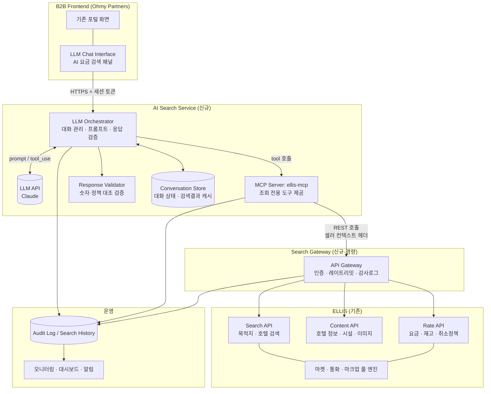
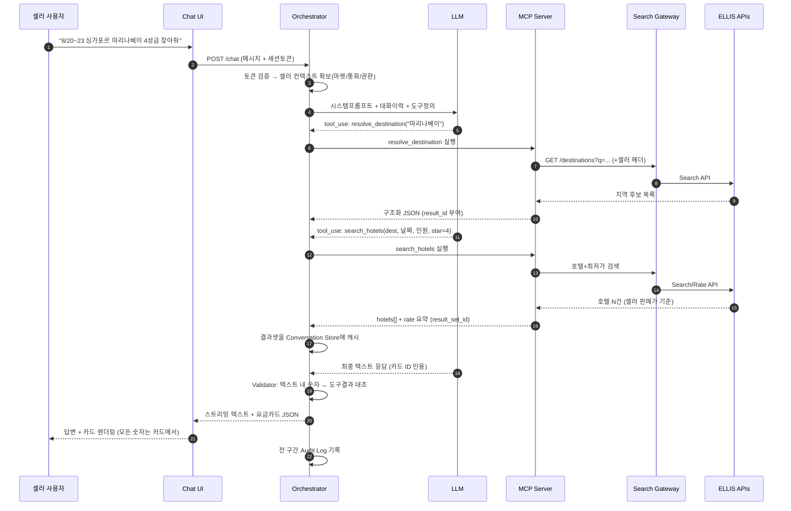
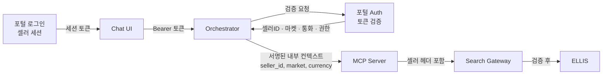

# ELLIS 기반 LLM 자연어 요금 검색 — 시스템 아키텍처 설계서

> **문서 상태**: DRAFT v0.1
> **작성일**: 2026-07-10
> **대상 시스템**: Ohmy Partners B2B 포털 (ohmyhotel.biz)
> **범위**: 조회 전용(Read-Only) 자연어 호텔/요금 검색 — 예약 생성·취소·수정·결제 제외

---

## 0. 전제 및 가정

| # | 항목 | 내용 | 구분 |
|---|------|------|------|
| A1 | ELLIS는 호텔 콘텐츠·요금·재고를 보유한 내부 시스템이며, 이미 B2B 포털이 사용하는 **Search / Content / Rate API가 존재**한다 | 현 포털의 목적지 자동완성(지역코드), 호텔 검색, 객실/요금 조회 화면이 해당 API 위에서 동작 중 | [가정] |
| A2 | 셀러(고객사)별 시장(마켓)·통화·마크업·판매가능 상품 필터링은 **ELLIS(또는 기존 API 계층)에서 이미 적용**되어 내려온다 | 신규 개발에서 재구현하지 않고 그대로 통과시킴 | [가정] |
| A3 | B2B 포털 로그인 세션(셀러 계정)에서 **셀러 식별자와 권한을 조회할 수 있는 인증 토큰**을 발급/검증할 수 있다 | 현 포털은 세션 기반(sessionStorage) | [가정] |
| A4 | LLM은 외부 상용 모델(예: Claude API)을 사용하며, **모델에는 고객 개인정보를 보내지 않는다** | 검색 조건·호텔 콘텐츠만 전달 | 결정 |
| A5 | 초기 버전 UI는 기존 포털 내 **채팅 패널(사이드 패널 또는 별도 탭)** 형태로 추가한다 | 기존 Create Booking 화면과 병행 운영 | 결정 |

---

## 1. 시스템 전체 아키텍처

**핵심 설계 원칙 반영**

- LLM ↔ ELLIS 사이에 **MCP Server와 Search Gateway 2중 경계**를 둔다. LLM은 SQL은 물론 ELLIS API도 직접 호출하지 못한다.
- 화면에 표시되는 **모든 요금·취소조건 숫자는 MCP 도구가 반환한 구조화 JSON에서만 렌더링**한다. LLM 텍스트는 설명·비교 서술만 담당한다 (§5, §9).

---

## 2. 각 시스템의 역할

| 시스템 | 신규/기존 | 역할 | 하지 않는 것 |
|--------|-----------|------|--------------|
| B2B Frontend (Chat UI) | 신규(포털 내 패널) | 자연어 입력, 스트리밍 응답 표시, **요금 카드(구조화 데이터) 렌더링**, 기존 예약 화면으로 이동 링크 제공 | 요금 계산, LLM 직접 호출 |
| LLM Orchestrator | 신규 | 대화 세션 관리, 시스템 프롬프트 주입, LLM 호출, MCP 도구 실행 중계, 응답 검증(Validator) 호출, 스트리밍 | ELLIS 직접 호출, 권한 판단 |
| LLM (Claude API) | 외부 | 자연어 → 검색 의도/파라미터 추출(tool call), 결과 요약·비교 서술, 후속 질문 유도 | 요금·재고·정책 **생성/추정 금지** |
| MCP Server (ellis-mcp) | 신규 | 조회 전용 도구 정의·실행, 입력 스키마 검증, 셀러 컨텍스트 주입, 결과 정규화(result_id 부여), 페이징/絞り込み | 쓰기 작업, 마크업 계산, 인증 발급 |
| Search Gateway | 신규(경량) | 토큰 검증, 셀러별 레이트리밋, ELLIS API 라우팅, 감사 로그, 타임아웃/서킷브레이커 | 비즈니스 로직 |
| ELLIS (Search/Content/Rate) | 기존 | 실데이터 소스. 마켓·통화·마크업·판매조건 적용된 **B2B 판매가와 동일한 결과** 반환 | — |
| Conversation Store | 신규 | 대화 이력, 직전 검색 결과셋 캐시(비교 질문 지원), TTL 관리 | 영구 저장(로그와 분리) |
| Audit Log / Monitoring | 신규 | 질의·도구호출·응답·오류 전 구간 기록, 사용량·품질 지표 | — |

---

## 3. 데이터 흐름

**후속 질문 흐름** — "그중 제일 싼 곳과 취소조건 좋은 곳 비교해줘"
→ Orchestrator가 Conversation Store의 직전 `result_set_id`를 도구 컨텍스트로 제공 → LLM은 `compare_results(result_set_id, criteria)` 도구를 호출 → **재검색 없이 캐시된 실데이터로 비교** (데이터 임의 생성 여지 차단).

---

## 4. MCP Server의 책임 범위

### 4.1 제공 도구 (MVP — 전부 조회 전용)

| 도구 | 입력(요약) | 출력(요약) | ELLIS 연동 |
|------|-----------|-----------|------------|
| `resolve_destination` | 자연어 지역/호텔명 | 지역코드 후보 목록 (예: `102911 Tokyo`) | Search API |
| `search_hotels` | 지역코드 또는 호텔코드, 체크인/아웃, 객실별 성인/아동(나이), 필터(성급·조식·무료취소·숙소유형·체인), `client_nationality` | 호텔 목록 + 대표요금 + `result_set_id` | Search + Rate API |
| `get_hotel_content` | 호텔코드 | 호텔 상세(주소·성급·시설·체크인아웃·유의사항) | Content API |
| `get_hotel_rates` | 호텔코드, 날짜, 인원 | 요금제 목록: 객실타입·식사·Billing(통화/Gross/Discount/Sum)·**취소 마감일시**·rate_key | Rate API |
| `get_cancellation_policy` | rate_key | 취소 정책 전문(단계별 위약금) | Rate API |
| `compare_results` | result_set_id, 기준(가격/취소조건 등) | 캐시된 결과 기반 정렬·비교 테이블 | Conversation Store (ELLIS 재호출 없음) |
| `get_search_history` | 기간(옵션) | 본인 세션의 최근 검색 요약 | Audit Log (read) |

### 4.2 책임 / 비책임

| MCP Server가 **한다** | MCP Server가 **하지 않는다** |
|---|---|
| 도구 입력 JSON Schema 검증 (날짜 형식, 인원 상한, 성급 범위 등) | 예약 생성/취소/수정, 결제 — **도구 자체가 존재하지 않음** |
| 셀러 컨텍스트(셀러ID·마켓·통화) 를 **세션에서 주입** — LLM이 파라미터로 넘겨도 무시 | 마크업·환율 계산 (ELLIS 룰 엔진 결과를 그대로 전달) |
| 결과 정규화 + `result_id`/`result_set_id` 부여 | 결과 내용 가공·보정·추정 |
| 결과 건수 상한(예: 호텔 20건, 요금제 30건) 및 페이징 | 원문 DB 접근(SQL) |
| 오류를 표준 에러 코드로 변환해 반환 (§9) | 오류 은폐·빈 결과를 임의 채움 |
| 도구 호출 단위 감사 로그 | 인증 토큰 발급 |

---

## 5. LLM의 책임 범위와 금지사항

| 책임 (해야 하는 것) | 금지 (해서는 안 되는 것) |
|---|---|
| 자연어에서 검색 조건 추출(날짜·지역·인원·필터) 후 **도구 호출로만** 데이터 획득 | 요금·세금·재고·취소조건 숫자를 **직접 생성·추정·반올림·환산** |
| 모호한 조건 되묻기 (예: "아동 나이가 몇 살인가요?") | 도구 결과에 없는 호텔/상품 언급 |
| 도구 결과를 요약·비교·서술하되 **반드시 result_id 인용** | 결과 없음/오류를 "있는 것처럼" 서술 |
| 결과 없음·오류 시 상태를 그대로 안내하고 대안 조건 제안 | 예약·결제 실행을 약속하거나 시도 |
| 셀러의 판매 언어(한/영/일 등)로 응답 | 다른 셀러의 조건·가격 언급, 내부 원가(Net) 노출 [가정: 응답은 셀러 판매가 기준만] |

**금지사항 기술적 강제 장치 (프롬프트에만 의존하지 않음)**

| 장치 | 구현 |
|------|------|
| 숫자 검증 | Response Validator가 LLM 텍스트 내 통화·금액·날짜를 파싱해 도구 결과와 대조. 불일치 시 해당 문장 차단 후 재생성(1회) 또는 카드만 표시 |
| 카드 렌더링 원칙 | 프론트는 금액·취소마감을 LLM 텍스트가 아닌 **도구 JSON에서만** 렌더 |
| 도구 화이트리스트 | MCP에 조회 도구만 등록. 쓰기 도구 부재 = 구조적 차단 |
| 인용 강제 | 시스템 프롬프트: "모든 상품 언급에 [H-3], [R-12] 형식 result_id 인용" → Validator가 인용 없는 상품 언급 차단 |

---

## 6. ELLIS 연동 방식

| 항목 | 설계 |
|------|------|
| 연동 계층 | MCP Server → **Search Gateway** → ELLIS API (REST/JSON) [가정: ELLIS가 REST 제공. gRPC/SOAP인 경우 Gateway에서 변환] |
| 직접 DB 접근 | **금지.** 신규 SQL 커넥션 없음 |
| 신규 API 필요 여부 | 원칙적으로 기존 B2B 포털이 쓰는 API 재사용. 부족 시 Gateway에 조합 엔드포인트 추가(예: 호텔+최저가 병합) — ELLIS 코어 수정 최소화 |
| 셀러 조건 적용 지점 | ELLIS 룰 엔진(마켓·통화·마크업)이 적용된 **판매가 그대로** 사용 → 원칙 #10 "기존 B2B 판매 조건과 동일" 충족 |
| 판매 가능 필터 | `client_nationality`(예: 베트남 고객) 파라미터를 Search API에 전달 [가정: ELLIS가 국적별 판매가능 필터 지원. 미지원 시 MVP에서 제외하고 확장 단계로 이동] |
| 타임아웃 | Gateway→ELLIS 호출당 8s, 도구 전체 15s, 채팅 턴 전체 60s |
| 캐싱 | 목적지 코드: 24h / 호텔 콘텐츠: 6h / **요금·재고: 캐시 금지**(대화 내 result_set 캐시만, TTL 30분, 비교 용도 한정 + "조회 시점" 표시) |
| 레이트리밋 | 셀러당 분당 도구호출 N회(초기 30) — ELLIS 부하 보호 |

---

## 7. 인증 및 권한 구조

| 계층 | 정책 |
|------|------|
| 사용자 인증 | 기존 포털 로그인 세션 재사용. 채팅 API는 **로그인 사용자만** 접근 |
| 셀러 컨텍스트 | Orchestrator가 토큰 검증 후 확보. **LLM 입력·출력으로는 절대 전달·변경 불가** (프롬프트 인젝션으로 타 셀러 조건 조회 차단) |
| 서비스 간 인증 | Orchestrator↔MCP↔Gateway는 내부망 + mTLS 또는 서명 토큰(short-lived) [가정: 내부망 배치 가능] |
| 권한 모델 | MVP: 셀러 단위 (Staff 계정은 소속 셀러 권한 상속). 기능 플래그로 셀러별 AI 검색 on/off — 파일럿 셀러부터 단계 오픈 |
| LLM API 자격증명 | 서버 측 비밀관리(Vault/KMS). 프론트 노출 금지 |
| 데이터 최소화 | LLM에 전달: 검색조건·호텔콘텐츠·요금결과. **전달 금지**: 예약자 개인정보, 셀러 계약조건 원문, Net 원가 |

---

## 8. 로그 및 모니터링 구조

### 8.1 로그 스키마 (구조화 JSON, 상관관계 ID = `trace_id`)

| 로그 | 주요 필드 | 보존 |
|------|-----------|------|
| `chat_turn` | trace_id, seller_id, user_id, 원문 질의, 응답 요약, 토큰 사용량, 지연시간, validator 결과 | 90일 [가정] |
| `tool_call` | trace_id, 도구명, 입력 파라미터, 결과 건수, ELLIS 응답코드, 지연시간 | 90일 |
| `search_history` | seller_id, 목적지, 날짜, 인원, 필터, result_set_id — **사용자 조회용** (§4.1 `get_search_history`) | 180일 |
| `error` | trace_id, 에러코드(§9), 원인 시스템, 스택 | 180일 |

### 8.2 모니터링 지표

| 분류 | 지표 | 알림 기준(초기) |
|------|------|----------------|
| 가용성 | 채팅 턴 성공률, ELLIS API 오류율 | 성공률 < 97% (5분) |
| 성능 | 턴 P50/P95 지연, 도구호출 지연 | P95 > 20s |
| 품질 | Validator 차단율(환각 의심), 결과없음 비율, 재질문 비율 | 차단율 > 2% |
| 비용 | 셀러별/일별 LLM 토큰 비용 | 일 예산 초과 |
| 사용 | DAU 셀러 수, 턴 수, 검색→기존 예약화면 이동 전환율 | — |

---

## 9. 실패 및 예외 처리 구조

| 코드 | 상황 | 시스템 동작 | 사용자 노출 메시지(예) |
|------|------|-------------|------------------------|
| `NO_RESULTS` | 조건에 맞는 호텔/요금 없음 | 빈 결과를 그대로 LLM에 전달, 대안 조건 제안 유도 | "조건에 맞는 상품이 없습니다. 날짜를 바꾸거나 성급 조건을 낮춰볼까요?" |
| `ELLIS_TIMEOUT` | ELLIS 응답 지연 | 1회 재시도 → 실패 시 부분결과/실패 명시 | "요금 시스템 응답이 지연되고 있습니다. 잠시 후 다시 시도해 주세요." |
| `ELLIS_ERROR` | ELLIS 5xx | 서킷브레이커(연속 5회 → 60s 오픈) | 동일 + 운영 알림 |
| `INVALID_QUERY` | 날짜 과거, 인원 초과 등 | LLM이 되묻기 (도구 호출 전 차단) | "체크인 날짜가 지났습니다. 다른 날짜로 검색할까요?" |
| `UNAUTHORIZED` | 토큰 만료/권한 없음 | 채팅 중단, 재로그인 유도 | "세션이 만료되었습니다. 다시 로그인해 주세요." |
| `RATE_LIMITED` | 셀러 호출 한도 초과 | 대기 안내 | "요청이 많습니다. 1분 후 다시 시도해 주세요." |
| `VALIDATION_BLOCKED` | LLM 텍스트 숫자 불일치 | 재생성 1회 → 실패 시 카드만 표시 + 로그 | (텍스트 없이) 요금 카드 + "상세는 카드를 확인해 주세요." |
| `LLM_UNAVAILABLE` | LLM API 장애 | 기존 검색 화면 안내 (기능 저하 운영) | "AI 검색이 일시 중단되었습니다. 일반 검색을 이용해 주세요." |

**공통 원칙**: 실패는 절대 그럴듯한 답변으로 대체하지 않는다. 채팅 UI에는 항상 "기존 검색 화면으로 이동" 탈출구를 상시 노출한다.

---

## 10. MVP와 향후 확장 기능 구분

### 10.1 MVP (Phase 1 — 목표: 파일럿 셀러 2~3개사)

| # | 기능 | 비고 |
|---|------|------|
| 1 | 자연어 호텔/요금 검색 (지역·날짜·인원·성급·조식·무료취소 필터) | 예시 질문 1·2·4 커버 |
| 2 | 대화 내 결과 비교 (최저가 vs 취소조건) | 예시 질문 3 커버 |
| 3 | 국적별 판매가능 필터 | 예시 질문 5 — ELLIS 지원 확인 필요 [가정 A: 지원] |
| 4 | 요금 카드 렌더 + 기존 예약화면 딥링크 (검색조건 이어받기) | 예약은 기존 플로우로 |
| 5 | 검색 이력 조회, 전 구간 감사 로그 | 원칙 #8 |
| 6 | 한국어/영어 응답 | 포털 지원 언어 기준 |

### 10.2 확장 (Phase 2+)

| 단계 | 기능 | 전제 |
|------|------|------|
| P2 | 예약 생성(휴먼 컨펌 필수: LLM 제안 → 사용자 버튼 확정), 예약 조회·취소기한 알림 | 별도 보안 검토, 쓰기 도구 신설 |
| P2 | 다중 목적지·기간 유연 검색("8월 중 아무 주말"), 가격 추이 | Rate API 확장 |
| P3 | 일본어·베트남어 등 응답 언어 확대, 셀러 자체 브랜딩 위젯/API 제공 | — |
| P3 | 개인화 추천(셀러 판매 이력 기반), FAQ/Notice 통합 Q&A | 데이터 축적 후 |
| P3 | 음성 입력, 이메일로 들어온 요청 자동 검색 | — |

### 10.3 MVP 제외 명시 (원칙 #3·4)

예약 생성 / 취소 / 수정 / 결제 / 정산 / 바우처 발행 — **MCP 도구 미구현으로 구조적 차단.**

---

## 부록 A. 개발 착수 시 확인 필요 사항 (Open Questions)

1. ELLIS Search/Content/Rate API의 실제 스펙 문서(엔드포인트·인증·쿼터) — Gateway 설계 확정에 필요
2. 국적별 판매가능 필터의 ELLIS 지원 여부 (§6, MVP #3)
3. 포털 세션 토큰의 서버측 검증 방법 (현재 sessionStorage 기반 → 검증 API 존재 여부)
4. 셀러별 LLM 비용 정책 (무상 제공 vs 사용량 과금)
5. 파일럿 셀러 선정 및 성공 지표 합의 (예: 검색→예약 전환율, 턴당 소요시간)
