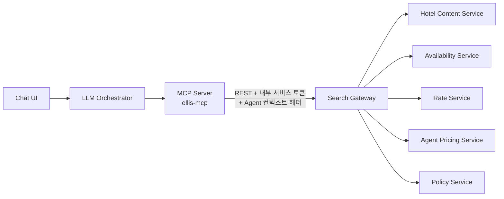
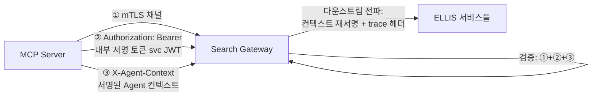
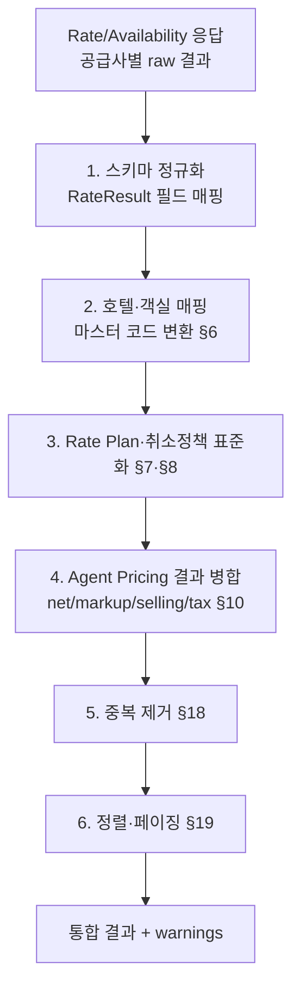
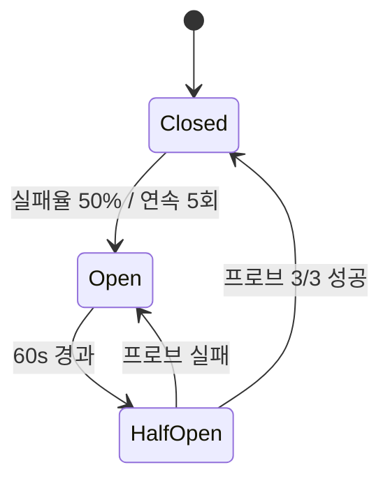
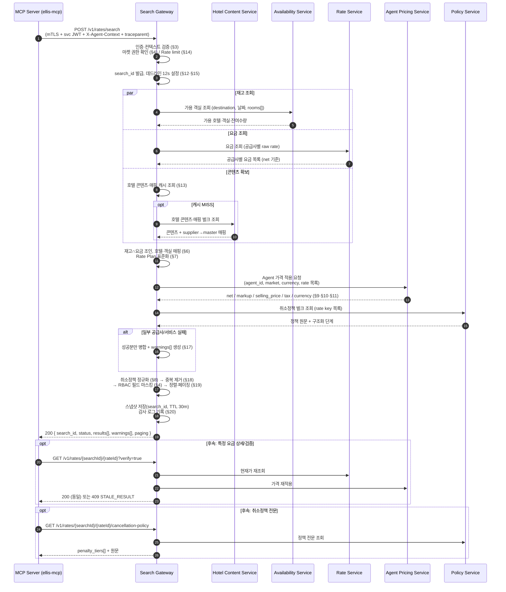

# Search Gateway 설계서

> **문서 상태**: DRAFT v0.1
> **작성일**: 2026-07-10
> **상위 문서**: [`docs/architecture/ellis-mcp-llm-search.md`](../architecture/ellis-mcp-llm-search.md)
> **범위**: MCP Server(ellis-mcp)와 ELLIS 서비스군 사이의 **Search Gateway** — 조회 전용(Read-Only)

## 목차

- [0. 개요 및 위치](#0-개요-및-위치)
- [1. API Endpoint 목록](#1-api-endpoint-목록)
- [2. Request/Response 구조](#2-requestresponse-구조)
- [3. 인증 방식](#3-인증-방식)
- [4. Agent별 권한 처리](#4-agent별-권한-처리)
- [5. 공급사별 결과 통합 방식](#5-공급사별-결과-통합-방식)
- [6. 호텔·객실 매핑 방식](#6-호텔객실-매핑-방식)
- [7. Rate Plan 표준화](#7-rate-plan-표준화)
- [8. 취소정책 표준화](#8-취소정책-표준화)
- [9. 통화 변환 처리](#9-통화-변환-처리)
- [10. Markup 처리](#10-markup-처리)
- [11. Tax 포함/불포함 처리](#11-tax-포함불포함-처리)
- [12. Search ID·Trace ID 관리](#12-search-idtrace-id-관리)
- [13. Cache 전략](#13-cache-전략)
- [14. Rate Limit](#14-rate-limit)
- [15. Timeout·Retry](#15-timeoutretry)
- [16. Circuit Breaker](#16-circuit-breaker)
- [17. 공급사 일부 실패 시 응답](#17-공급사-일부-실패-시-응답)
- [18. 중복 요금 제거](#18-중복-요금-제거)
- [19. 검색 결과 정렬](#19-검색-결과-정렬)
- [20. 감사 로그](#20-감사-로그)
- [21. REST vs GraphQL 비교 및 권장안](#21-rest-vs-graphql-비교-및-권장안)
- [22. 전체 시퀀스 다이어그램](#22-전체-시퀀스-다이어그램)

---

## 0. 개요 및 위치



| 원칙 | 내용 |
|------|------|
| 단일 진입점 | MCP(및 향후 다른 내부 소비자)는 ELLIS 5개 서비스를 직접 호출하지 않고 **Gateway만** 호출한다 |
| DB 직접 접근 금지 | Gateway 포함 어느 신규 컴포넌트도 ELLIS DB에 SQL 연결하지 않는다 |
| 계산 금지 | 환율·마크업·세금은 ELLIS(Agent Pricing Service 등)의 결과를 **그대로 통과** — Gateway는 재계산하지 않는다 (§9, §10, §11) |
| 조회 전용 | 쓰기(예약 생성·취소·수정·결제) 엔드포인트는 존재하지 않는다 |
| 표준화 책임 | 공급사별 상이한 호텔코드·객실타입·요금제·취소정책 표현을 **표준 스키마로 정규화**하는 것이 Gateway의 핵심 부가가치 (§5~§8) |

---

## 1. API Endpoint 목록

모든 엔드포인트는 `https://search-gw.internal.ohmyhotel.com` (내부망) 하위, 버전 프리픽스 `/v1`. [가정: 내부망 전용 배포, 외부 노출 없음]

| # | Method | Path | 목적 | 호출하는 ELLIS 서비스 | 페이징 |
|---|--------|------|------|----------------------|--------|
| 1 | POST | `/v1/destinations/search` | 자연어/키워드 → 목적지(지역코드) 후보 조회 | Hotel Content Service | O |
| 2 | POST | `/v1/hotels/search` | 목적지·필터 기반 호텔 목록 조회(콘텐츠만, 요금 없음) | Hotel Content Service | O |
| 3 | GET | `/v1/hotels/{hotelId}` | 호텔 상세 콘텐츠(시설·이미지·정책 텍스트) | Hotel Content Service | — |
| 4 | POST | `/v1/rates/search` | 날짜·인원 기반 **요금 검색** (핵심 엔드포인트, `search_id` 발급) | Availability + Rate + Agent Pricing + Policy (+Content 캐시) | O |
| 5 | GET | `/v1/rates/{searchId}/{rateId}` | 검색 결과 내 특정 요금 재조회(가격 검증 포함) | Rate + Agent Pricing | — |
| 6 | GET | `/v1/rates/{searchId}/{rateId}/cancellation-policy` | 특정 요금의 취소정책 전문(단계별 위약금) | Policy Service | — |
| 7 | GET | `/v1/searches/{searchId}/status` | 비동기 요금 검색 진행 상태(공급사별 완료/실패) | 내부 상태 저장소 | — |
| 8 | GET | `/v1/searches/recent` | 호출 Agent 컨텍스트 기준 최근 검색 이력 | 감사 로그 (read) | O |
| 9 | GET | `/v1/health` | 헬스체크(자체 + ELLIS 다운스트림 상태 요약) | — | — |

**설계 노트**

- 검색류는 요청 본문이 복잡(객실별 인원 배열, 다중 필터)하므로 `POST` 사용. 단건 조회·상태 조회는 `GET`(캐시 가능).
- `rateId`는 항상 `searchId` 스코프 하위에서만 유효 — 요금은 검색 시점 스냅샷이며 검색 간 재사용을 금지한다 (§12).
- 삭제·수정 계열 Method(`PUT`/`DELETE`/`PATCH`)는 라우터 수준에서 미등록 → 구조적 차단.

---

## 2. Request/Response 구조

### 2.1 공통 규약

| 항목 | 규약 |
|------|------|
| 콘텐츠 타입 | `application/json; charset=utf-8` |
| 날짜 | `YYYY-MM-DD` (체크인/아웃), 일시는 ISO 8601 + 오프셋 (`2026-08-20T23:59:00+09:00`) |
| 금액 | `string` 십진 표기(예: `"152.30"`) — 부동소수점 오차 방지. 통화는 별도 `currency` 필드(ISO 4217) |
| ID | `search_id`: `srch_` 프리픽스 ULID, `rate_id`: 결과 내 유일 키, `booking_token`: 서명된 불투명 토큰 |
| 페이징 | 요청: `page`(1-base), `page_size`(기본 20, 최대 100) / 응답: `page`, `page_size`, `total_count`, `has_more` |
| 에러 | 모든 4xx/5xx는 표준 `Error` 객체(§2.4) 반환 |

### 2.2 요금 검색 요청 (POST /v1/rates/search)

```json
{
  "destination": { "type": "REGION", "code": "SG-MBS" },
  "hotel_ids": null,
  "check_in": "2026-08-20",
  "check_out": "2026-08-23",
  "rooms": [
    { "adults": 2, "children": 1, "children_ages": [7] }
  ],
  "client_nationality": "VN",
  "currency": "USD",
  "filters": {
    "star_rating_min": 4,
    "meal_plans": ["BREAKFAST"],
    "free_cancellation_only": true,
    "supplier_ids": null
  },
  "sort": { "by": "PRICE_ASC" },
  "page": 1,
  "page_size": 20,
  "timeout_hint_ms": 12000
}
```

- `destination`과 `hotel_ids`는 상호 배타(둘 중 하나 필수).
- `rooms[]`는 `RoomOccupancy` 스키마 — 객실별 `adults`, `children`, `children_ages[]`(children 수와 길이 일치 필수).
- `currency`는 **표시 요청 통화**일 뿐이며, 실제 통화 결정·환산은 ELLIS Agent Pricing Service가 수행 (§9).

### 2.3 요금 검색 응답 — RateResult (최소 필드 전체)

응답 루트: `{ search_id, status, results: RateResult[], warnings: PartialFailureWarning[], paging }`.

| 필드 | 타입 | 설명 | 원천 서비스 |
|------|------|------|------------|
| `search_id` | string | 이 검색 실행의 스냅샷 ID | Gateway 발급 |
| `hotel_id` | string | **오마이호텔 마스터 호텔 ID** (공급사 코드 아님, §6) | Content |
| `hotel_name` | string | 호텔명(요청 언어) | Content |
| `destination` | string | 목적지 표시명 | Content |
| `star_rating` | number | 성급 (0.5 단위) | Content |
| `latitude` / `longitude` | number | 좌표 | Content |
| `room_type_id` / `room_type_name` | string | 표준 객실 타입 (§6.2) | Gateway 매핑 |
| `rate_plan_id` / `rate_plan_name` | string | 표준 요금제 (§7) | Gateway 매핑 |
| `supplier_id` | string | 공급사 식별자 | Rate |
| `meal_plan` | enum | `ROOM_ONLY` \| `BREAKFAST` \| `HALF_BOARD` \| `FULL_BOARD` \| `ALL_INCLUSIVE` (§7) | Gateway 매핑 |
| `cancellation_type` | enum | `FREE` \| `PARTIAL` \| `NON_REFUNDABLE` \| `UNKNOWN` (§8) | Policy |
| `cancellation_deadline` | string(date-time)\|null | 무료취소 마감 일시(호텔 현지 TZ 오프셋 포함) | Policy |
| `cancellation_policy_text` | string | 정책 요약 원문 | Policy |
| `net_price` | string\|null | 공급가 — **INTERNAL_SALES/OPS 이상에만 포함, 그 외 null** (§4) | Agent Pricing |
| `markup` | string\|null | 마크업 금액 — 위와 동일 마스킹 | Agent Pricing |
| `selling_price` | string | 판매가 (Agent Pricing 계산 결과 그대로) | Agent Pricing |
| `tax` | string | 세금·수수료 합계 (§11) | Agent Pricing |
| `currency` | string | ISO 4217 | Agent Pricing |
| `total_nights` | integer | 숙박 일수 | Gateway 산출(체크인/아웃 차) |
| `total_rooms` | integer | 객실 수 | 요청 echo |
| `availability` | integer | 판매 가능 잔여 객실 수 | Availability |
| `last_updated_at` | string(date-time) | 이 요금 데이터의 ELLIS 기준 최종 갱신 시각 — STALE 판정 근거 | Rate |
| `booking_token` | string | 예약 화면 딥링크용 서명 토큰(요금 스냅샷 캡슐화, TTL 30분) [가정] | Gateway 발급 |
| `warnings` | array | 해당 결과 개별 경고(예: `STALE_RESULT`) | Gateway |

### 2.4 표준 에러 객체

```json
{
  "error": {
    "code": "ELLIS_TIMEOUT",
    "message": "Rate Service did not respond within 8000ms",
    "trace_id": "trc_01J...",
    "retryable": true,
    "details": { "service": "rate-service" }
  }
}
```

`code`는 고정 enum: `INVALID_QUERY`, `UNAUTHORIZED`, `FORBIDDEN`, `NO_RESULTS`, `RATE_LIMITED`, `ELLIS_TIMEOUT`, `ELLIS_ERROR`, `SUPPLIER_PARTIAL_FAILURE`, `STALE_RESULT`, `INTERNAL_ERROR`.

| HTTP | 코드 매핑 |
|------|-----------|
| 400 | `INVALID_QUERY` |
| 401 | `UNAUTHORIZED` |
| 403 | `FORBIDDEN` |
| 404 | `NO_RESULTS` (단건 조회 miss 포함) |
| 409 | `STALE_RESULT` (요금 재검증 시 가격/재고 변경) |
| 429 | `RATE_LIMITED` (+`Retry-After` 헤더) |
| 502 | `ELLIS_ERROR` |
| 504 | `ELLIS_TIMEOUT` |
| 500 | `INTERNAL_ERROR` |
| 200 + warnings | `SUPPLIER_PARTIAL_FAILURE`는 성공 응답 내 `warnings[]`로 표현 (§17) |

---

## 3. 인증 방식

두 층위를 분리한다: **(a) 서비스 간 인증**(호출자가 신뢰된 내부 서비스인가) + **(b) Agent 컨텍스트**(어느 여행사/사용자를 대신한 요청인가).



| 층 | 방식 | 상세 |
|----|------|------|
| ① 전송 계층 | **mTLS** | 내부 CA 발급 클라이언트 인증서. SPIFFE ID 형식 `spiffe://ohmyhotel/svc/ellis-mcp` [가정: 서비스 메시 또는 사설 CA 운용 가능]. 인증서 없는 연결은 TCP 수준 거부 |
| ② 서비스 토큰 | **서명 토큰(JWT, RS256/EdDSA)** | `iss`: 내부 IdP, `sub`: 호출 서비스 ID, `aud`: `search-gateway`, TTL ≤ 5분. mTLS 불가 구간(레거시 네트워크)의 폴백 겸 다중 방어 |
| ③ Agent 컨텍스트 | **`X-Agent-Context` 헤더 (서명 JWT)** | Orchestrator가 포털 세션 검증 후 발급·서명. 클레임: `agent_id`, `user_id`, `role`(§4), `markets[]`, `currency`, `nationality_default`, `exp`(≤ 10분). **MCP·LLM이 값을 변조할 수 없도록 Orchestrator 서명 키로만 발급** |
| 키 관리 | Vault/KMS, 서명키 90일 로테이션, JWKS 엔드포인트로 공개키 배포 [가정] | |
| 실패 처리 | ①② 실패 → `401 UNAUTHORIZED` / ③ 서명·만료 실패 → `401` / ③ 클레임은 유효하나 자원 권한 없음 → `403 FORBIDDEN` | |

Gateway는 ELLIS 다운스트림 호출 시 자신의 서비스 토큰으로 재인증하고, Agent 컨텍스트는 **검증 후 재서명하여 전파**한다(호출 사슬 어디서도 무서명 컨텍스트가 흐르지 않음).

---

## 4. Agent별 권한 처리

### 4.1 역할(RBAC) 매트릭스

| 역할 | 요금 검색 | `net_price`/`markup` 열람 | 타 Agent 컨텍스트 조회 | 감사 로그 조회 | 비고 |
|------|-----------|--------------------------|------------------------|----------------|------|
| `AGENT_USER` | O (자기 Agent) | **X — 응답에서 null 마스킹** | X | X (본인 `searches/recent`만) | 여행사 실무자. `selling_price`·`tax`만 |
| `INTERNAL_SALES` | O (담당 Agent 대행) | O | O (지정 Agent 한정) | X | 오마이호텔 영업 |
| `INTERNAL_OPS` | O | O | O | O (read) | 운영 |
| `SECURITY_ADMIN` | X (검색 불필요) | X | X | O (전체, 마스킹 해제 승인 절차) | 감사 전담 |
| `SYSTEM_ADMIN` | O | O | O | O | 시스템 관리. 사용은 전량 감사 대상 |

### 4.2 처리 규칙

| 규칙 | 구현 |
|------|------|
| 필드 수준 마스킹 | 직렬화 마지막 단계에서 role 기반 필드 필터 적용. `AGENT_USER`는 `net_price=null`, `markup=null`. **마스킹 누락은 배포 차단 테스트(contract test)로 강제** |
| **판매 시장(마켓) 확인** | 요청의 `destination`/`client_nationality` 조합이 Agent 컨텍스트의 `markets[]`에 포함되는지 Gateway가 선검증. 불일치 → `403 FORBIDDEN` (ELLIS 호출 전 차단). 최종 판매 가능 여부는 ELLIS Agent Pricing/Policy가 재판정 [가정: markets[] 클레임은 계약 시스템에서 동기화] |
| Agent 격리 | `search_id`는 `agent_id`에 바인딩. 다른 Agent 컨텍스트로 `GET /v1/rates/{searchId}/...` 접근 시 `403` |
| 대행 조회 | `INTERNAL_SALES`가 특정 Agent 대행 시 `X-Agent-Context`의 `agent_id` = 대상 Agent, `acting_user_id` = 내부 직원 — 감사 로그에 둘 다 기록 (§20) |
| 통화·국적 강제 | 컨텍스트의 `currency`/`nationality_default`가 요청 값과 충돌하면 **컨텍스트 우선** (프롬프트 인젝션으로 타 시장 가격 조회 차단) |

---

## 5. 공급사별 결과 통합 방식

ELLIS Rate/Availability Service가 여러 공급사(supplier) 채널의 요금을 반환한다. [가정: 공급사 fan-out 자체는 ELLIS 내부에서 수행되며, Gateway는 ELLIS가 공급사별로 반환한 결과 묶음을 통합·정규화한다. 공급사별 개별 호출이 ELLIS API 구조상 분리되어 있는 경우에도 아래 파이프라인은 동일 적용]



| 단계 | 규칙 |
|------|------|
| 병렬 수집 | 공급사(또는 서비스) 단위 비동기 수집, 개별 타임아웃 독립 적용 (§15) |
| 부분 도착 허용 | 전체 데드라인 내 도착한 공급사 결과만으로 응답 구성, 미도착분은 `warnings[]` (§17) |
| 매핑 실패 처리 | 마스터 호텔 매핑 실패 결과는 **응답에서 제외**하고 `UNMAPPED_HOTEL` 경고 카운트 로그(임의로 신규 호텔 생성 금지) |
| 필드 결측 | 필수 필드(판매가·통화·취소유형) 결측 결과는 제외 + 로그. 선택 필드 결측은 null 허용 |
| 원본 보존 | 정규화 전 raw 응답은 디버깅용으로 7일 보존(개인정보 없음) [가정] |

---

## 6. 호텔·객실 매핑 방식

### 6.1 호텔 매핑 (공급사 호텔 코드 → 마스터 호텔 ID)

| 항목 | 설계 |
|------|------|
| 매핑 원천 | **Hotel Content Service의 마스터 매핑 테이블** (`supplier_id + supplier_hotel_code → master_hotel_id`) [가정: ELLIS에 매핑 데이터 존재. 부재 시 별도 매핑 구축 프로젝트 선행 필요] |
| Gateway 역할 | 매핑 조회(캐시 24h, §13) 및 적용만. **매핑 생성·수정은 하지 않음** (콘텐츠 운영 도구의 몫) |
| 미매핑 코드 | 결과 제외 + `unmapped_count` 메트릭 + 일 배치 리포트로 콘텐츠 운영팀 전달 |
| 충돌(1:N) | 하나의 공급사 코드가 복수 마스터에 걸리면 신뢰도 점수 최상위 1건 채택, 나머지 로그 [가정: 매핑 테이블에 confidence 존재] |

### 6.2 객실 타입 매핑 (room type)

| 항목 | 설계 |
|------|------|
| 표준 축 | `room_type_id`는 마스터 호텔 하위의 표준 객실 타입. 표준화 축: 침대 구성(King/Twin…), 정원(occupancy), 뷰, 등급(Standard/Deluxe/Suite…) |
| 매핑 방법 | 1순위: Content Service의 기존 room 매핑 테이블. 2순위: 규칙 기반 이름 정규화(토큰 사전: "DBL"→Double, "TRP"→Triple 등). 3순위 미매핑: `room_type_id = "UNMAPPED:{supplier_room_code}"`로 **표기하되 결과는 유지**(요금 기회 손실 방지), `room_type_name`은 공급사 원문 노출 |
| 이름 표시 | `room_type_name`은 표준명 우선, 미매핑 시 공급사 원문 + `warnings`에 `ROOM_TYPE_UNMAPPED` |
| LLM 유의 | 미매핑 객실은 MCP가 "공급사 표기 그대로"임을 카드에 표시하도록 플래그 전달 |

---

## 7. Rate Plan 표준화

공급사마다 요금제 이름·구성(조식 포함 여부, 회원가, 패키지)이 제각각이므로 표준 차원(dimension)으로 분해한다.

| 표준 차원 | 값 | 원천 |
|-----------|----|------|
| `meal_plan` | `ROOM_ONLY` / `BREAKFAST` / `HALF_BOARD` / `FULL_BOARD` / `ALL_INCLUSIVE` | 공급사 boardCode 사전 매핑 (OTA `mealPlanCode` 표준 참조) |
| `cancellation_type` | §8 | Policy Service |
| `payment_type` | `PREPAID` / `PAY_AT_HOTEL` [가정: B2B는 대부분 PREPAID] | Rate Service |
| `rate_category` | `PUBLIC` / `NEGOTIATED` / `PACKAGE` / `MOBILE` 등 | Rate Service 코드 매핑 |

| 규칙 | 내용 |
|------|------|
| `rate_plan_id` | 표준 차원 조합의 해시가 아닌, **공급사 rate plan 원본 키를 Gateway 네임스페이스로 감싼 값** (`{supplier_id}:{supplier_rate_key}` 해시) — 예약 딥링크 시 원본 추적 가능 |
| `rate_plan_name` | 표준 차원 기반 생성명(예: "디럭스 킹 · 조식 포함 · 무료취소") 우선, 공급사 마케팅 명칭은 `supplier_rate_name`(부가 필드)으로 보존 |
| 매핑 사전 관리 | boardCode·rate_category 사전은 Gateway 설정 저장소에서 운영팀이 관리(배포 없이 갱신) [가정] |
| 미분류 | 사전에 없는 코드는 `meal_plan=ROOM_ONLY`로 **추정하지 않고** `UNKNOWN` 불가 → 해당 필드가 필수이므로 결과 제외 대신 `ROOM_ONLY` + `MEAL_PLAN_UNVERIFIED` 경고로 노출 [가정: 상품팀 합의 필요] |

---

## 8. 취소정책 표준화

Policy Service 원문(공급사별 자유 텍스트/구조 혼재)을 3요소로 정규화한다.

### 8.1 정규화 모델

```json
{
  "cancellation_type": "PARTIAL",
  "cancellation_deadline": "2026-08-17T23:59:00+08:00",
  "penalty_tiers": [
    { "from": null,                        "to": "2026-08-17T23:59:00+08:00", "penalty_type": "NONE",    "amount": "0",      "currency": "USD" },
    { "from": "2026-08-17T23:59:00+08:00", "to": "2026-08-19T23:59:00+08:00", "penalty_type": "AMOUNT",  "amount": "152.30", "currency": "USD" },
    { "from": "2026-08-19T23:59:00+08:00", "to": null,                        "penalty_type": "FULL",    "amount": "456.90", "currency": "USD" }
  ],
  "cancellation_policy_text": "8/17 23:59(현지)까지 무료취소, 이후 1박 요금, 8/19 이후 전액 위약금"
}
```

### 8.2 규칙

| 항목 | 규칙 |
|------|------|
| `cancellation_type` 판정 | 체크인 전 어느 시점이든 위약금 0 구간 존재 → `FREE`(마감=`cancellation_deadline`) / 처음부터 위약금 100% → `NON_REFUNDABLE`(deadline=null) / 그 외 단계형 → `PARTIAL` / 파싱 불가 → `UNKNOWN` |
| `penalty_type` | `NONE` / `AMOUNT`(정액) / `PERCENT`(판매가 대비) / `NIGHTS`(N박 요금) / `FULL` — 원문 단위를 보존하며, 금액 환산은 Policy/Pricing이 제공한 값만 사용(Gateway 계산 금지) |
| 시간대 | 마감 일시는 **호텔 현지 시각 + 오프셋**으로 통일. 공급사가 UTC/판매국 기준 제공 시 Policy Service의 변환 값 사용 [가정: Policy Service가 TZ 정보 보유] |
| `UNKNOWN` 처리 | 정규화 실패 시 원문 텍스트만 전달하고 `cancellation_type=UNKNOWN` + `CANCELLATION_UNPARSED` 경고 — **"무료취소"로 낙관 추정 금지** |
| 검색 필터 연동 | `free_cancellation_only=true` 필터는 `FREE`만 통과(`UNKNOWN` 제외) — 보수적 필터링 |

---

## 9. 통화 변환 처리

| 규칙 | 내용 |
|------|------|
| **환산 주체** | **ELLIS Agent Pricing Service 단독.** Gateway는 환율 테이블을 보유하지 않으며 어떤 금액도 재계산·재환산하지 않는다 |
| 요청 통화 | Gateway는 요청의 `currency`(또는 Agent 컨텍스트 기본 통화)를 Agent Pricing Service에 그대로 전달 |
| 응답 통화 | `RateResult.currency` = Agent Pricing이 반환한 값. 요청 통화와 다를 수 있음(해당 Agent 계약 통화 강제 등) — 그 경우도 변환 없이 통과 |
| 혼합 통화 | 한 검색 결과 내 통화가 섞이면(공급사별 상이) 정렬을 위해 Agent Pricing의 기준통화 환산 정렬키(`sort_amount`)를 함께 요청 [가정: Pricing이 정렬용 환산치 제공. 미지원 시 통화별 그룹 정렬로 폴백] |
| 위약금 통화 | 취소 위약금 금액도 Pricing/Policy 반환 통화 그대로 (§8) |
| 검증 | Gateway는 `net + markup + tax ≈ selling_price` 정합성 **검증만** 수행(불일치 시 `PRICE_INTEGRITY` 경고 로그, 값 수정은 하지 않음) [가정: 합산 공식은 Pricing 팀과 확정 필요] |

---

## 10. Markup 처리

| 규칙 | 내용 |
|------|------|
| 계산 주체 | **Agent Pricing Service.** Agent별 계약 마크업(정률/정액/시즌별)은 ELLIS에 이미 존재하는 룰 엔진이 적용 |
| Gateway 역할 | Pricing 응답의 `net_price`, `markup`, `selling_price`를 **필드 그대로 매핑**. 수정·보정·반올림 금지 |
| 노출 제어 | §4 — `AGENT_USER`에게는 `net_price`/`markup`을 null 마스킹. 마스킹은 값 삭제이지 재계산이 아님 |
| Pricing 누락 | 특정 결과에 Pricing 적용 실패 시 해당 결과 **제외**(마크업 미적용 net 가격을 판매가로 노출하는 사고 방지) + `PRICING_FAILED` 경고 |
| 정합성 | §9의 정합성 검증 공유. `markup < 0`(역마진) 결과는 통과시키되 경고 메트릭 (영업 정책상 의도적 역마진 존재 가능) [가정] |

---

## 11. Tax 포함/불포함 처리

| 항목 | 설계 |
|------|------|
| 표준 표현 | `selling_price` = **세금 포함 총액**(total, 전 객실·전 숙박 합계), `tax` = 그중 세금·수수료 합계 [가정: "세금 포함 총액" 표준은 상품팀 확정 필요 — 공급사별 tax-exclusive 요금은 Pricing이 총액화하여 반환] |
| 현장 지불 요금 | 리조트피·시티택스 등 **호텔 현장 지불(pay-at-property)** 항목은 `selling_price`에 미포함. 부가 필드 `property_fees[]`(명칭·금액·통화)로 별도 전달, LLM 카드에 "현장 지불" 라벨 강제 |
| 계산 금지 | 세액 산출·역산은 Pricing 결과 사용. Gateway는 필드 매핑만 |
| 결측 | `tax` 결측 시 `"0"`으로 채우지 않고 결과 제외 또는 `TAX_UNVERIFIED` 경고와 함께 전달 [가정: 상품팀 정책 선택 필요 — 초안은 경고+전달] |
| 표시 규약 | MCP/LLM 카드 렌더 규약: 항상 "총액(세금 포함), 현장 지불 별도" 문구 — Gateway 응답의 `price_display_rule` 필드로 힌트 제공 |

---

## 12. Search ID·Trace ID 관리

| ID | 발급 주체 | 형식 | 수명 | 용도 |
|----|-----------|------|------|------|
| `trace_id` | 최초 진입점(Orchestrator), 없으면 Gateway 생성 | W3C Trace Context (`traceparent` 헤더) | 요청 1건 | 전 구간 상관관계 — Chat → Orchestrator → MCP → Gateway → ELLIS 로그 연결 |
| `search_id` | Gateway (`POST /v1/rates/search` 시) | `srch_` + ULID | **TTL 30분** [가정] | 요금 스냅샷 스코프. `rate_id`·`booking_token`·후속 조회의 네임스페이스 |
| `rate_id` | Gateway (결과 정규화 시) | search 내 유일 해시 | search_id와 동일 | 개별 요금 참조 (`GET /v1/rates/{searchId}/{rateId}`) |
| `booking_token` | Gateway | 서명 불투명 토큰 | 30분 | 예약 화면 딥링크 — 요금 스냅샷(공급사 원본 키 포함)을 캡슐화, 위변조 방지 |

| 규칙 | 내용 |
|------|------|
| 전파 | Gateway는 수신한 `traceparent`를 ELLIS 다운스트림 호출 전부에 전파. 응답과 모든 로그에 `trace_id` 포함 |
| 만료 | TTL 경과한 `search_id` 참조 → `409 STALE_RESULT` (재검색 유도). LLM의 "아까 그 요금" 후속 질문은 MCP가 재검색 or 캐시 result_set으로 처리 |
| 재검증 | `GET /v1/rates/{searchId}/{rateId}`는 저장 스냅샷 반환 + `verify=true` 파라미터 시 ELLIS 재조회로 현재가 대조 — 변동 시 `409 STALE_RESULT` + 신구 가격 병기 |
| Agent 바인딩 | `search_id`→`agent_id` 매핑 저장, 타 Agent 접근 차단 (§4) |

---

## 13. Cache 전략

**원칙: 콘텐츠는 적극 캐시, 요금·재고는 캐시하지 않는다(스냅샷 저장과 캐시를 구분).**

| 대상 | 캐시 | TTL | 키 | 무효화 |
|------|------|-----|-----|--------|
| 목적지 검색 결과 | O (Redis) [가정] | 24h | `dest:{query_norm}:{lang}` | TTL 만료 |
| 호텔 콘텐츠(상세·목록) | O | 6h | `hotel:{hotel_id}:{lang}` | TTL + Content Service 변경 이벤트 수신 시 즉시 [가정: 이벤트 존재] |
| 호텔·객실 매핑 테이블 | O | 24h | `map:{supplier_id}:{code}` | 일 배치 리프레시 |
| boardCode·정책 사전 | O (로컬 메모리) | 1h | 설정 버전 | 설정 저장소 폴링 |
| **요금·재고 (rates/search 결과)** | **캐시 금지** | — | — | 매 검색 ELLIS 실조회 |
| 요금 스냅샷 (search_id 결과셋) | 저장(캐시 아님) | 30분 | `srch:{search_id}` | TTL — 후속 단건조회·비교·딥링크 전용, **신규 검색 응답에 재사용 금지** |
| 환율 | 없음 (Pricing 소관, §9) | — | — | — |

- 캐시 응답에는 `X-Cache: HIT|MISS`와 원본 조회 시각을 포함해 감사·디버깅 가능하게 한다.
- 콘텐츠 캐시는 Agent 무관(공용), 요금 스냅샷은 Agent 바인딩(격리) — 키 설계로 강제.

---

## 14. Rate Limit

| 차원 | 한도(초기값) [가정: 부하 테스트 후 조정] | 알고리즘 | 초과 시 |
|------|------|----------|---------|
| Agent별 요금 검색 | 30 req/min, burst 10 | 토큰 버킷 (Redis) | `429 RATE_LIMITED` + `Retry-After` |
| Agent별 전체 호출 | 120 req/min | 토큰 버킷 | 동일 |
| 호출 서비스별(MCP 인스턴스) | 600 req/min | 토큰 버킷 | 동일 + 운영 알림 |
| 전역(ELLIS 보호) | Rate Service 200 concurrent / 기타 서비스별 별도 [가정: ELLIS 팀 쿼터 협의] | 동시성 세마포어 | 대기 큐 200ms 후 `429` |

- 한도는 **Agent 컨텍스트의 `agent_id` 기준**(사용자 단위 아님) — 셀러별 공정 사용 보장.
- `INTERNAL_OPS` 이상은 별도 완화 한도. 한도 설정은 배포 없이 설정 저장소에서 변경.
- 응답 헤더: `X-RateLimit-Limit`, `X-RateLimit-Remaining`, `X-RateLimit-Reset`.

---

## 15. Timeout·Retry

| 구간 | Connect | Read(전체) | Retry |
|------|---------|-----------|-------|
| Gateway → Hotel Content | 1s | 3s | 1회 (idempotent GET) |
| Gateway → Availability | 1s | 8s | 1회 |
| Gateway → Rate | 1s | 8s | **0회** (요금 fan-out 비용 큼 — 부분 실패 처리로 대체 §17) |
| Gateway → Agent Pricing | 1s | 3s | 1회 |
| Gateway → Policy | 1s | 3s | 1회 |
| 요금 검색 전체 데드라인 | — | **12s** (요청 `timeout_hint_ms`로 하향만 가능) | — |
| MCP → Gateway (참고) | 1s | 15s | 0회 (상위에서 대안 처리) |

| 규칙 | 내용 |
|------|------|
| Retry 조건 | 네트워크 오류·5xx·타임아웃만. 4xx는 재시도 금지. 재시도 간 지수 백오프(200ms 기점) + 지터 |
| 데드라인 전파 | 전체 데드라인을 `X-Deadline` 헤더로 다운스트림 전파 — 잔여 시간 초과 호출은 시작하지 않음 |
| 타임아웃 응답 | 전 서비스 타임아웃 → `504 ELLIS_TIMEOUT` / 일부만 → `200` + `SUPPLIER_PARTIAL_FAILURE` (§17) |
| Hedging | 사용하지 않음(ELLIS 부하 보호 우선) [가정] |

---

## 16. Circuit Breaker

ELLIS **서비스별 독립 브레이커** (Rate 장애가 Content 조회까지 전파되지 않도록).

| 파라미터 | 값(초기) |
|----------|----------|
| 실패 판정 | 5xx, 타임아웃, 연결 실패 |
| Open 조건 | 최근 30초 슬라이딩 윈도우 실패율 ≥ 50% (최소 10건) 또는 연속 실패 5회 |
| Open 지속 | 60s |
| Half-Open | 프로브 3건 허용 → 전부 성공 시 Close, 1건 실패 시 재Open |
| Open 중 동작 | 즉시 실패 반환(fail-fast). 요금 검색에서 Rate/Availability Open → `502 ELLIS_ERROR`, 보조 서비스(Policy 등) Open → 부분 응답 + 경고 (§17) |
| 관측 | 브레이커 상태 전이는 메트릭 + 운영 알림. `/v1/health`에 서비스별 상태 노출 |



---

## 17. 공급사 일부 실패 시 응답

일부 공급사/서비스 실패 시 **성공 결과는 반환하고 실패는 명시**한다 — 침묵 누락 금지.

### 17.1 응답 형태 (HTTP 200)

```json
{
  "search_id": "srch_01J...",
  "status": "PARTIAL",
  "results": [ /* 성공 공급사 RateResult[] */ ],
  "warnings": [
    {
      "code": "SUPPLIER_PARTIAL_FAILURE",
      "supplier_id": "SUP-HB",
      "reason": "ELLIS_TIMEOUT",
      "affected": "해당 공급사 요금 전체 누락",
      "retryable": true,
      "occurred_at": "2026-07-10T09:12:33+09:00"
    }
  ],
  "paging": { "page": 1, "page_size": 20, "total_count": 47, "has_more": true }
}
```

### 17.2 판정 매트릭스

| 상황 | status | HTTP | 처리 |
|------|--------|------|------|
| 전 공급사 성공 | `COMPLETE` | 200 | 정상 |
| 일부 실패, 결과 ≥ 1건 | `PARTIAL` | 200 | `warnings[]`에 실패 공급사별 `SUPPLIER_PARTIAL_FAILURE` |
| 일부 실패, 결과 0건 | — | 404 | `NO_RESULTS` + `details.partial_failures` 병기 |
| 필수 서비스(Rate/Availability/Pricing) 전면 실패 | — | 502/504 | `ELLIS_ERROR` / `ELLIS_TIMEOUT` |
| Policy만 실패 | `PARTIAL` | 200 | 요금은 반환하되 `cancellation_type=UNKNOWN` + 경고 — 무료취소로 표시 금지 |

- MCP/LLM 계약: `warnings[]` 존재 시 LLM은 "일부 공급사 결과가 누락되었습니다"를 반드시 안내(시스템 프롬프트 + Validator 강제).
- `GET /v1/searches/{searchId}/status`로 공급사별 완료/실패 현황 확인 및 늦게 도착한 결과 보강 조회 가능. [가정: MVP는 동기 응답 우선, status는 보조]

---

## 18. 중복 요금 제거

여러 공급사가 **동일 호텔·객실·조건**의 요금을 중복 반환할 수 있다.

| 항목 | 규칙 |
|------|------|
| 중복 판정 키 | `(hotel_id, room_type_id, meal_plan, cancellation_type, payment_type, total_nights, total_rooms, occupancy 시그니처)` — 정규화(§6·§7·§8) **이후** 비교 |
| 미매핑 예외 | `room_type_id`가 `UNMAPPED:*`이면 중복 제거 대상 제외(잘못된 병합 방지) |
| 생존자 선택(정렬 기준) | ① `selling_price` 낮은 순 → ② `cancellation_deadline` 늦은 순(취소 여유 큰 쪽) → ③ `availability` 많은 순 → ④ `last_updated_at` 최신 순 → ⑤ 공급사 우선순위 설정값 [가정: 운영 설정] |
| 탈락 요금 | 응답에서 제거하되 `duplicate_group` 로그로 보존(가격 경쟁력 분석용). `INTERNAL_SALES` 이상은 `include_duplicates=true` 파라미터로 전체 열람 가능 |
| 비활성화 | `dedupe=false` 요청 파라미터 지원(디버깅용, 내부 역할 한정) |

---

## 19. 검색 결과 정렬

| sort.by | 기준 | 비고 |
|---------|------|------|
| `PRICE_ASC` (기본) | `selling_price` 오름차순 | 혼합 통화 시 Pricing 정렬키 사용 (§9) |
| `PRICE_DESC` | 내림차순 | |
| `STAR_DESC_PRICE_ASC` | 성급 내림 → 가격 오름 | |
| `CANCELLATION_FLEX` | `FREE`(마감 늦은 순) → `PARTIAL` → `NON_REFUNDABLE` → `UNKNOWN`, 동순위 가격 오름 | "취소조건 좋은 곳" 질의 대응 |
| `DISTANCE_ASC` | 요청 좌표 기준 거리 | `sort.origin{lat,lng}` 필수 |
| `RECOMMENDED` | MVP에서는 `PRICE_ASC` 별칭 [가정: 추천 스코어는 Phase 2] | |

| 규칙 | 내용 |
|------|------|
| 안정 정렬 | 동률은 `hotel_id`, `rate_id` 사전순 — 페이지 간 결과 요동 방지 |
| 정렬 시점 | 중복 제거(§18) 후, 페이징 전. 전체 결과셋 기준 정렬 후 페이지 슬라이스 |
| 호텔 그룹 뷰 | `group_by=hotel` 파라미터 시 호텔당 대표(최저) 요금으로 정렬, `rates_count` 병기 — 채팅 카드 UI 기본 |
| 광고·프로모션 부스팅 | 없음 (LLM 검색 결과 신뢰성 원칙) |

---

## 20. 감사 로그

### 20.1 이벤트와 스키마 (구조화 JSON, 필수 공통: `trace_id`, `timestamp`, `agent_id`, `user_id`, `acting_user_id`, `role`, `service="search-gateway"`)

| 이벤트 | 추가 필드 | 보존 |
|--------|-----------|------|
| `gw_request` | endpoint, method, 요청 파라미터 요약(목적지·날짜·인원·필터), search_id, 응답코드, 지연 ms, 결과 건수, 캐시 HIT 여부 | 180일 [가정] |
| `gw_downstream_call` | 대상 서비스, supplier_id(해당 시), 응답코드, 지연 ms, retry 횟수, 브레이커 상태 | 90일 |
| `gw_authz_decision` | 판정(ALLOW/DENY), 사유(마켓 불일치·역할 부족·search_id 소유 불일치), 마스킹 적용 필드 목록 | 365일 |
| `gw_partial_failure` | 실패 공급사, 코드, 누락 추정 건수 | 180일 |
| `gw_sensitive_access` | `net_price`/`markup` 노출 응답 건 — 열람 역할·대상 Agent·결과 건수 (INTERNAL_* 이상 전용 이벤트) | 365일 |
| `gw_ratelimit` | 초과 차원, 한도, 현재치 | 90일 |

### 20.2 규칙

| 규칙 | 내용 |
|------|------|
| 불변성 | 로그는 append-only 스토어(WORM 정책) [가정]. `SECURITY_ADMIN`만 전체 열람, 수정 권한은 누구에게도 없음 |
| 개인정보 | 요청 원문 저장 시 예약자 개인정보 없음(조회 전용 파라미터만). `client_nationality`는 통계 목적상 저장 |
| 가격 재현성 | `search_id` 스냅샷(30분) 만료 후에도 감사 로그의 결과 요약(호텔/최저가/통화)으로 "그 시점에 무엇이 보였는가" 추적 가능 |
| 상관관계 | `trace_id`로 Orchestrator·MCP 로그와 조인 — 자연어 질의부터 ELLIS 응답까지 전 구간 재구성 |
| 알림 연동 | `gw_authz_decision=DENY` 급증, `gw_sensitive_access` 이상 패턴은 SECURITY_ADMIN 알림 |

---

## 21. REST vs GraphQL 비교 및 권장안

| 평가 항목 | REST | GraphQL | 판단 |
|-----------|------|---------|------|
| 스키마 안정성·계약 | OpenAPI 3.1로 명세 고정, 버전 프리픽스(`/v1`)로 호환성 관리 용이 | 스키마 진화 유연하나 deprecation 관리·필드 폭증 관리 부담 | 소비자가 MCP 단일(초기)이라 유연 질의 필요성 낮음 → **REST 우세** |
| 캐싱 | GET 단건(호텔 상세·정책)은 HTTP 캐시·CDN·`ETag` 표준 그대로 활용 | 단일 `POST /graphql`로 HTTP 캐시 무력화, 별도 캐시 계층 필요 | 콘텐츠 캐시 전략(§13)과 정합 → **REST 우세** |
| 도구 생태계 | OpenAPI → 코드젠·계약 테스트·게이트웨이 rate-limit·모니터링 성숙 | Apollo 등 성숙하나 내부 인프라(서비스 메시·감사 파이프라인)와 추가 통합 필요 | 사내 표준 [가정: REST 기반] → **REST 우세** |
| 부분 실패 표현 | 200 + `warnings[]` 설계 명시 필요(본 문서 §17로 해결) | `errors[] + data` 동시 반환이 스펙 내장 → 자연스러움 | **GraphQL 우세** (단, REST로 충분히 표현 가능) |
| Over/Under-fetching | 엔드포인트별 필드 고정. `fields` 파라미터로 완화 가능 | 소비자가 필요한 필드만 질의 — LLM 토큰 절약 관점 이점 | GraphQL 소폭 우세하나, 응답 필드는 RBAC 마스킹과 결합되어 **서버 통제형이 안전** |
| 보안·RBAC | 엔드포인트×역할 매트릭스 단순, 필드 마스킹 일원화 | 질의 깊이·복잡도 제한, resolver별 인가 등 공격면 관리 추가 필요 | **REST 우세** |
| Rate limit·비용 산정 | 엔드포인트 단위로 직관적 | 질의 복잡도 기반 산정 필요 | **REST 우세** |
| 실시간·구독 | 폴링(`/status`)으로 충분 | Subscription 내장 | MVP 요건 아님 → 동률 |

**권장안: REST (OpenAPI 3.1)**

1. 소비자가 MCP Server 하나로 고정된 내부 API이므로 GraphQL의 핵심 이점(다양한 클라이언트의 유연한 질의)이 발생하지 않는 반면, RBAC 필드 마스킹·rate limit·감사·캐싱은 REST에서 더 단순하고 검증된 방식으로 강제할 수 있다.
2. 부분 실패 표현은 GraphQL이 유리한 유일한 항목이나, §17의 `status + warnings[]` 규약으로 동등하게 해결되며 ELLIS 기존 연동·사내 운영 도구와의 정합성 [가정] 을 해치지 않는다.

---

## 22. 전체 시퀀스 다이어그램

`POST /v1/rates/search` 기준 — 콘텐츠/매핑은 캐시 우선, ELLIS 호출은 병렬(Availability+Rate) 후 순차(Pricing→Policy 병합) 구성.



[가정] Availability와 Rate가 별도 서비스로 분리 호출되는 구조를 전제했다. ELLIS가 통합 응답(재고+요금)을 제공한다면 `par` 블록이 단일 호출로 축소되며 이후 파이프라인은 동일하다.

---

## 부록 A. 확인 필요 사항 (Open Questions)

1. ELLIS 5개 서비스의 실제 API 스펙(엔드포인트·인증·벌크 조회 지원·쿼터) — §15 타임아웃, §14 전역 한도 확정에 필요
2. supplier→master 호텔/객실 매핑 테이블의 존재 여부와 커버리지 (§6)
3. Agent Pricing Service의 혼합 통화 정렬키(`sort_amount`) 제공 여부 (§9)
4. `selling_price` 총액(세금 포함) 표준화에 대한 상품팀 확정 (§11)
5. `search_id` TTL 30분·`booking_token` 서명 방식에 대한 예약 플로우 팀 합의 (§12)
