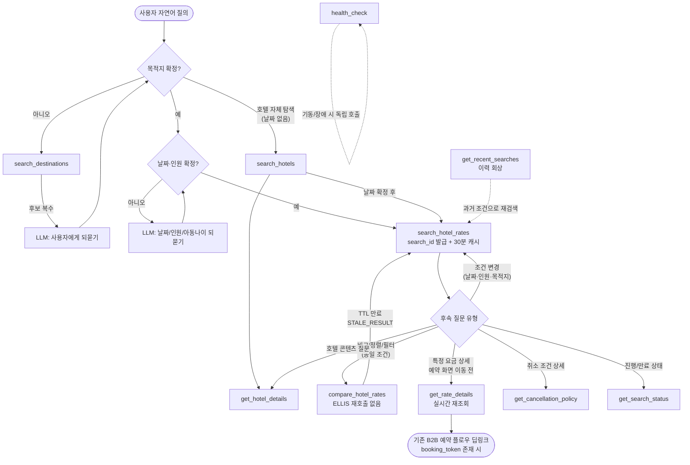

# ellis-mcp Tool 설계서 (MCP Tool Design Specification)

> **문서 상태**: DRAFT v0.1
> **작성일**: 2026-07-10
> **상위 문서**: [`docs/architecture/ellis-mcp-llm-search.md`](../architecture/ellis-mcp-llm-search.md)
> **범위**: MCP Server(`ellis-mcp`)가 제공하는 **조회 전용 10개 Tool**의 상세 설계 — 예약/결제/쓰기 도구는 존재하지 않음(구조적 차단)

---

## 목차

1. [공통 규약](#1-공통-규약)
2. [Tool 상세 설계 (10종)](#2-tool-상세-설계)
   - [2.1 search_destinations](#21-search_destinations)
   - [2.2 search_hotels](#22-search_hotels)
   - [2.3 get_hotel_details](#23-get_hotel_details)
   - [2.4 search_hotel_rates](#24-search_hotel_rates)
   - [2.5 compare_hotel_rates](#25-compare_hotel_rates)
   - [2.6 get_rate_details](#26-get_rate_details)
   - [2.7 get_cancellation_policy](#27-get_cancellation_policy)
   - [2.8 get_search_status](#28-get_search_status)
   - [2.9 get_recent_searches](#29-get_recent_searches)
   - [2.10 health_check](#210-health_check)
3. [rooms 배열 구조](#3-rooms-배열-구조)
4. [availability · booking_token 의미 정의](#4-availability--booking_token-의미-정의)
5. [Tool 간 호출 순서](#5-tool-간-호출-순서)
6. [결과 상한 · 페이징 정책](#6-결과-상한--페이징-정책)
7. [get_search_status / get_recent_searches 데이터 소스](#7-get_search_status--get_recent_searches-데이터-소스)

---

## 1. 공통 규약

### 1.1 Tool 목록 요약

| # | Tool 이름 | 한 줄 설명 | ELLIS 호출 | 데이터 소스 |
|---|-----------|-----------|:---:|------|
| 1 | `search_destinations` | 자연어 지역/랜드마크명 → 목적지 코드 후보 | O | Search API |
| 2 | `search_hotels` | 목적지/이름 기반 호텔 목록 검색 (요금 미포함) | O | Search + Content API |
| 3 | `get_hotel_details` | 호텔 1건 상세 콘텐츠 조회 | O | Content API |
| 4 | `search_hotel_rates` | 날짜·인원·필터 기반 실시간 요금 검색 (핵심 도구) | O | Search + Rate API |
| 5 | `compare_hotel_rates` | 직전 검색 결과(캐시) 기반 정렬·비교 | X | Conversation Store |
| 6 | `get_rate_details` | 단일 요금의 상세 내역(1박별 금액·세금) 재조회 | O | Rate API |
| 7 | `get_cancellation_policy` | 단일 요금의 취소 정책 전문 조회 | O | Rate API |
| 8 | `get_search_status` | 진행 중/완료된 검색의 상태 조회 | X | Conversation Store |
| 9 | `get_recent_searches` | 본인 최근 검색 이력 조회 | X | Audit Log(search_history) |
| 10 | `health_check` | ellis-mcp 및 하위 시스템 상태 점검 | O(경량) | Gateway ping |

### 1.2 공통 컨텍스트 주입 (agent_id)

모든 Tool의 입력 스키마에는 `agent_id`(셀러/에이전트 식별자)가 **문서화 목적상 존재**하지만, MCP Server는 **사용자·LLM이 전달한 값을 신뢰하지 않고 무조건 세션(서명된 내부 컨텍스트)의 값으로 덮어쓴다.** 프롬프트 인젝션으로 타 셀러의 조건·가격을 조회하는 것을 구조적으로 차단하기 위함이다. `market`, `currency` 기본값, 마크업 룰 역시 세션 컨텍스트에서 확정된다.

```
LLM이 agent_id="OTHER_AGENT" 전달 → MCP가 세션의 agent_id="AGT-KR-0042"로 강제 치환 + 감사 로그 기록
```

### 1.3 공통 오류 응답 형식

모든 Tool은 실패 시 아래 표준 구조를 반환한다. 오류를 은폐하거나 빈 결과를 임의로 채우지 않는다.

```json
{
  "error": {
    "code": "ELLIS_TIMEOUT",
    "message": "Rate API did not respond within 8000ms",
    "retryable": true,
    "trace_id": "trc_01J9X2K8FQ3W",
    "occurred_at": "2026-07-10T09:15:22Z"
  }
}
```

**표준 에러 코드 (전 Tool 공통 풀)**

| 코드 | 의미 | retryable |
|------|------|:---:|
| `INVALID_QUERY` | 입력 스키마/Validation 위반 (과거 날짜, 인원 초과 등) | X |
| `UNAUTHORIZED` | 세션 토큰 만료/부재 | X |
| `FORBIDDEN` | 역할(RBAC)상 허용되지 않은 호출·필드 접근 | X |
| `NO_RESULTS` | 조건에 맞는 결과 0건 (정상 흐름 — LLM이 대안 제안) | X |
| `RATE_LIMITED` | 셀러별 분당 호출 한도 초과 | O(대기 후) |
| `ELLIS_TIMEOUT` | ELLIS 응답 지연 (1회 재시도 후에도 실패) | O |
| `ELLIS_ERROR` | ELLIS 5xx (서킷브레이커: 연속 5회 → 60s 오픈) | O |
| `SUPPLIER_PARTIAL_FAILURE` | 일부 공급사 응답 실패 — 부분 결과 반환 + warnings 명시 | O |
| `STALE_RESULT` | 캐시된 검색 결과 TTL(30분) 만료 — 재검색 필요 | X(재검색) |
| `VALIDATION_BLOCKED` | Response Validator가 숫자 불일치로 응답 차단 (Orchestrator 계층) | X |
| `LLM_UNAVAILABLE` | LLM API 장애 (Orchestrator 계층 — MCP는 직접 반환하지 않음) | O |
| `INTERNAL_ERROR` | 그 외 내부 오류 | O |

### 1.4 RBAC 역할과 필드 마스킹

| 역할 | 설명 | `net_price`/`markup` 노출 |
|------|------|:---:|
| `AGENT_USER` | 셀러(고객사) 소속 사용자 | **X — `selling_price`만** (응답 직렬화 시 필드 자체 제거) |
| `INTERNAL_SALES` | 오마이호텔 내부 영업 | O |
| `INTERNAL_OPS` | 내부 운영/CS | O |
| `SECURITY_ADMIN` | 보안 관리자 (감사 목적 조회) | O |
| `SYSTEM_ADMIN` | 시스템 관리자 | O |

마스킹은 **MCP Server 응답 직렬화 단계**에서 수행한다. LLM 프롬프트에도 마스킹된 결과만 전달되므로 LLM이 Net 원가를 알 수 없다.

### 1.5 공통 Validation 규칙 (날짜·인원)

날짜/인원을 받는 모든 Tool(`search_hotel_rates`, `get_rate_details`, `get_cancellation_policy` 재조회 시)에 공통 적용한다.

| # | 규칙 | 위반 시 |
|---|------|---------|
| V1 | 날짜는 `YYYY-MM-DD` (ISO 8601, 서버 기준 타임존은 셀러 마켓 타임존 [가정]) | `INVALID_QUERY` |
| V2 | `check_in` ≥ 오늘 (과거 날짜 금지) | `INVALID_QUERY` |
| V3 | `check_out` > `check_in` (최소 1박) | `INVALID_QUERY` |
| V4 | 총 숙박일수 ≤ 30박 [가정] | `INVALID_QUERY` |
| V5 | `check_in` ≤ 오늘+365일 [가정: ELLIS 선판매 캘린더 1년] | `INVALID_QUERY` |
| V6 | 객실당 `adults` 1~4 | `INVALID_QUERY` |
| V7 | 객실당 `children` 0~3 | `INVALID_QUERY` |
| V8 | `children_ages[]` 각 원소 0~17 (정수) | `INVALID_QUERY` |
| V9 | `children` 수 == `children_ages[]` 길이 (children ≥ 1인 경우 `children_ages` 필수) | `INVALID_QUERY` |
| V10 | `rooms` 배열 길이 1~5 [가정] | `INVALID_QUERY` |
| V11 | `result_limit` 상한 초과 시 오류가 아닌 **상한값으로 절삭 + warnings 기재** | warnings |
| V12 | 통화 코드는 ISO 4217 3자리, 국가 코드는 ISO 3166-1 alpha-2 | `INVALID_QUERY` |

### 1.6 Timeout 계층 (공통 기준)

| 계층 | 기준 |
|------|------|
| Gateway → ELLIS 단일 API 호출 | **8s** (1회 재시도) |
| MCP Tool 실행 전체 | **15s** (ELLIS 호출형) / **3s** (캐시·로그 조회형) |
| 채팅 턴 전체 (Orchestrator) | 60s |

### 1.7 Cache 정책 요약

| 대상 | TTL | 비고 |
|------|-----|------|
| 목적지 코드 (`search_destinations`) | **24h** | 변동 거의 없음 |
| 호텔 콘텐츠 (`search_hotels` 목록, `get_hotel_details`) | **6h** | |
| 요금·재고·취소정책 (`search_hotel_rates`, `get_rate_details`, `get_cancellation_policy`) | **캐시 금지** | 항상 ELLIS 실조회 |
| 검색 결과셋 (Conversation Store, `compare_hotel_rates`·`get_search_status`용) | **30분** | 비교/상태조회 한정, "조회 시점(`last_updated_at`)" 항상 표기 |
| health_check 결과 | 10s | 폭주 방지 |

---

## 2. Tool 상세 설계

---

### 2.1 search_destinations

| 항목 | 내용 |
|------|------|
| **설명** | 자연어 지역명·도시명·랜드마크명·공항코드를 ELLIS 목적지 코드(`destination_id`) 후보 목록으로 변환한다. |
| **사용 시점** | 사용자가 "마리나베이", "도쿄 신주쿠" 등 지역을 언급했으나 `destination_id`가 확정되지 않았을 때 **요금 검색보다 먼저** 호출. 후보가 복수이면 LLM이 사용자에게 되묻는다. |
| **권한(RBAC)** | 전 역할 호출 가능 (`AGENT_USER` 이상) |
| **Timeout** | ELLIS 8s / Tool 전체 10s |
| **Cache** | **적용 — TTL 24h** (query+language 키) |

**입력 JSON Schema**

```json
{
  "type": "object",
  "properties": {
    "agent_id": {
      "type": "string",
      "description": "셀러 식별자. 서버가 세션 값으로 덮어씀 — LLM/사용자 입력 무시"
    },
    "query": {
      "type": "string",
      "minLength": 1,
      "maxLength": 100,
      "description": "자연어 지역/도시/랜드마크/공항 검색어"
    },
    "language": {
      "type": "string",
      "enum": ["ko", "en", "ja"],
      "default": "ko"
    },
    "country_code": {
      "type": "string",
      "pattern": "^[A-Z]{2}$",
      "description": "결과를 특정 국가로 제한 (선택)"
    },
    "result_limit": {
      "type": "integer",
      "minimum": 1,
      "maximum": 20,
      "default": 10
    }
  },
  "required": ["query"],
  "additionalProperties": false
}
```

**출력 JSON Schema**

```json
{
  "type": "object",
  "properties": {
    "destinations": {
      "type": "array",
      "items": {
        "type": "object",
        "properties": {
          "destination_id": { "type": "string" },
          "name": { "type": "string" },
          "name_en": { "type": "string" },
          "type": { "type": "string", "enum": ["country", "city", "region", "district", "landmark", "airport"] },
          "country_code": { "type": "string" },
          "parent_destination": { "type": "string" },
          "hotel_count": { "type": "integer" },
          "latitude": { "type": "number" },
          "longitude": { "type": "number" },
          "match_score": { "type": "number", "minimum": 0, "maximum": 1 }
        },
        "required": ["destination_id", "name", "type", "country_code"]
      }
    },
    "total_count": { "type": "integer" },
    "cache_hit": { "type": "boolean" },
    "warnings": { "type": "array", "items": { "type": "string" } }
  },
  "required": ["destinations", "total_count"]
}
```

**필수값 · 선택값**

| 파라미터 | 필수 | 타입 | 기본값 | 비고 |
|----------|:---:|------|--------|------|
| `agent_id` | — | string | 세션 주입 | LLM 입력 무시·서버 덮어쓰기 |
| `query` | **필수** | string | — | 1~100자 |
| `language` | 선택 | string | `ko` | ko/en/ja |
| `country_code` | 선택 | string | — | ISO 3166-1 alpha-2 |
| `result_limit` | 선택 | integer | 10 | 상한 20 |

**Validation 규칙**

| 규칙 | 위반 시 |
|------|---------|
| `query` 공백 제거 후 1자 이상, 100자 이하 | `INVALID_QUERY` |
| `country_code` ISO alpha-2 형식 | `INVALID_QUERY` |
| `result_limit` > 20 → 20으로 절삭 | warnings |
| 결과 0건 | `NO_RESULTS` |

**오류 코드**: `INVALID_QUERY`, `UNAUTHORIZED`, `NO_RESULTS`, `RATE_LIMITED`, `ELLIS_TIMEOUT`, `ELLIS_ERROR`, `INTERNAL_ERROR`

**샘플 요청**

```json
{
  "query": "마리나베이",
  "language": "ko",
  "result_limit": 5
}
```

**샘플 응답**

```json
{
  "destinations": [
    {
      "destination_id": "SG-108801",
      "name": "마리나베이",
      "name_en": "Marina Bay",
      "type": "district",
      "country_code": "SG",
      "parent_destination": "Singapore (SG-108000)",
      "hotel_count": 42,
      "latitude": 1.2834,
      "longitude": 103.8607,
      "match_score": 0.97
    },
    {
      "destination_id": "SG-108000",
      "name": "싱가포르",
      "name_en": "Singapore",
      "type": "city",
      "country_code": "SG",
      "parent_destination": "Singapore (SG)",
      "hotel_count": 812,
      "latitude": 1.3521,
      "longitude": 103.8198,
      "match_score": 0.71
    }
  ],
  "total_count": 2,
  "cache_hit": true,
  "warnings": []
}
```

---

### 2.2 search_hotels

| 항목 | 내용 |
|------|------|
| **설명** | 목적지 코드 또는 호텔명 키워드로 호텔 목록(콘텐츠 요약)을 검색한다. **요금은 포함하지 않는다** — 요금은 `search_hotel_rates` 전담. |
| **사용 시점** | 사용자가 날짜 없이 "마리나베이에 4성급 호텔 뭐 있어?"처럼 호텔 자체를 탐색할 때, 또는 특정 호텔명을 `hotel_id`로 확정해야 할 때. |
| **권한(RBAC)** | 전 역할 호출 가능 |
| **Timeout** | ELLIS 8s / Tool 전체 15s |
| **Cache** | **적용 — TTL 6h** (콘텐츠성 데이터) |

**입력 JSON Schema**

```json
{
  "type": "object",
  "properties": {
    "agent_id": { "type": "string", "description": "서버가 세션 값으로 덮어씀" },
    "destination_id": { "type": "string" },
    "hotel_name_query": { "type": "string", "minLength": 2, "maxLength": 100 },
    "star_rating": {
      "type": "array",
      "items": { "type": "integer", "minimum": 1, "maximum": 5 },
      "description": "복수 선택 가능 (예: [4,5])"
    },
    "property_type": {
      "type": "array",
      "items": { "type": "string", "enum": ["hotel", "resort", "apartment", "hostel", "ryokan", "villa"] }
    },
    "chain_code": { "type": "string" },
    "language": { "type": "string", "enum": ["ko", "en", "ja"], "default": "ko" },
    "sort_by": {
      "type": "string",
      "enum": ["relevance", "star_rating_desc", "name_asc"],
      "default": "relevance"
    },
    "result_limit": { "type": "integer", "minimum": 1, "maximum": 50, "default": 20 },
    "offset": { "type": "integer", "minimum": 0, "default": 0 }
  },
  "anyOf": [
    { "required": ["destination_id"] },
    { "required": ["hotel_name_query"] }
  ],
  "additionalProperties": false
}
```

**출력 JSON Schema**

```json
{
  "type": "object",
  "properties": {
    "hotels": {
      "type": "array",
      "items": {
        "type": "object",
        "properties": {
          "hotel_id": { "type": "string" },
          "hotel_name": { "type": "string" },
          "hotel_name_en": { "type": "string" },
          "destination": { "type": "string" },
          "star_rating": { "type": "number" },
          "property_type": { "type": "string" },
          "chain_name": { "type": "string" },
          "address": { "type": "string" },
          "latitude": { "type": "number" },
          "longitude": { "type": "number" },
          "thumbnail_url": { "type": "string" },
          "review_score": { "type": "number" },
          "landmark_distance_km": { "type": "number" }
        },
        "required": ["hotel_id", "hotel_name", "destination", "star_rating"]
      }
    },
    "total_count": { "type": "integer" },
    "offset": { "type": "integer" },
    "has_more": { "type": "boolean" },
    "cache_hit": { "type": "boolean" },
    "warnings": { "type": "array", "items": { "type": "string" } }
  },
  "required": ["hotels", "total_count", "has_more"]
}
```

**필수값 · 선택값**

| 파라미터 | 필수 | 타입 | 기본값 | 비고 |
|----------|:---:|------|--------|------|
| `agent_id` | — | string | 세션 주입 | 서버 덮어쓰기 |
| `destination_id` | **택1 필수** | string | — | `hotel_name_query`와 둘 중 하나 |
| `hotel_name_query` | **택1 필수** | string | — | 2~100자 |
| `star_rating` | 선택 | int[] | — | 1~5 |
| `property_type` | 선택 | string[] | — | enum |
| `chain_code` | 선택 | string | — | |
| `language` | 선택 | string | `ko` | |
| `sort_by` | 선택 | string | `relevance` | |
| `result_limit` | 선택 | integer | 20 | 상한 50 |
| `offset` | 선택 | integer | 0 | 페이징 |

**Validation 규칙**

| 규칙 | 위반 시 |
|------|---------|
| `destination_id`·`hotel_name_query` 둘 다 없음 | `INVALID_QUERY` |
| `star_rating` 원소 1~5 정수 | `INVALID_QUERY` |
| `result_limit` > 50 → 50 절삭 | warnings |
| `offset` < 0 | `INVALID_QUERY` |
| 존재하지 않는 `destination_id` | `NO_RESULTS` (사유 warnings 기재) |

**오류 코드**: `INVALID_QUERY`, `UNAUTHORIZED`, `NO_RESULTS`, `RATE_LIMITED`, `ELLIS_TIMEOUT`, `ELLIS_ERROR`, `INTERNAL_ERROR`

**샘플 요청**

```json
{
  "destination_id": "SG-108801",
  "star_rating": [4, 5],
  "sort_by": "star_rating_desc",
  "result_limit": 20
}
```

**샘플 응답**

```json
{
  "hotels": [
    {
      "hotel_id": "HTL-SG-00412",
      "hotel_name": "마리나 베이 샌즈",
      "hotel_name_en": "Marina Bay Sands",
      "destination": "Marina Bay, Singapore",
      "star_rating": 5,
      "property_type": "hotel",
      "chain_name": "Marina Bay Sands",
      "address": "10 Bayfront Avenue, Singapore 018956",
      "latitude": 1.2838,
      "longitude": 103.8591,
      "thumbnail_url": "https://img.ellis.internal/htl-sg-00412/main.jpg",
      "review_score": 9.0,
      "landmark_distance_km": 0.2
    },
    {
      "hotel_id": "HTL-SG-00398",
      "hotel_name": "더 풀러턴 베이 호텔",
      "hotel_name_en": "The Fullerton Bay Hotel",
      "destination": "Marina Bay, Singapore",
      "star_rating": 5,
      "property_type": "hotel",
      "chain_name": "Fullerton Hotels",
      "address": "80 Collyer Quay, Singapore 049326",
      "latitude": 1.2836,
      "longitude": 103.8531,
      "thumbnail_url": "https://img.ellis.internal/htl-sg-00398/main.jpg",
      "review_score": 9.2,
      "landmark_distance_km": 0.6
    }
  ],
  "total_count": 17,
  "offset": 0,
  "has_more": false,
  "cache_hit": false,
  "warnings": []
}
```

---

### 2.3 get_hotel_details

| 항목 | 내용 |
|------|------|
| **설명** | 호텔 1건의 상세 콘텐츠(주소·시설·체크인/아웃 시각·객실타입 개요·유의사항·이미지)를 조회한다. 요금·재고는 포함하지 않는다. |
| **사용 시점** | 요금 검색 결과에서 특정 호텔에 대해 "이 호텔 수영장 있어?", "체크인 몇 시야?" 등 콘텐츠 질문이 나올 때. |
| **권한(RBAC)** | 전 역할 호출 가능 |
| **Timeout** | ELLIS 8s / Tool 전체 10s |
| **Cache** | **적용 — TTL 6h** (hotel_id+language 키) |

**입력 JSON Schema**

```json
{
  "type": "object",
  "properties": {
    "agent_id": { "type": "string", "description": "서버가 세션 값으로 덮어씀" },
    "hotel_id": { "type": "string", "minLength": 1 },
    "language": { "type": "string", "enum": ["ko", "en", "ja"], "default": "ko" },
    "include_images": { "type": "boolean", "default": false },
    "image_limit": { "type": "integer", "minimum": 1, "maximum": 10, "default": 5 }
  },
  "required": ["hotel_id"],
  "additionalProperties": false
}
```

**출력 JSON Schema**

```json
{
  "type": "object",
  "properties": {
    "hotel_id": { "type": "string" },
    "hotel_name": { "type": "string" },
    "hotel_name_en": { "type": "string" },
    "star_rating": { "type": "number" },
    "destination": { "type": "string" },
    "address": { "type": "string" },
    "latitude": { "type": "number" },
    "longitude": { "type": "number" },
    "phone": { "type": "string" },
    "check_in_from": { "type": "string", "description": "HH:mm" },
    "check_out_until": { "type": "string", "description": "HH:mm" },
    "description": { "type": "string" },
    "facilities": { "type": "array", "items": { "type": "string" } },
    "room_types_overview": {
      "type": "array",
      "items": {
        "type": "object",
        "properties": {
          "room_type_id": { "type": "string" },
          "room_type_name": { "type": "string" },
          "max_occupancy": { "type": "integer" },
          "bed_type": { "type": "string" }
        }
      }
    },
    "notices": { "type": "array", "items": { "type": "string" } },
    "images": { "type": "array", "items": { "type": "string" } },
    "last_updated_at": { "type": "string", "format": "date-time" },
    "warnings": { "type": "array", "items": { "type": "string" } }
  },
  "required": ["hotel_id", "hotel_name", "star_rating", "destination"]
}
```

**필수값 · 선택값**

| 파라미터 | 필수 | 타입 | 기본값 | 비고 |
|----------|:---:|------|--------|------|
| `agent_id` | — | string | 세션 주입 | 서버 덮어쓰기 |
| `hotel_id` | **필수** | string | — | |
| `language` | 선택 | string | `ko` | |
| `include_images` | 선택 | boolean | false | 토큰 절약을 위해 기본 미포함 |
| `image_limit` | 선택 | integer | 5 | 상한 10 |

**Validation 규칙**

| 규칙 | 위반 시 |
|------|---------|
| `hotel_id` 형식(`HTL-` prefix) 및 존재 여부 | `INVALID_QUERY` / `NO_RESULTS` |
| `image_limit` > 10 → 10 절삭 | warnings |
| 셀러가 판매 불가한 호텔 [가정: ELLIS 필터 적용] | `NO_RESULTS` |

**오류 코드**: `INVALID_QUERY`, `UNAUTHORIZED`, `NO_RESULTS`, `RATE_LIMITED`, `ELLIS_TIMEOUT`, `ELLIS_ERROR`, `INTERNAL_ERROR`

**샘플 요청**

```json
{
  "hotel_id": "HTL-SG-00412",
  "language": "ko",
  "include_images": false
}
```

**샘플 응답**

```json
{
  "hotel_id": "HTL-SG-00412",
  "hotel_name": "마리나 베이 샌즈",
  "hotel_name_en": "Marina Bay Sands",
  "star_rating": 5,
  "destination": "Marina Bay, Singapore",
  "address": "10 Bayfront Avenue, Singapore 018956",
  "latitude": 1.2838,
  "longitude": 103.8591,
  "phone": "+65 6688 8868",
  "check_in_from": "15:00",
  "check_out_until": "11:00",
  "description": "마리나베이 중심에 위치한 랜드마크 호텔로, 인피니티 풀과 스카이파크를 보유하고 있습니다.",
  "facilities": ["인피니티 풀", "피트니스 센터", "스파", "카지노", "레스토랑 8곳", "무료 Wi-Fi", "컨시어지"],
  "room_types_overview": [
    { "room_type_id": "RT-DLX-K", "room_type_name": "Deluxe Room, King Bed", "max_occupancy": 3, "bed_type": "King" },
    { "room_type_id": "RT-PRM-TW", "room_type_name": "Premier Room, Twin Beds", "max_occupancy": 4, "bed_type": "Twin" }
  ],
  "notices": ["2026-08-15~08-31 스카이파크 일부 구역 보수 공사 예정"],
  "images": [],
  "last_updated_at": "2026-07-10T03:00:00Z",
  "warnings": []
}
```

---

### 2.4 search_hotel_rates

| 항목 | 내용 |
|------|------|
| **설명** | 핵심 도구. 날짜·객실별 인원·국적·필터 조건으로 ELLIS 실시간 요금·재고를 검색한다. 결과에 `search_id`를 부여하고 Conversation Store에 30분 캐시하여 후속 비교(`compare_hotel_rates`)를 지원한다. **모든 금액은 ELLIS/Pricing 룰 엔진 결과 그대로 전달하며 MCP는 어떤 금액도 계산·환산·반올림하지 않는다.** |
| **사용 시점** | 목적지(또는 호텔)와 날짜·인원이 확정된 후. 예: "8/20~23 마리나베이 4성급, 성인 2명 요금 찾아줘". |
| **권한(RBAC)** | 전 역할 호출 가능. `AGENT_USER`는 응답에서 `net_price`·`markup` 필드 마스킹(제거), `include_markup` 요청 무시 |
| **Timeout** | Gateway→ELLIS 호출당 8s(1회 재시도) / Tool 전체 **15s**. 15s 내 일부 공급사 미응답 시 부분 결과 + `SUPPLIER_PARTIAL_FAILURE` warnings |
| **Cache** | **요금·재고 원본 캐시 금지.** 결과셋만 Conversation Store에 **TTL 30분** 저장(비교·상태조회 용도 한정, `last_updated_at` 필수 표기) |

**입력 JSON Schema**

```json
{
  "type": "object",
  "properties": {
    "agent_id": {
      "type": "string",
      "description": "셀러 식별자. 스키마에는 존재하나 서버가 세션 값으로 무조건 덮어씀 — 사용자/LLM 입력 불신"
    },
    "destination_id": { "type": "string", "description": "hotel_ids와 택1" },
    "hotel_ids": {
      "type": "array",
      "items": { "type": "string" },
      "minItems": 1,
      "maxItems": 20,
      "description": "특정 호텔 지정 검색. destination_id와 택1"
    },
    "check_in": { "type": "string", "format": "date", "description": "YYYY-MM-DD" },
    "check_out": { "type": "string", "format": "date", "description": "YYYY-MM-DD, check_in 초과" },
    "rooms": {
      "type": "array",
      "minItems": 1,
      "maxItems": 5,
      "items": {
        "type": "object",
        "properties": {
          "adults": { "type": "integer", "minimum": 1, "maximum": 4 },
          "children": { "type": "integer", "minimum": 0, "maximum": 3, "default": 0 },
          "children_ages": {
            "type": "array",
            "items": { "type": "integer", "minimum": 0, "maximum": 17 },
            "description": "children 수와 길이 일치 필수"
          }
        },
        "required": ["adults"]
      },
      "description": "객실별 인원 구성 — 객실마다 상이한 인원 지원"
    },
    "nationality": { "type": "string", "pattern": "^[A-Z]{2}$", "description": "투숙객 국적 (판매가능·요금 조건에 영향)" },
    "residence_country": { "type": "string", "pattern": "^[A-Z]{2}$", "description": "투숙객 거주국" },
    "currency": { "type": "string", "pattern": "^[A-Z]{3}$", "description": "미지정 시 셀러 계약 통화 (세션 컨텍스트)" },
    "meal_plan": {
      "type": "string",
      "enum": ["any", "room_only", "breakfast", "half_board", "full_board", "all_inclusive"],
      "default": "any"
    },
    "refundable_only": { "type": "boolean", "default": false },
    "max_total_price": { "type": "number", "exclusiveMinimum": 0, "description": "총액(전 객실·전 숙박) 상한" },
    "max_nightly_price": { "type": "number", "exclusiveMinimum": 0, "description": "1박 평균가 상한" },
    "star_rating": {
      "type": "array",
      "items": { "type": "integer", "minimum": 1, "maximum": 5 }
    },
    "sort_by": {
      "type": "string",
      "enum": ["price_asc", "price_desc", "star_rating_desc", "cancellation_flexibility", "recommended"],
      "default": "price_asc"
    },
    "result_limit": { "type": "integer", "minimum": 1, "maximum": 50, "default": 20, "description": "호텔 단위 상한. 호텔당 요금제는 최대 30건" },
    "include_tax": { "type": "boolean", "default": true, "description": "표시 금액에 세금 포함 여부 — 계산이 아니라 ELLIS 응답 필드 선택" },
    "include_markup": { "type": "boolean", "default": false, "description": "net/markup 분리 표시 요청. AGENT_USER는 무시됨(FORBIDDEN 아님, 마스킹)" }
  },
  "required": ["check_in", "check_out", "rooms"],
  "oneOf": [
    { "required": ["destination_id"] },
    { "required": ["hotel_ids"] }
  ],
  "additionalProperties": false
}
```

**출력 JSON Schema**

```json
{
  "type": "object",
  "properties": {
    "search_id": { "type": "string", "description": "결과셋 식별자. compare/get_search_status에서 사용, TTL 30분" },
    "search_status": { "type": "string", "enum": ["completed", "partial_failure"] },
    "expires_at": { "type": "string", "format": "date-time", "description": "결과셋 캐시 만료 시각" },
    "results": {
      "type": "array",
      "items": {
        "type": "object",
        "properties": {
          "result_id": { "type": "string", "description": "카드 인용용 ID (예: R-1)" },
          "hotel_id": { "type": "string" },
          "hotel_name": { "type": "string" },
          "destination": { "type": "string" },
          "star_rating": { "type": "number" },
          "latitude": { "type": "number" },
          "longitude": { "type": "number" },
          "room_type_id": { "type": "string" },
          "room_type_name": { "type": "string" },
          "rate_plan_id": { "type": "string" },
          "rate_plan_name": { "type": "string" },
          "supplier_id": { "type": "string" },
          "meal_plan": { "type": "string" },
          "cancellation_type": { "type": "string", "enum": ["free_cancellation", "non_refundable", "partial_penalty"] },
          "cancellation_deadline": { "type": ["string", "null"], "format": "date-time" },
          "cancellation_policy_text": { "type": "string" },
          "net_price": { "type": "number", "description": "내부 권한자만. AGENT_USER 응답에서는 필드 제거" },
          "markup": { "type": "number", "description": "내부 권한자만. AGENT_USER 응답에서는 필드 제거" },
          "selling_price": { "type": "number" },
          "tax": { "type": "number" },
          "currency": { "type": "string" },
          "total_nights": { "type": "integer" },
          "total_rooms": { "type": "integer" },
          "availability": { "type": "string", "enum": ["available", "on_request", "unavailable"] },
          "last_updated_at": { "type": "string", "format": "date-time" },
          "booking_token": { "type": ["string", "null"], "description": "존재 시 기존 B2B 예약 플로우 전달용 참조(TTL 있음). null이면 quote-only" },
          "warnings": { "type": "array", "items": { "type": "string" } }
        },
        "required": [
          "result_id", "hotel_id", "hotel_name", "destination", "star_rating",
          "room_type_id", "room_type_name", "rate_plan_id", "rate_plan_name",
          "supplier_id", "meal_plan", "cancellation_type", "selling_price", "tax",
          "currency", "total_nights", "total_rooms", "availability", "last_updated_at"
        ]
      }
    },
    "total_count": { "type": "integer" },
    "truncated": { "type": "boolean" },
    "failed_suppliers": { "type": "array", "items": { "type": "string" } },
    "warnings": { "type": "array", "items": { "type": "string" } }
  },
  "required": ["search_id", "search_status", "results", "total_count", "expires_at"]
}
```

**필수값 · 선택값**

| 파라미터 | 필수 | 타입 | 기본값 | 비고 |
|----------|:---:|------|--------|------|
| `agent_id` | — | string | 세션 주입 | **서버 강제 덮어쓰기** |
| `destination_id` | **택1 필수** | string | — | `hotel_ids`와 oneOf |
| `hotel_ids` | **택1 필수** | string[] | — | 최대 20개 |
| `check_in` | **필수** | date | — | YYYY-MM-DD, 오늘 이후 |
| `check_out` | **필수** | date | — | `check_in` 초과 |
| `rooms` | **필수** | object[] | — | 1~5개, §3 참조 |
| `nationality` | 선택 | string | 세션 마켓 기본값 [가정] | ISO alpha-2 |
| `residence_country` | 선택 | string | `nationality`와 동일 [가정] | ISO alpha-2 |
| `currency` | 선택 | string | 셀러 계약 통화 | ISO 4217 |
| `meal_plan` | 선택 | string | `any` | |
| `refundable_only` | 선택 | boolean | false | true 시 `free_cancellation`만 |
| `max_total_price` | 선택 | number | — | > 0 |
| `max_nightly_price` | 선택 | number | — | > 0 |
| `star_rating` | 선택 | int[] | — | 1~5 |
| `sort_by` | 선택 | string | `price_asc` | |
| `result_limit` | 선택 | integer | 20 | **상한 50 (호텔 단위)** |
| `include_tax` | 선택 | boolean | true | |
| `include_markup` | 선택 | boolean | false | AGENT_USER는 무시 |

**Validation 규칙** (§1.5 공통 규칙 전체 적용 + 아래 추가)

| # | 규칙 | 위반 시 |
|---|------|---------|
| R1 | `check_in`·`check_out`은 `YYYY-MM-DD` 형식 (그 외 형식·존재하지 않는 날짜 거부) | `INVALID_QUERY` |
| R2 | `check_in` 과거 날짜 금지 (오늘 포함 허용) | `INVALID_QUERY` |
| R3 | `check_out` > `check_in` | `INVALID_QUERY` |
| R4 | 객실당 `adults` 1~4 | `INVALID_QUERY` |
| R5 | 객실당 `children` 0~3 | `INVALID_QUERY` |
| R6 | `children_ages[]` 각 나이 0~17 정수 | `INVALID_QUERY` |
| R7 | `children` ≥ 1이면 `children_ages` 필수이며 **길이 == children 수** | `INVALID_QUERY` |
| R8 | `rooms` 1~5개 | `INVALID_QUERY` |
| R9 | `destination_id`와 `hotel_ids` 동시 지정 금지 / 둘 다 없음 금지 | `INVALID_QUERY` |
| R10 | `hotel_ids` 최대 20개 | `INVALID_QUERY` |
| R11 | `result_limit` > 50 → 50 절삭, 호텔당 요금제 30건 초과 → 절삭 | warnings + `truncated: true` |
| R12 | `max_total_price`·`max_nightly_price` 동시 지정 시 둘 다 적용(AND) | — |
| R13 | `currency`가 셀러 판매 허용 통화 외 [가정: ELLIS 통화 룰] | `INVALID_QUERY` |
| R14 | `refundable_only=true` && 결과 전부 non_refundable | `NO_RESULTS` |

**오류 코드**: `INVALID_QUERY`, `UNAUTHORIZED`, `FORBIDDEN`, `NO_RESULTS`, `RATE_LIMITED`, `ELLIS_TIMEOUT`, `ELLIS_ERROR`, `SUPPLIER_PARTIAL_FAILURE`, `INTERNAL_ERROR`

**샘플 요청** — "8/20~23 마리나베이, 첫 방은 성인 2명, 둘째 방은 성인 2명+아동(만 5·9세), 무료취소만, USD"

```json
{
  "destination_id": "SG-108801",
  "check_in": "2026-08-20",
  "check_out": "2026-08-23",
  "rooms": [
    { "adults": 2 },
    { "adults": 2, "children": 2, "children_ages": [5, 9] }
  ],
  "nationality": "KR",
  "residence_country": "KR",
  "currency": "USD",
  "meal_plan": "breakfast",
  "refundable_only": true,
  "star_rating": [4, 5],
  "sort_by": "price_asc",
  "result_limit": 20,
  "include_tax": true
}
```

**샘플 응답** (AGENT_USER 시점 — `net_price`·`markup` 마스킹됨)

```json
{
  "search_id": "srch_01J9X2M4TQ8B",
  "search_status": "completed",
  "expires_at": "2026-07-10T09:45:22Z",
  "results": [
    {
      "result_id": "R-1",
      "hotel_id": "HTL-SG-00377",
      "hotel_name": "팬 퍼시픽 싱가포르",
      "destination": "Marina Bay, Singapore",
      "star_rating": 5,
      "latitude": 1.2915,
      "longitude": 103.8610,
      "room_type_id": "RT-DLX-K",
      "room_type_name": "Deluxe Room, King Bed",
      "rate_plan_id": "RP-BRK-FLEX-01",
      "rate_plan_name": "Flexible - Breakfast Included",
      "supplier_id": "SUP-ELLIS-DIRECT",
      "meal_plan": "breakfast",
      "cancellation_type": "free_cancellation",
      "cancellation_deadline": "2026-08-17T14:59:00Z",
      "cancellation_policy_text": "2026-08-17 23:59 (호텔 현지시간) 이전 무료 취소, 이후 1박 요금 부과",
      "selling_price": 1824.00,
      "tax": 168.30,
      "currency": "USD",
      "total_nights": 3,
      "total_rooms": 2,
      "availability": "available",
      "last_updated_at": "2026-07-10T09:15:20Z",
      "booking_token": "bkt_v1_eyJyIjoiUlAtQlJLLUZMRVgtMDEi...",
      "warnings": []
    },
    {
      "result_id": "R-2",
      "hotel_id": "HTL-SG-00412",
      "hotel_name": "마리나 베이 샌즈",
      "destination": "Marina Bay, Singapore",
      "star_rating": 5,
      "latitude": 1.2838,
      "longitude": 103.8591,
      "room_type_id": "RT-PRM-TW",
      "room_type_name": "Premier Room, Twin Beds",
      "rate_plan_id": "RP-BRK-FLEX-07",
      "rate_plan_name": "Bed & Breakfast Flexible",
      "supplier_id": "SUP-GTA-02",
      "meal_plan": "breakfast",
      "cancellation_type": "free_cancellation",
      "cancellation_deadline": "2026-08-13T14:59:00Z",
      "cancellation_policy_text": "2026-08-13 23:59 (호텔 현지시간) 이전 무료 취소, 이후 전액 위약금",
      "selling_price": 2685.00,
      "tax": 247.80,
      "currency": "USD",
      "total_nights": 3,
      "total_rooms": 2,
      "availability": "on_request",
      "last_updated_at": "2026-07-10T09:15:21Z",
      "booking_token": null,
      "warnings": ["on_request 요금 — 재고 확정에 공급사 확인 필요, 참고용"]
    }
  ],
  "total_count": 2,
  "truncated": false,
  "failed_suppliers": [],
  "warnings": []
}
```

> `INTERNAL_SALES` 이상 역할의 동일 응답에는 각 result에 `"net_price": 1650.00, "markup": 174.00` 형태의 필드가 추가된다.

---

### 2.5 compare_hotel_rates

| 항목 | 내용 |
|------|------|
| **설명** | 직전 `search_hotel_rates` 결과셋(Conversation Store 캐시)을 **ELLIS 재호출 없이** 지정 기준으로 정렬·필터·비교한다. LLM이 비교 서술 시 임의 데이터를 생성할 여지를 차단하는 도구. |
| **사용 시점** | "그중 제일 싼 곳이랑 취소조건 좋은 곳 비교해줘", "조식 포함만 다시 보여줘" 등 **직전 결과에 대한 후속 질문**. 재검색이 필요한 조건 변경(날짜·인원 변경)에는 사용 금지 — `search_hotel_rates` 재호출. |
| **권한(RBAC)** | 전 역할. 단 **본인 세션의 search_id만** 접근 가능(타 세션 ID는 `FORBIDDEN`). `AGENT_USER`는 net/markup 마스킹 유지 |
| **Timeout** | Tool 전체 **3s** (ELLIS 미호출, 캐시 전용) |
| **Cache** | Conversation Store 읽기 전용. 결과셋 TTL 30분 — 만료 시 `STALE_RESULT` |

**입력 JSON Schema**

```json
{
  "type": "object",
  "properties": {
    "agent_id": { "type": "string", "description": "서버가 세션 값으로 덮어씀" },
    "search_id": { "type": "string" },
    "criteria": {
      "type": "string",
      "enum": ["price", "cancellation_flexibility", "meal_plan", "star_rating", "availability"],
      "description": "비교 기준"
    },
    "result_ids": {
      "type": "array",
      "items": { "type": "string" },
      "minItems": 2,
      "maxItems": 10,
      "description": "비교 대상 한정 (예: [\"R-1\",\"R-4\"]). 생략 시 전체 결과 대상"
    },
    "filters": {
      "type": "object",
      "properties": {
        "refundable_only": { "type": "boolean" },
        "meal_plan": { "type": "string" },
        "max_total_price": { "type": "number", "exclusiveMinimum": 0 }
      },
      "additionalProperties": false
    },
    "top_n": { "type": "integer", "minimum": 1, "maximum": 10, "default": 5 }
  },
  "required": ["search_id", "criteria"],
  "additionalProperties": false
}
```

**출력 JSON Schema**

```json
{
  "type": "object",
  "properties": {
    "search_id": { "type": "string" },
    "criteria": { "type": "string" },
    "compared_at": { "type": "string", "format": "date-time" },
    "source_last_updated_at": { "type": "string", "format": "date-time", "description": "원 검색의 조회 시점 — UI에 '조회 시점' 필수 표기" },
    "comparison": {
      "type": "array",
      "items": {
        "type": "object",
        "properties": {
          "rank": { "type": "integer" },
          "result_id": { "type": "string" },
          "hotel_name": { "type": "string" },
          "room_type_name": { "type": "string" },
          "rate_plan_name": { "type": "string" },
          "selling_price": { "type": "number" },
          "currency": { "type": "string" },
          "meal_plan": { "type": "string" },
          "cancellation_type": { "type": "string" },
          "cancellation_deadline": { "type": ["string", "null"] },
          "availability": { "type": "string" },
          "booking_token_present": { "type": "boolean" },
          "highlight": { "type": "string", "description": "기준 대비 특이점 (예: '최저가', '취소 마감 가장 늦음')" }
        },
        "required": ["rank", "result_id", "hotel_name", "selling_price", "currency", "cancellation_type", "availability"]
      }
    },
    "excluded_count": { "type": "integer", "description": "필터로 제외된 건수" },
    "warnings": { "type": "array", "items": { "type": "string" } }
  },
  "required": ["search_id", "criteria", "comparison", "source_last_updated_at"]
}
```

**필수값 · 선택값**

| 파라미터 | 필수 | 타입 | 기본값 | 비고 |
|----------|:---:|------|--------|------|
| `agent_id` | — | string | 세션 주입 | 서버 덮어쓰기 |
| `search_id` | **필수** | string | — | 본인 세션 것만 |
| `criteria` | **필수** | string | — | enum |
| `result_ids` | 선택 | string[] | 전체 | 2~10개 |
| `filters` | 선택 | object | — | |
| `top_n` | 선택 | integer | 5 | 상한 10 |

**Validation 규칙**

| 규칙 | 위반 시 |
|------|---------|
| `search_id` 존재 + 본인 세션 소유 | `NO_RESULTS` / `FORBIDDEN` |
| 결과셋 TTL(30분) 만료 | `STALE_RESULT` (LLM은 재검색 제안) |
| `result_ids` 중 결과셋에 없는 ID | `INVALID_QUERY` (없는 ID 목록 명시) |
| `result_ids` 지정 시 2개 이상 | `INVALID_QUERY` |
| `top_n` > 10 → 10 절삭 | warnings |
| 필터 적용 후 0건 | `NO_RESULTS` |

**오류 코드**: `INVALID_QUERY`, `UNAUTHORIZED`, `FORBIDDEN`, `NO_RESULTS`, `STALE_RESULT`, `RATE_LIMITED`, `INTERNAL_ERROR`

**샘플 요청**

```json
{
  "search_id": "srch_01J9X2M4TQ8B",
  "criteria": "cancellation_flexibility",
  "result_ids": ["R-1", "R-2"],
  "top_n": 2
}
```

**샘플 응답**

```json
{
  "search_id": "srch_01J9X2M4TQ8B",
  "criteria": "cancellation_flexibility",
  "compared_at": "2026-07-10T09:18:40Z",
  "source_last_updated_at": "2026-07-10T09:15:21Z",
  "comparison": [
    {
      "rank": 1,
      "result_id": "R-1",
      "hotel_name": "팬 퍼시픽 싱가포르",
      "room_type_name": "Deluxe Room, King Bed",
      "rate_plan_name": "Flexible - Breakfast Included",
      "selling_price": 1824.00,
      "currency": "USD",
      "meal_plan": "breakfast",
      "cancellation_type": "free_cancellation",
      "cancellation_deadline": "2026-08-17T14:59:00Z",
      "availability": "available",
      "booking_token_present": true,
      "highlight": "취소 마감 가장 늦음 (체크인 3일 전) + 최저가"
    },
    {
      "rank": 2,
      "result_id": "R-2",
      "hotel_name": "마리나 베이 샌즈",
      "room_type_name": "Premier Room, Twin Beds",
      "rate_plan_name": "Bed & Breakfast Flexible",
      "selling_price": 2685.00,
      "currency": "USD",
      "meal_plan": "breakfast",
      "cancellation_type": "free_cancellation",
      "cancellation_deadline": "2026-08-13T14:59:00Z",
      "availability": "on_request",
      "booking_token_present": false,
      "highlight": "취소 마감 7일 전 · on_request(참고용)"
    }
  ],
  "excluded_count": 0,
  "warnings": ["비교 데이터는 2026-07-10T09:15:21Z 조회 시점 기준 — 실시간 재고·요금 보장 아님"]
}
```

---

### 2.6 get_rate_details

| 항목 | 내용 |
|------|------|
| **설명** | 캐시 결과의 단일 요금(`result_id`)에 대해 ELLIS Rate API를 **실시간 재조회**하여 1박별 금액·세금/수수료 내역·`booking_token` 갱신값을 반환한다. 예약 화면 딥링크 직전 최신화 용도. |
| **사용 시점** | 사용자가 특정 요금을 골라 "이걸로 자세히 보여줘 / 예약 화면으로 갈게" 할 때. 캐시가 30분 이내라도 **금액 확정 안내 전에는 이 도구로 재확인**한다. |
| **권한(RBAC)** | 전 역할. 본인 세션 `search_id` 한정. `AGENT_USER`는 `net_price`·`markup`·`nightly_breakdown[].net` 마스킹 |
| **Timeout** | ELLIS 8s / Tool 전체 15s |
| **Cache** | **캐시 금지** — 항상 ELLIS 실조회. 조회 결과로 Conversation Store의 해당 result만 갱신 |

**입력 JSON Schema**

```json
{
  "type": "object",
  "properties": {
    "agent_id": { "type": "string", "description": "서버가 세션 값으로 덮어씀" },
    "search_id": { "type": "string" },
    "result_id": { "type": "string", "description": "search_hotel_rates 결과의 result_id (예: R-1)" }
  },
  "required": ["search_id", "result_id"],
  "additionalProperties": false
}
```

**출력 JSON Schema**

```json
{
  "type": "object",
  "properties": {
    "search_id": { "type": "string" },
    "result_id": { "type": "string" },
    "hotel_id": { "type": "string" },
    "hotel_name": { "type": "string" },
    "room_type_id": { "type": "string" },
    "room_type_name": { "type": "string" },
    "rate_plan_id": { "type": "string" },
    "rate_plan_name": { "type": "string" },
    "supplier_id": { "type": "string" },
    "meal_plan": { "type": "string" },
    "check_in": { "type": "string", "format": "date" },
    "check_out": { "type": "string", "format": "date" },
    "rooms": { "type": "array", "items": { "type": "object" } },
    "nightly_breakdown": {
      "type": "array",
      "items": {
        "type": "object",
        "properties": {
          "date": { "type": "string", "format": "date" },
          "selling_price": { "type": "number" },
          "net": { "type": "number", "description": "내부 권한자만" }
        },
        "required": ["date", "selling_price"]
      }
    },
    "fees": {
      "type": "array",
      "items": {
        "type": "object",
        "properties": {
          "name": { "type": "string" },
          "amount": { "type": "number" },
          "included_in_selling_price": { "type": "boolean" },
          "payable_at": { "type": "string", "enum": ["prepaid", "at_property"] }
        }
      }
    },
    "net_price": { "type": "number", "description": "내부 권한자만" },
    "markup": { "type": "number", "description": "내부 권한자만" },
    "selling_price": { "type": "number" },
    "tax": { "type": "number" },
    "currency": { "type": "string" },
    "cancellation_type": { "type": "string", "enum": ["free_cancellation", "non_refundable", "partial_penalty"] },
    "cancellation_deadline": { "type": ["string", "null"], "format": "date-time" },
    "availability": { "type": "string", "enum": ["available", "on_request", "unavailable"] },
    "booking_token": { "type": ["string", "null"] },
    "booking_token_expires_at": { "type": ["string", "null"], "format": "date-time" },
    "price_changed": { "type": "boolean", "description": "최초 검색 대비 금액 변동 여부" },
    "previous_selling_price": { "type": ["number", "null"] },
    "last_updated_at": { "type": "string", "format": "date-time" },
    "warnings": { "type": "array", "items": { "type": "string" } }
  },
  "required": ["search_id", "result_id", "hotel_id", "rate_plan_id", "selling_price", "tax", "currency", "availability", "last_updated_at", "price_changed"]
}
```

**필수값 · 선택값**

| 파라미터 | 필수 | 타입 | 기본값 | 비고 |
|----------|:---:|------|--------|------|
| `agent_id` | — | string | 세션 주입 | 서버 덮어쓰기 |
| `search_id` | **필수** | string | — | 본인 세션 것만 |
| `result_id` | **필수** | string | — | 결과셋 내 존재해야 함 |

**Validation 규칙**

| 규칙 | 위반 시 |
|------|---------|
| `search_id` 존재·본인 소유 | `NO_RESULTS` / `FORBIDDEN` |
| 결과셋 TTL 만료 (재조회 파라미터 소실) | `STALE_RESULT` |
| `result_id`가 결과셋에 없음 | `INVALID_QUERY` |
| ELLIS 재조회 결과 해당 요금 소멸 | `NO_RESULTS` (`availability: "unavailable"` 대신 명시적 안내) |
| 금액 변동 감지 시 `price_changed: true` + warnings 필수 기재 | — |

**오류 코드**: `INVALID_QUERY`, `UNAUTHORIZED`, `FORBIDDEN`, `NO_RESULTS`, `STALE_RESULT`, `RATE_LIMITED`, `ELLIS_TIMEOUT`, `ELLIS_ERROR`, `INTERNAL_ERROR`

**샘플 요청**

```json
{
  "search_id": "srch_01J9X2M4TQ8B",
  "result_id": "R-1"
}
```

**샘플 응답** (AGENT_USER — net 계열 마스킹)

```json
{
  "search_id": "srch_01J9X2M4TQ8B",
  "result_id": "R-1",
  "hotel_id": "HTL-SG-00377",
  "hotel_name": "팬 퍼시픽 싱가포르",
  "room_type_id": "RT-DLX-K",
  "room_type_name": "Deluxe Room, King Bed",
  "rate_plan_id": "RP-BRK-FLEX-01",
  "rate_plan_name": "Flexible - Breakfast Included",
  "supplier_id": "SUP-ELLIS-DIRECT",
  "meal_plan": "breakfast",
  "check_in": "2026-08-20",
  "check_out": "2026-08-23",
  "rooms": [
    { "adults": 2 },
    { "adults": 2, "children": 2, "children_ages": [5, 9] }
  ],
  "nightly_breakdown": [
    { "date": "2026-08-20", "selling_price": 640.00 },
    { "date": "2026-08-21", "selling_price": 640.00 },
    { "date": "2026-08-22", "selling_price": 544.00 }
  ],
  "fees": [
    { "name": "Service Charge 10%", "amount": 168.30, "included_in_selling_price": true, "payable_at": "prepaid" }
  ],
  "selling_price": 1824.00,
  "tax": 168.30,
  "currency": "USD",
  "cancellation_type": "free_cancellation",
  "cancellation_deadline": "2026-08-17T14:59:00Z",
  "availability": "available",
  "booking_token": "bkt_v1_eyJyIjoiUlAtQlJLLUZMRVgtMDEi...",
  "booking_token_expires_at": "2026-07-10T09:50:00Z",
  "price_changed": false,
  "previous_selling_price": null,
  "last_updated_at": "2026-07-10T09:20:05Z",
  "warnings": []
}
```

---

### 2.7 get_cancellation_policy

| 항목 | 내용 |
|------|------|
| **설명** | 단일 요금의 취소 정책 **전문(단계별 위약금 스케줄)**을 ELLIS Rate API에서 조회한다. 요약 필드(`cancellation_type`/`deadline`)보다 상세한 위약금 구간 정보를 제공. |
| **사용 시점** | "이 요금 취소하면 언제까지 무료야? 그 이후엔 얼마 물어?" 등 취소 조건 상세 질문. LLM이 취소 조건 숫자를 언급하려면 **반드시 이 도구(또는 rate 결과 필드) 값만 인용**. |
| **권한(RBAC)** | 전 역할. 본인 세션 `search_id` 한정 |
| **Timeout** | ELLIS 8s / Tool 전체 10s |
| **Cache** | **캐시 금지** — 취소 정책은 요금과 함께 변동 가능. 항상 실조회 |

**입력 JSON Schema**

```json
{
  "type": "object",
  "properties": {
    "agent_id": { "type": "string", "description": "서버가 세션 값으로 덮어씀" },
    "search_id": { "type": "string" },
    "result_id": { "type": "string" },
    "language": { "type": "string", "enum": ["ko", "en", "ja"], "default": "ko" }
  },
  "required": ["search_id", "result_id"],
  "additionalProperties": false
}
```

**출력 JSON Schema**

```json
{
  "type": "object",
  "properties": {
    "search_id": { "type": "string" },
    "result_id": { "type": "string" },
    "rate_plan_id": { "type": "string" },
    "cancellation_type": { "type": "string", "enum": ["free_cancellation", "non_refundable", "partial_penalty"] },
    "cancellation_deadline": { "type": ["string", "null"], "format": "date-time", "description": "무료 취소 마감(UTC). non_refundable이면 null" },
    "timezone_note": { "type": "string", "description": "호텔 현지시간 기준 안내 문구" },
    "penalty_schedule": {
      "type": "array",
      "items": {
        "type": "object",
        "properties": {
          "from": { "type": ["string", "null"], "format": "date-time" },
          "to": { "type": ["string", "null"], "format": "date-time" },
          "penalty_type": { "type": "string", "enum": ["none", "fixed_amount", "percentage", "nights"] },
          "penalty_amount": { "type": ["number", "null"] },
          "penalty_percent": { "type": ["number", "null"] },
          "penalty_nights": { "type": ["integer", "null"] },
          "currency": { "type": "string" },
          "description": { "type": "string" }
        },
        "required": ["penalty_type", "description"]
      }
    },
    "no_show_policy": { "type": "string" },
    "policy_text": { "type": "string", "description": "ELLIS 원문 그대로 — MCP 가공 금지" },
    "last_updated_at": { "type": "string", "format": "date-time" },
    "warnings": { "type": "array", "items": { "type": "string" } }
  },
  "required": ["search_id", "result_id", "rate_plan_id", "cancellation_type", "penalty_schedule", "policy_text", "last_updated_at"]
}
```

**필수값 · 선택값**

| 파라미터 | 필수 | 타입 | 기본값 | 비고 |
|----------|:---:|------|--------|------|
| `agent_id` | — | string | 세션 주입 | 서버 덮어쓰기 |
| `search_id` | **필수** | string | — | 본인 세션 것만 |
| `result_id` | **필수** | string | — | |
| `language` | 선택 | string | `ko` | policy_text 번역본 존재 시 |

**Validation 규칙**

| 규칙 | 위반 시 |
|------|---------|
| `search_id` 존재·본인 소유 | `NO_RESULTS` / `FORBIDDEN` |
| 결과셋 TTL 만료 | `STALE_RESULT` |
| `result_id` 결과셋에 없음 | `INVALID_QUERY` |
| `penalty_schedule` 구간이 시간순 정렬·비중첩인지 서버 검증 (ELLIS 응답 이상 시) | `ELLIS_ERROR` + warnings |

**오류 코드**: `INVALID_QUERY`, `UNAUTHORIZED`, `FORBIDDEN`, `NO_RESULTS`, `STALE_RESULT`, `RATE_LIMITED`, `ELLIS_TIMEOUT`, `ELLIS_ERROR`, `INTERNAL_ERROR`

**샘플 요청**

```json
{
  "search_id": "srch_01J9X2M4TQ8B",
  "result_id": "R-1",
  "language": "ko"
}
```

**샘플 응답**

```json
{
  "search_id": "srch_01J9X2M4TQ8B",
  "result_id": "R-1",
  "rate_plan_id": "RP-BRK-FLEX-01",
  "cancellation_type": "free_cancellation",
  "cancellation_deadline": "2026-08-17T14:59:00Z",
  "timezone_note": "호텔 현지시간(SGT, UTC+8) 2026-08-17 23:59 기준",
  "penalty_schedule": [
    {
      "from": null,
      "to": "2026-08-17T14:59:00Z",
      "penalty_type": "none",
      "penalty_amount": null,
      "penalty_percent": null,
      "penalty_nights": null,
      "currency": "USD",
      "description": "무료 취소"
    },
    {
      "from": "2026-08-17T15:00:00Z",
      "to": "2026-08-19T14:59:00Z",
      "penalty_type": "nights",
      "penalty_amount": null,
      "penalty_percent": null,
      "penalty_nights": 1,
      "currency": "USD",
      "description": "1박 요금 위약금"
    },
    {
      "from": "2026-08-19T15:00:00Z",
      "to": null,
      "penalty_type": "percentage",
      "penalty_amount": null,
      "penalty_percent": 100,
      "penalty_nights": null,
      "currency": "USD",
      "description": "전액 위약금"
    }
  ],
  "no_show_policy": "노쇼 시 전액 위약금 부과",
  "policy_text": "Free cancellation until 23:59 (hotel local time) on 17 Aug 2026. From 18 Aug 2026, a penalty of 1 night applies. From 20 Aug 2026, 100% of the total booking amount applies. No-show: 100%.",
  "last_updated_at": "2026-07-10T09:21:10Z",
  "warnings": []
}
```

---

### 2.8 get_search_status

| 항목 | 내용 |
|------|------|
| **설명** | 특정 `search_id`의 진행 상태(공급사별 수집 진행률, 부분 실패 여부, 캐시 만료 시각)를 조회한다. **ELLIS를 호출하지 않고** Conversation Store만 읽는다. |
| **사용 시점** | 검색이 오래 걸릴 때 Orchestrator/LLM이 중간 상태를 사용자에게 안내할 때, 또는 후속 질문 전에 결과셋이 아직 유효한지(만료 여부) 확인할 때. |
| **권한(RBAC)** | 전 역할. 본인 세션 `search_id` 한정 (`INTERNAL_OPS`·`SECURITY_ADMIN`·`SYSTEM_ADMIN`은 운영/감사 목적으로 타 세션 조회 가능) |
| **Timeout** | Tool 전체 **3s** (스토어 조회 전용) |
| **Cache** | 해당 없음 — Conversation Store 실시간 읽기 (자체가 캐시) |

**입력 JSON Schema**

```json
{
  "type": "object",
  "properties": {
    "agent_id": { "type": "string", "description": "서버가 세션 값으로 덮어씀" },
    "search_id": { "type": "string" }
  },
  "required": ["search_id"],
  "additionalProperties": false
}
```

**출력 JSON Schema**

```json
{
  "type": "object",
  "properties": {
    "search_id": { "type": "string" },
    "status": {
      "type": "string",
      "enum": ["pending", "in_progress", "completed", "partial_failure", "failed", "expired"]
    },
    "progress_percent": { "type": "integer", "minimum": 0, "maximum": 100 },
    "suppliers_total": { "type": "integer" },
    "suppliers_completed": { "type": "integer" },
    "failed_suppliers": { "type": "array", "items": { "type": "string" } },
    "result_count": { "type": "integer" },
    "created_at": { "type": "string", "format": "date-time" },
    "expires_at": { "type": "string", "format": "date-time" },
    "query_summary": {
      "type": "object",
      "properties": {
        "destination": { "type": "string" },
        "check_in": { "type": "string" },
        "check_out": { "type": "string" },
        "rooms_summary": { "type": "string" }
      }
    },
    "warnings": { "type": "array", "items": { "type": "string" } }
  },
  "required": ["search_id", "status", "result_count", "created_at", "expires_at"]
}
```

**필수값 · 선택값**

| 파라미터 | 필수 | 타입 | 기본값 | 비고 |
|----------|:---:|------|--------|------|
| `agent_id` | — | string | 세션 주입 | 서버 덮어쓰기 |
| `search_id` | **필수** | string | — | 본인 세션 것만 (운영 역할 예외) |

**Validation 규칙**

| 규칙 | 위반 시 |
|------|---------|
| `search_id` 형식(`srch_` prefix) | `INVALID_QUERY` |
| 존재하지 않는 `search_id` | `NO_RESULTS` |
| 타 세션 소유 + 운영 역할 아님 | `FORBIDDEN` |
| TTL 만료된 검색 | 정상 응답 (`status: "expired"`) — 오류 아님 |

**오류 코드**: `INVALID_QUERY`, `UNAUTHORIZED`, `FORBIDDEN`, `NO_RESULTS`, `RATE_LIMITED`, `INTERNAL_ERROR`

**샘플 요청**

```json
{
  "search_id": "srch_01J9X2M4TQ8B"
}
```

**샘플 응답**

```json
{
  "search_id": "srch_01J9X2M4TQ8B",
  "status": "completed",
  "progress_percent": 100,
  "suppliers_total": 4,
  "suppliers_completed": 4,
  "failed_suppliers": [],
  "result_count": 2,
  "created_at": "2026-07-10T09:15:22Z",
  "expires_at": "2026-07-10T09:45:22Z",
  "query_summary": {
    "destination": "Marina Bay, Singapore (SG-108801)",
    "check_in": "2026-08-20",
    "check_out": "2026-08-23",
    "rooms_summary": "2 rooms (2 adults / 2 adults + 2 children)"
  },
  "warnings": []
}
```

---

### 2.9 get_recent_searches

| 항목 | 내용 |
|------|------|
| **설명** | 요청 주체(셀러/사용자)의 최근 검색 이력 요약을 조회한다. **데이터 소스는 Audit Log의 `search_history` 스트림**(보존 180일)이며 ELLIS를 호출하지 않는다. §7 참조. |
| **사용 시점** | "아까 검색했던 도쿄 조건으로 다시 찾아줘", "오늘 뭐 검색했었지?" 등 이력 기반 재검색·회상. 반환된 조건으로 `search_hotel_rates`를 재호출한다(과거 결과 재사용 아님 — 요금 캐시 금지 원칙). |
| **권한(RBAC)** | `AGENT_USER`: **본인 user_id 이력만**. `INTERNAL_SALES`/`INTERNAL_OPS`: 담당 셀러 범위 [가정]. `SECURITY_ADMIN`/`SYSTEM_ADMIN`: 감사 목적 전체 (사유 로깅) |
| **Timeout** | Tool 전체 **3s** (로그 인덱스 조회) |
| **Cache** | 미적용 (짧은 응답, 최신성 우선) |

**입력 JSON Schema**

```json
{
  "type": "object",
  "properties": {
    "agent_id": { "type": "string", "description": "서버가 세션 값으로 덮어씀" },
    "from_date": { "type": "string", "format": "date", "description": "조회 시작일 (기본: 7일 전)" },
    "to_date": { "type": "string", "format": "date", "description": "조회 종료일 (기본: 오늘)" },
    "destination_filter": { "type": "string", "description": "목적지명 부분일치 필터" },
    "limit": { "type": "integer", "minimum": 1, "maximum": 20, "default": 10 }
  },
  "additionalProperties": false
}
```

**출력 JSON Schema**

```json
{
  "type": "object",
  "properties": {
    "searches": {
      "type": "array",
      "items": {
        "type": "object",
        "properties": {
          "search_id": { "type": "string" },
          "searched_at": { "type": "string", "format": "date-time" },
          "destination": { "type": "string" },
          "destination_id": { "type": "string" },
          "check_in": { "type": "string", "format": "date" },
          "check_out": { "type": "string", "format": "date" },
          "rooms": { "type": "array", "items": { "type": "object" } },
          "filters_summary": { "type": "string" },
          "result_count": { "type": "integer" },
          "status": { "type": "string", "enum": ["completed", "partial_failure", "failed", "no_results"] },
          "result_set_available": { "type": "boolean", "description": "30분 캐시가 아직 유효한지 (true면 compare 가능)" }
        },
        "required": ["search_id", "searched_at", "destination", "check_in", "check_out", "result_count", "status", "result_set_available"]
      }
    },
    "total_count": { "type": "integer" },
    "warnings": { "type": "array", "items": { "type": "string" } }
  },
  "required": ["searches", "total_count"]
}
```

**필수값 · 선택값**

| 파라미터 | 필수 | 타입 | 기본값 | 비고 |
|----------|:---:|------|--------|------|
| `agent_id` | — | string | 세션 주입 | 서버 덮어쓰기 |
| `from_date` | 선택 | date | 오늘−7일 | |
| `to_date` | 선택 | date | 오늘 | |
| `destination_filter` | 선택 | string | — | 부분일치 |
| `limit` | 선택 | integer | 10 | 상한 20 |

**Validation 규칙**

| 규칙 | 위반 시 |
|------|---------|
| `from_date` ≤ `to_date` | `INVALID_QUERY` |
| 조회 기간 ≤ 180일 (로그 보존 한도) | `INVALID_QUERY` |
| `to_date` 미래 날짜 → 오늘로 절삭 | warnings |
| `limit` > 20 → 20 절삭 | warnings |
| 이력 0건 | `NO_RESULTS` |

**오류 코드**: `INVALID_QUERY`, `UNAUTHORIZED`, `FORBIDDEN`, `NO_RESULTS`, `RATE_LIMITED`, `INTERNAL_ERROR`

**샘플 요청**

```json
{
  "from_date": "2026-07-08",
  "to_date": "2026-07-10",
  "limit": 5
}
```

**샘플 응답**

```json
{
  "searches": [
    {
      "search_id": "srch_01J9X2M4TQ8B",
      "searched_at": "2026-07-10T09:15:22Z",
      "destination": "Marina Bay, Singapore",
      "destination_id": "SG-108801",
      "check_in": "2026-08-20",
      "check_out": "2026-08-23",
      "rooms": [
        { "adults": 2 },
        { "adults": 2, "children": 2, "children_ages": [5, 9] }
      ],
      "filters_summary": "4-5성, 조식 포함, 무료취소, USD",
      "result_count": 2,
      "status": "completed",
      "result_set_available": true
    },
    {
      "search_id": "srch_01J9V8HW2N4C",
      "searched_at": "2026-07-09T02:40:11Z",
      "destination": "Shinjuku, Tokyo",
      "destination_id": "JP-102911",
      "check_in": "2026-09-05",
      "check_out": "2026-09-08",
      "rooms": [
        { "adults": 2 }
      ],
      "filters_summary": "3-4성, 제한 없음, JPY",
      "result_count": 18,
      "status": "completed",
      "result_set_available": false
    }
  ],
  "total_count": 2,
  "warnings": []
}
```

---

### 2.10 health_check

| 항목 | 내용 |
|------|------|
| **설명** | ellis-mcp 자체 및 하위 의존 시스템(Search Gateway, ELLIS Search/Content/Rate, Conversation Store)의 가용 상태를 점검한다. Gateway 경유 경량 ping만 수행. |
| **사용 시점** | Orchestrator의 기동/주기 점검, 장애 의심 시 운영자 확인, LLM이 연속 오류 후 "시스템 상태를 확인해볼게요" 흐름. 모니터링 시스템의 liveness/readiness 프로브 겸용. |
| **권한(RBAC)** | 기본(`verbose: false`) 상태값: 전 역할. **`verbose: true`(컴포넌트별 지연·서킷브레이커 상태)는 `INTERNAL_OPS`·`SECURITY_ADMIN`·`SYSTEM_ADMIN` 한정** — 그 외 역할이 요청 시 `FORBIDDEN` 없이 기본 응답으로 강등 + warnings |
| **Timeout** | 컴포넌트별 ping 2s / Tool 전체 **5s** |
| **Cache** | **적용 — TTL 10s** (점검 폭주 방지) |

**입력 JSON Schema**

```json
{
  "type": "object",
  "properties": {
    "agent_id": { "type": "string", "description": "서버가 세션 값으로 덮어씀" },
    "components": {
      "type": "array",
      "items": {
        "type": "string",
        "enum": ["gateway", "ellis_search", "ellis_content", "ellis_rate", "conversation_store"]
      },
      "description": "생략 시 전체 점검"
    },
    "verbose": { "type": "boolean", "default": false, "description": "상세 지표 — INTERNAL_OPS 이상" }
  },
  "additionalProperties": false
}
```

**출력 JSON Schema**

```json
{
  "type": "object",
  "properties": {
    "status": { "type": "string", "enum": ["healthy", "degraded", "unhealthy"] },
    "checked_at": { "type": "string", "format": "date-time" },
    "cache_hit": { "type": "boolean" },
    "components": {
      "type": "array",
      "items": {
        "type": "object",
        "properties": {
          "name": { "type": "string" },
          "status": { "type": "string", "enum": ["up", "degraded", "down"] },
          "latency_ms": { "type": ["integer", "null"], "description": "verbose 전용" },
          "circuit_breaker": { "type": ["string", "null"], "enum": ["closed", "open", "half_open", null], "description": "verbose 전용" },
          "message": { "type": ["string", "null"] }
        },
        "required": ["name", "status"]
      }
    },
    "warnings": { "type": "array", "items": { "type": "string" } }
  },
  "required": ["status", "checked_at", "components"]
}
```

**필수값 · 선택값**

| 파라미터 | 필수 | 타입 | 기본값 | 비고 |
|----------|:---:|------|--------|------|
| `agent_id` | — | string | 세션 주입 | 서버 덮어쓰기 |
| `components` | 선택 | string[] | 전체 | enum 외 값 거부 |
| `verbose` | 선택 | boolean | false | 권한 미달 시 강등 |

**Validation 규칙**

| 규칙 | 위반 시 |
|------|---------|
| `components` 원소가 enum 외 값 | `INVALID_QUERY` |
| `verbose: true` + 권한 미달 | 기본 응답으로 강등 + warnings (오류 아님) |

**오류 코드**: `INVALID_QUERY`, `UNAUTHORIZED`, `RATE_LIMITED`, `INTERNAL_ERROR` (하위 시스템 다운은 오류가 아니라 `status`로 표현)

**샘플 요청** (INTERNAL_OPS)

```json
{
  "verbose": true
}
```

**샘플 응답**

```json
{
  "status": "degraded",
  "checked_at": "2026-07-10T09:30:00Z",
  "cache_hit": false,
  "components": [
    { "name": "gateway", "status": "up", "latency_ms": 12, "circuit_breaker": "closed", "message": null },
    { "name": "ellis_search", "status": "up", "latency_ms": 210, "circuit_breaker": "closed", "message": null },
    { "name": "ellis_content", "status": "up", "latency_ms": 180, "circuit_breaker": "closed", "message": null },
    { "name": "ellis_rate", "status": "degraded", "latency_ms": 4200, "circuit_breaker": "half_open", "message": "P95 latency elevated since 09:10Z" },
    { "name": "conversation_store", "status": "up", "latency_ms": 3, "circuit_breaker": "closed", "message": null }
  ],
  "warnings": ["ellis_rate 응답 지연 — 요금 검색이 평소보다 느릴 수 있음"]
}
```

---

## 3. rooms 배열 구조

`search_hotel_rates`(및 `get_rate_details` 응답 echo)의 `rooms`는 **객실별로 상이한 인원 구성**을 지원하는 배열이다. 사용자 제공 표준 형태는 다음과 같다(그대로 준수).

```
rooms: [{ adults, children, children_ages[] }]
```

| 필드 | 타입 | 범위 | 필수 | 설명 |
|------|------|------|:---:|------|
| `adults` | integer | **1~4** | 필수 | 객실당 성인 수 |
| `children` | integer | **0~3** | 선택(기본 0) | 객실당 아동 수 |
| `children_ages` | integer[] | 각 원소 **0~17** | children ≥ 1이면 필수 | 아동 나이 목록. **길이가 `children`과 정확히 일치**해야 함 (요금은 아동 나이에 따라 달라지므로 생략·불일치 불가) |

**규칙 요약**

1. `rooms` 배열 길이 1~5 [가정] — 그 이상은 그룹 예약으로 기존 화면 안내.
2. 객실 순서는 의미를 갖는다(1번 객실, 2번 객실…). 응답의 총액은 전 객실 합산이다.
3. `children: 0`인 객실은 `children_ages`를 생략하거나 빈 배열 `[]`로 보낸다.
4. LLM은 아동 나이가 대화에 없으면 **추정하지 말고 사용자에게 되묻는다** (아키텍처 §5).

**예시 — 객실 2개, 인원 구성이 서로 다른 경우**

```json
{
  "rooms": [
    { "adults": 2 },
    { "adults": 2, "children": 2, "children_ages": [5, 9] }
  ]
}
```

**잘못된 예시와 사유**

| 입력 | 오류 | 사유 |
|------|------|------|
| `{ "adults": 5 }` | `INVALID_QUERY` | 성인 상한 4 초과 |
| `{ "adults": 2, "children": 2, "children_ages": [5] }` | `INVALID_QUERY` | children(2) ≠ children_ages 길이(1) |
| `{ "adults": 2, "children": 1, "children_ages": [18] }` | `INVALID_QUERY` | 아동 나이 상한 17 초과 (성인으로 처리해야 함) |
| `{ "children": 2, "children_ages": [3, 7] }` | `INVALID_QUERY` | adults 누락 — 객실당 성인 최소 1명 |

---

## 4. availability · booking_token 의미 정의

LLM이 **"예약 가능한 요금"과 "참고용 요금"을 혼동하지 않도록** 두 필드의 의미를 아래와 같이 확정한다. 이 정의는 시스템 프롬프트와 Response Validator 규칙에 동일하게 반영한다.

### 4.1 availability

`availability`는 **ELLIS가 `last_updated_at` 시점에 반환한 재고 상태**이며, **실시간 보장이 아니다.** 최종 확정은 항상 기존 B2B 예약 플로우에서 이루어진다.

| 값 | 의미 | LLM 표현 규칙 |
|----|------|--------------|
| `available` | 조회 시점 기준 즉시 예약 가능 재고 확인됨 | "조회 시점 기준 예약 가능" — "예약 보장"·"확정" 표현 금지 |
| `on_request` | 즉시 확정 불가. 공급사 확인 후 확정되는 재고 | 반드시 "요청 후 확정(온리퀘스트)" 명시. 즉시 예약 가능처럼 서술 금지 |
| `unavailable` | 조회 시점 기준 판매 불가(마감·중지) | 결과 카드에 노출하되 예약 유도 금지. 대안 제안 |

- 모든 요금 카드에는 `last_updated_at`(조회 시점)을 함께 표기한다.
- 결과셋 캐시(30분) 내 재질문이라도 상태는 조회 시점 기준임을 고지한다. 금액·재고 확정 안내 전에는 `get_rate_details`로 재조회한다.

### 4.2 booking_token

| 상태 | 의미 | LLM/프론트 동작 |
|------|------|----------------|
| `booking_token` 존재 | **기존 B2B 예약 플로우로 전달 가능한 예약 가능 요금 참조.** TTL이 있으며(`booking_token_expires_at`), 만료 시 `get_rate_details` 재조회로 갱신 | "예약 화면으로 이동" 딥링크 활성화. 토큰은 UI/예약 플로우 전용 — LLM 텍스트에 토큰 값 노출 금지 |
| `booking_token: null` | **quote-only(견적 참고용) 요금.** 예약 플로우로 전달 불가 | **확정 요금처럼 표현 금지.** "참고용 요금" 명시, 예약 버튼 비활성 |

- `booking_token`은 예약을 **생성하지 않는다.** 기존 Create Booking 플로우에 검색 조건·요금 참조를 이어주는 포인터일 뿐이다(조회 전용 MVP 원칙 유지).
- 토큰 TTL 만료 후 사용 시 예약 플로우가 거부하며, 챗에서는 재조회를 안내한다.
- Validator 규칙: LLM 텍스트가 `booking_token: null`인 요금에 "지금 예약 가능"류 표현을 쓰면 차단.

---

## 5. Tool 간 호출 순서



**호출 순서 원칙**

| # | 원칙 |
|---|------|
| 1 | `search_hotel_rates` 전에 `destination_id`(또는 `hotel_ids`)·날짜·객실별 인원이 확정되어야 한다. 미확정 값은 도구 호출 대신 되묻기. |
| 2 | 동일 조건 후속 질문은 `compare_hotel_rates`(캐시) 우선 — ELLIS 부하 절감 + 데이터 임의 생성 차단. |
| 3 | 조건이 하나라도 바뀌면 반드시 `search_hotel_rates` 재호출(요금 캐시 금지 원칙). |
| 4 | 예약 화면 이동 직전에는 `get_rate_details`로 금액·재고·booking_token을 최신화한다. |
| 5 | `get_recent_searches`는 조건 회상용이며, 반환된 과거 요금이 아닌 **재검색 결과**만 사용자에게 금액으로 제시한다. |

---

## 6. 결과 상한 · 페이징 정책

### 6.1 상한

| 대상 | 기본값 | 최대 상한 | 초과 시 동작 |
|------|:---:|:---:|------|
| `search_destinations` 목적지 후보 | 10 | 20 | 절삭 + warnings |
| `search_hotels` 호텔 목록 | 20 | 50 | 절삭 + warnings, `offset` 페이징 |
| `search_hotel_rates` 호텔 수 | 20 | 50 | 절삭 + `truncated: true` + warnings |
| `search_hotel_rates` 호텔당 요금제 | 정렬 상위 자동 선별 | **30** | 절삭 + warnings ("상위 30개 요금제만 표시") |
| `compare_hotel_rates` 비교 행 | 5 | 10 | 절삭 + warnings |
| `get_recent_searches` 이력 | 10 | 20 | 절삭 + warnings |
| `hotel_ids` 지정 검색 | — | 20개 | `INVALID_QUERY` |

### 6.2 정책 상세

1. **상한 초과는 오류가 아니다.** `result_limit`이 상한을 넘으면 상한값으로 절삭하고 `warnings`에 명시한다(대화 흐름 유지). 단, 필수 구조 위반(형식 오류)은 `INVALID_QUERY`.
2. **절삭 기준은 `sort_by` 정렬 순서**다. 즉 `price_asc`이면 저가 상위 N건이 유지된다. 정렬은 tie-breaker로 `hotel_id`/`rate_plan_id`를 사용해 **동일 요청은 동일 순서**를 보장한다(페이징 안정성).
3. **페이징**: `search_hotels`는 `offset` 기반(`has_more`로 다음 페이지 유무 안내). `search_hotel_rates`는 MVP에서 **페이징 미지원** — LLM 대화 특성상 "다음 20개"보다 조건 좁히기(성급·가격 상한·조식 필터)를 유도하는 것이 UX·토큰 비용 모두 우수하다. `truncated: true`이면 LLM이 "조건을 좁혀볼까요?"를 제안한다. [가정: Phase 2에서 `page_token` 방식 검토]
4. **토큰 예산 보호**: LLM 컨텍스트에 주입되는 결과는 위 상한과 별개로 Orchestrator가 카드 요약 형태로 축약할 수 있으나, 축약 시에도 금액·취소조건 숫자는 원본 그대로 유지한다(반올림 금지).
5. **레이트리밋과의 관계**: 상한 절삭은 셀러당 분당 도구호출 30회 레이트리밋(아키텍처 §6)과 독립적으로 적용된다.

---

## 7. get_search_status / get_recent_searches 데이터 소스

두 도구는 ELLIS를 호출하지 않으며, 서로 다른 저장소를 읽는다.

| 구분 | `get_search_status` | `get_recent_searches` |
|------|---------------------|----------------------|
| **데이터 소스** | **Conversation Store** (대화 상태·결과셋 캐시) | **Audit Log**의 `search_history` 스트림 |
| **저장 주체** | `search_hotel_rates` 실행 시 MCP가 결과셋+진행 메타 기록 | 도구 호출 완료 시 MCP가 요약 레코드 append (원본 결과 미포함) |
| **보존 기간** | TTL **30분** (만료 후 `status: "expired"`) | **180일** (아키텍처 §8.1) |
| **저장 내용** | 결과셋 전체, 공급사별 진행 상태, 만료 시각 | seller_id, user_id, 목적지, 날짜, rooms, 필터, result_set_id(=search_id), 결과 건수, 상태 |
| **미포함(의도적)** | — | **요금 숫자·booking_token 미저장** — 과거 요금 재제시(스테일 요금 노출) 원천 차단 |
| **접근 범위** | 본인 세션 (운영 역할 예외) | 본인 이력 (역할별 범위 §2.9) |
| **쓰기 가능 여부** | MCP 내부만. 도구로는 읽기 전용 | append-only. 도구로는 읽기 전용 |

**설계 의도**

1. **Conversation Store는 "지금 대화"를 위한 휘발성 캐시**다. `compare_hotel_rates`·`get_search_status`가 여기서 읽어 재검색 없는 후속 질문을 지원하되, 30분 TTL로 스테일 요금 사용을 제한한다.
2. **Audit Log(search_history)는 "무엇을 검색했는가"의 불변 기록**이다. 조건(입력)만 보존하고 요금(출력 숫자)은 보존하지 않으므로, `get_recent_searches`로 회상한 뒤에는 반드시 `search_hotel_rates` 재검색을 거쳐야 금액이 제시된다.
3. 두 저장소 모두 `trace_id`로 `chat_turn`/`tool_call` 로그와 상관관계를 유지하여(아키텍처 §8) 장애·품질 분석 시 전 구간 추적이 가능하다.

---

## 부록 — 본 문서의 [가정] 목록

| # | 가정 | 확인 필요 대상 |
|---|------|----------------|
| G1 | 최대 숙박 30박, 선판매 캘린더 365일 | ELLIS Rate API 스펙 |
| G2 | `rooms` 최대 5개 (초과는 그룹 예약) | 영업 정책 |
| G3 | `nationality` 미지정 시 셀러 마켓 기본값 적용 | ELLIS 룰 엔진 |
| G4 | 날짜 Validation의 "오늘" 기준 타임존 = 셀러 마켓 타임존 | 정책 확정 필요 |
| G5 | INTERNAL_SALES/OPS의 `get_recent_searches` 조회 범위 = 담당 셀러 | 보안 정책 |
| G6 | `search_hotel_rates` 페이징은 Phase 2에서 page_token 방식 검토 | 로드맵 |
| G7 | 통화 허용 목록은 셀러 계약 기준으로 ELLIS가 검증 | ELLIS 통화 룰 |
