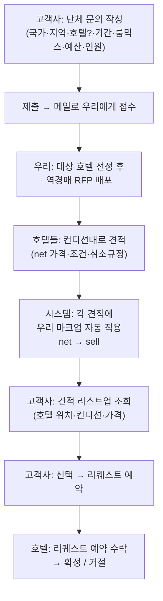

# 기능 기획 — 단체 문의 · 역경매(RFP) 소싱

> **작성일**: 2026-09-21 (갱신 2026-09-22 — SCM 1차 피드백 반영) · **트랙**: B (Marketplace 고도화) · **상태**: 🟡 **신규 기획 (프로토타입 반영 · 일부 정책 결정 대기)**
> **요청 출처**: 현업(2026-09-21) — 고객사 단체 문의를 리퀘스트 기반으로 접수 → 호텔에 역경매로 뿌려 견적 회수 → 우리 마크업 자동 적용 후 고객사에 리스트업 → 리퀘스트 예약

---

## 0. 한 줄 요약

**고객사가 마켓플레이스에서 "단체 문의"를 넣으면 → 메일로 우리에게 접수되고 → 우리가 호텔들에게 역경매(RFP)로 뿌려 견적을 회수 → 각 호텔 견적에 우리 마크업을 자동으로 얹어 고객사에 리스트업 → 고객사가 선택하면 리퀘스트 예약으로 진행**하는 기능.

- **핵심 1**: 즉시 예약이 아니라 **리퀘스트(문의) 기반**. 접수는 **메일 알림**으로 시작.
- **핵심 2**: 우리가 중간에서 일일이 처리하지 않고 **호텔들에게 역경매로 뿌린다**(호텔이 자기 컨디션에 맞춰 견적).
- **핵심 3**: 호텔 견적은 **우리 마크업 불포함일 수 있다** → 시스템이 **마크업을 자동으로 얹어** 고객 안내가 나가야 하고, 그 마크업은 **일률적으로 설정** 가능해야 한다.

---

## 1. 배경과 목적

### 1.1 문제 인식
- 단체(스포츠팀·행사·MICE 등)는 **다실·특수요건**(장소 인접·특정 룸믹스·총예산)이라 **즉시 예약 흐름에 맞지 않는다.** 기존 즉시 예약은 **5실 초과 차단**(No.12 확정), 약관 **제4조 ③ 4실 이상 = 그룹 예약(별도 요금·취소)** 이라 별도 채널이 필요하다.
- 지금은 이런 문의가 **오프라인/메일로 산발 접수**되고, 우리가 수작업으로 호텔을 물색·중개한다. 표준 접수 양식·역경매·마크업 자동화가 없다.

### 1.2 목적
- **표준 접수 양식**으로 단체 문의를 구조화(국가·지역·호텔·기간·룸믹스·예산·인원).
- **역경매 소싱** — 한 번의 문의를 다수 호텔에 뿌려 **호텔이 경쟁 견적**하게 함(우리 수작업 중개 최소화).
- **마크업 자동·일률 설정** — 호텔 net 가격에 우리 마진을 자동으로 얹어 고객 sell 가격 산출(요율·net 은닉).
- 리퀘스트 예약까지 **한 흐름**으로 연결.

### 1.3 다른 기획과의 관계
| 관계 | 내용 |
|------|------|
| 즉시 예약 5실 캡 (No.12) | 즉시 예약은 5실 초과 차단 → **초과·단체는 이 기능으로 라우팅**. 상호 보완 |
| 약관 제4조 ③ | 4실 이상 = 그룹 예약(별도 요금·취소). 단체 문의가 그 **공식 채널** |
| OP Points | 무관(리퀘스트 예약 확정 시 적립 대상 여부는 추후 — 지금 범위 밖) |

---

## 2. 사용자·역할

| 역할 | 하는 일 |
|------|---------|
| **고객사 (셀러/OP)** | 단체 문의 작성·제출 → 회수된 견적 리스트 조회 → 선택 → 리퀘스트 예약 |
| **우리 (OMH 오퍼레이션)** | 접수 메일 수신 → 대상 호텔에 RFP 배포 → 호텔 견적(net) 회수·입력 → **마크업 자동 적용** → 고객사에 리스트업 |
| **호텔 (공급사)** | RFP 수신 → 자기 컨디션대로 견적(수락/인상/인하) 회신 → 고객 선택 시 리퀘스트 예약 수락 |

---

## 3. 전체 흐름



### 상태(Status) 정의
| 상태 | 의미 |
|------|------|
| `Draft` | 작성 중 |
| `Submitted` | 제출 완료 — **접수 메일 발송** |
| `Sourcing` | 우리가 호텔에 RFP 배포 (견적 수집 중) |
| `Quoted` | 견적 회수 + 마크업 적용 + 고객 리스트업 완료 |
| `Selected` | 고객사가 특정 호텔 견적 선택 |
| `Requested` | 리퀘스트 예약 접수(호텔 응답 대기) |
| `Confirmed` / `Declined` | 호텔 수락 / 거절 |
| `Expired` / `Cancelled` | 견적 마감 경과 / 문의 취소 |

---

## 4. 문의 입력 항목

| 항목 | 필수 | 설명 | 샘플 매핑 |
|------|:---:|------|-----------|
| **목적지** | ✔ | **국가 → 지역 → (선택) 호텔.** 호텔까지 특정할 수도, **지역까지만** 지정하고 열어둘 수도 있음 | Japan → Ibaraki (호텔 미지정) |
| **기준점(앵커)** | – | 특정 장소(경기장·행사장) + **거리 제약**(예: 차량 30분 이내). 있으면 호텔을 거리로 필터/정렬 | Sakaimachi Urban Sports Park, **차량 30분 이내** |
| **기간** | ✔ | 체크인~체크아웃 / 박수 | 11/23–11/30, **7박** |
| **희망 호텔·성급** | – | 호텔 리스트 외 **희망 호텔·성급** 자유 기재 〔SCM/Aiden〕 | 역세권 · 3성↑ |
| **룸 요건** | ✔ | 룸타입 + 수량 여러 행 + **식사조건** | **Twin 5 + Single 5**, Room Only |
| **인원 / 국적** | ✔ | 총 인원 + **국적 전용란** 〔SCM②·Aiden②〕 | **15명 / 중국** |
| **단체 성격 / 담당 범위** | ✔ | 스포츠팀·기업·인센티브·MICE 등 성격 + **객실만 vs 객실+부대서비스** 〔SCM②〕 | 스포츠 대표팀 / 객실만 |
| **부대 서비스** | – | 범위=객실+부대일 때 — **세미나실·연회장·부분 조식·행사장 차량** + 상세 〔SCM②·Aiden⑤〕 | (오사카) 세미나실·부분 조식 |
| **객실 홀드 여부** | – | 견적 시 **객실 홀드 필요 여부**(호텔은 기본 홀드 안 함) 〔SCM③〕 | 홀드 필요 |
| **예산** | ✔ | **1실·1박 기준** 입력 → 총액 환산(견적 비교 기준). **날짜별 입력** 옵션(주말/성수 차등) 〔Aiden③〕 | JPY 9,100/실·박 (총 637,000) |
| **Golden Key** | ✔ | **확정에 가장 중요한 1가지** 필수 기재 〔SCM⑤〕 | 경기장 30분 + 동일 호텔 10실 |
| **비교견적 아님 동의** | ✔ | **비교견적용이 아니며 실제 예약 전제**임을 확인(체크) 〔SCM④〕 | ✔ |
| **비고** | – | 특수요건 자유서술 | – |

> 입력 UX: 목적지는 **드릴다운**(국가→지역→호텔, 중간에서 멈춤 허용) + **국가별 요금 구조 안내**(§6). 룸 요건은 **행 추가**. 예산은 균일/**날짜별** 전환. Golden Key·비교견적 동의는 **제출 필수**.

---

## 5. 역경매 · 견적 회수

- **한 문의 → 다수 호텔 배포.** 대상은 **기존 계약/마켓플레이스 호텔이 기본**이며 ⑴ 문의에서 호텔을 특정했으면 그 호텔(들), ⑵ 지역까지만이면 **해당 지역(±앵커 거리) 내 기존 호텔군.** **신규 소싱은 필수가 아니라 옵션**(해당 지역에 계약 호텔 재고가 부족할 때만 운영 판단으로 추가). 〔현업 확정 2026-09-21〕
- 호텔 견적 1건 = **회수 금액(국가 요금 구조 기준) + 가용성 + 컨디션 + 취소규정(무료취소 마감) + 유효기한.** 〔SCM①: 호텔 단체 견적은 NET 제공, 단 일본 등은 단가+커미션〕
- 호텔은 자기 사정대로 **수락(견적 그대로)/인상/인하** 가능. **견적 시 객실 홀드는 기본 안 함**(가용만 체크) — 홀드 필요는 문의에 기재 〔SCM③〕.
- 회수된 견적은 **국가별 요금 구조 산출 후**(§6) 고객사에 **리스트업**: *"어디 호텔은 위치가 이렇고, 컨디션·가격이 이렇다."*

**역경매 방식 — 결정 필요 (제안 기본값):**
| 논점 | 제안 기본값 | 대안 |
|------|-------------|------|
| 호텔이 서로 견적을 보는가 | **블라인드(sealed)** — 각자 독립 견적 | 오픈(경쟁가 노출) |
| 견적 마감 | **시한제**(예: 48~72h) | 무기한(선착 마감) |
| 고객 노출 큐레이션 | 회수 견적 **전부 자동 리스트** | 우리가 필터 후 노출 |

---

## 6. 국가별 요금 구조 ⭐ (핵심) 〔SCM 확정 2026-09-22〕

> 호텔 요금 구조가 **국가마다 다르다.** 마크업 "글로벌 일률"이 아니라 **국가별**로 처리한다. 어느 쪽이든 고객에겐 **고객가(sell)만** 보이고 net·단가·마크업률·커미션율은 은닉(OP Points 요율 은닉과 동일).

| 국가 유형 | 호텔 회수 | 고객가(sell) | 우리 마진 | 예시 |
|-----------|-----------|--------------|-----------|------|
| **net 국가**(예: 한국) | **net(원가)** | `round(net × (1 + 마크업%))` | sell − net | net 100,000 · 마크업 12% → **112,000** (마진 12,000) |
| **단가+커미션 국가**(예: 일본) | **단가(판매가)** + 커미션 | `단가`(그대로) | `단가 × 커미션%` (호텔 지급) | 단가 100,000 · 커미션 10% → **100,000** (마진 10,000) |

- **국가별 설정**: ELLIS 내부에서 **국가마다 요금 구조(net/단가) + 값(마크업%/커미션%)** 을 설정. 국가 선택 시 문의 폼도 통화·안내가 해당 국가에 맞춰 달라진다 〔Aiden④〕.
- **접수 규칙**: net 국가는 **net 기준**, 단가 국가는 **단가+커미션 기준**으로 회수(혼용 시 이중 적용/누락 위험) → 접수 화면에 국가별 기준 명시.
- **은닉**: 고객·리스트업·리퀘스트 예약 어디에도 회수금액·마크업률·커미션율 비노출. 내부(오퍼레이션/ELLIS)만 확인.

---

## 6-1. 정책·프로세스 〔SCM 피드백 — 폼 아님, 내부 정의/약관 필요〕

| 항목 | 내용 | 출처 |
|------|------|------|
| **취소 수수료 확보** | 무료취소 조건(기간·객실수)이 호텔마다 다름 → **수수료 구간 취소 시 Seller로부터 수수료 확보 가능한지** 사전 체크 + 약관/동의 | SCM① |
| **비교견적 금지** | 비교견적용 요청 금지 — Seller에게 **고지·약관** + 문의 시 **비교견적 아님 동의** 체크(§4) | SCM④ |
| **단체 Follow-up** | 확정 시 **계약서·단체 핸들링 F/U** 프로세스 내부 정리 | SCM⑥ |

---

## 7. 데이터 모델 (프로토타입 · 폐기 가능 구조)

```ts
GroupInquiry {
  id, opAccountId, status, country, region, hotelId?,
  preferredHotel?, preferredStar?,                       // 희망 호텔·성급
  anchor?: { name, radiusMinutes },
  checkIn, checkOut, nights,
  rooms: { roomType, count }[], mealPlan,
  guests, nationality?,                                   // 국적 전용
  groupType?, scope: 'rooms' | 'rooms_plus',             // 단체 성격 / 담당 범위
  ancillary?: { seminar, banquet, partialBreakfast, transport }, ancillaryNote?,
  holdRequired?,                                          // 견적 시 객실 홀드
  goldenKey,                                              // 확정 핵심 1가지 (필수)
  comparisonAck,                                          // 비교견적 아님 동의 (필수)
  currency,
  budgetMode: 'flat' | 'byDate', budgetPerRoomNight?, budgetByDate?: {date, perRoomNight}[],
  budgetTotal?,                                           // 총액 환산 (견적 비교 기준)
  notes?, createdAt, submittedAt, quoteDeadline?, quotes: HotelQuote[],
}

HotelQuote {
  id, hotelId, hotelName, star?, location, distanceMin?,
  amount,                    // 호텔 회수 금액 — net국가=net(원가) / 커미션국가=단가. 내부
  currency, condition, cancellation, freeCancelUntil?, validUntil,
  status: 'listed' | 'selected' | 'declined',
}
// 고객가·마진은 저장하지 않고 국가 요금 구조로 산출:
CountryRate { mode: 'net' | 'commission', value }        // net: 마크업% / commission: 커미션%
priceQuote(amount, rate) → { sell, margin, basisLabel, marginLabel }
```

---

## 8. 화면 (Screens)

| # | 화면 | 대상 | 내용 |
|---|------|------|------|
| S1 | **단체 문의 작성** | 고객사 | 목적지 드릴다운 · 앵커+거리 · 기간 · 룸 행(타입+수량) · 식사 · 인원 · 예산 · 비고 → 제출 |
| S2 | **내 문의 목록/상세** | 고객사 | 상태별 목록 · 상세에서 회수 견적 리스트(호텔·거리·컨디션·**sell 가격**) → **선택** → 리퀘스트 예약 |
| S3 | **문의 접수·소싱** | 우리(내부) | 접수 문의 · 기존 계약 호텔 배포 · 호텔 회수금액 입력 → 국가 요금 구조 산출 → 리스트업 |
| S4 | **국가별 요금 설정** | 내부/ELLIS | 국가마다 net(마크업%) / 단가(커미션%) 설정 — 고객가·마진 자동 산출 |
| — | **접수 메일** | 우리 | 제출 시 문의 요약이 메일로 발송(알림) |

> 프로토타입 우선순위: **S1(작성) + S2(리스트업·선택)** 를 고객 흐름으로 먼저, S3/S4는 내부 데모 패널로 간이 구현(마크업 자동 적용 시연).

---

## 9. 단계 (MVP → 확장)

| 단계 | 범위 |
|------|------|
| **MVP** | 문의 작성(S1) · 제출 시 **메일 접수** · 내부에서 호텔 견적 **수기 입력** · **마크업 자동 적용** · 고객 리스트업(S2)·선택 → 리퀘스트 예약. **호텔 배포/회수는 메일·오퍼레이션 중개.** |
| **확장** | **호텔용 셀프 견적 포털/ELLIS 모듈**(호텔이 직접 견적 입력) · 앵커 거리 자동계산(지도) · 견적 시한 자동 마감 · 범위별 마크업 · 리퀘스트 예약↔ELLIS 연동 |

---

## 10. 기존 규칙과의 관계 (제약)

1. **약관 제4조 ③** — 4실 이상 = 그룹 예약(별도 요금·취소). 단체 문의 견적·리퀘스트 예약은 이 규정을 따른다(취소규정은 견적별 호텔 조건 기준).
2. **즉시 예약 5실 캡** — 6실+ 즉시 예약 차단. 초과 시 **"단체 문의로 진행"** 안내로 라우팅(연결).
3. **취소는 예약 전체 단위**(부분취소 미지원, 전사 정책) — 리퀘스트 예약도 동일.

---

## 11. 열린 결정 (착수 전 확인)

| # | 논점 | 상태 / 제안 |
|---|------|------|
| 1 | **요금 구조** | ✅ **국가별 확정**(2026-09-22) — net 국가=net+마크업 / 단가국가=단가+커미션. ELLIS 국가별 설정 |
| 2 | **역경매 가시성** | 블라인드(호텔 상호 비노출) · 견적 시한제(48~72h) — SCM 회신 대기 |
| 3 | **호텔 배포/회수 채널** | 대상=**기존 계약 호텔**. MVP=메일·오퍼레이션 중개 → 확장=호텔 셀프 포털 |
| 4 | **즉시예약→단체문의 라우팅 기준** | 몇 실부터? 약관 4조③(4실) vs 5실 캡 — **정렬 필요** |
| 5 | **취소 수수료 확보** | 수수료 구간 취소 시 Seller 통해 확보 가능한지 + 약관/동의 〔SCM①〕 |
| 6 | **단체 Follow-up** | 확정 시 계약서·단체 핸들링 F/U 프로세스 정의 〔SCM⑥〕 |
| 7 | **리스트업 큐레이션 / 제출자·메일함** | 전부 자동 vs 필터 · 접수 메일 수신 주체 확정 |

---

## 12. 부록 — 샘플 문의 (워크드 예시)

| 필드 | 값 |
|------|----|
| 목적지 | Japan / Ibaraki (호텔 미지정 — 지역까지) |
| 앵커 | Sakaimachi Urban Sports Park (境町アーバンスポーツパーク駐車場), 차량 **30분 이내** |
| 기간 | 2026-11-23 ~ 11-30 (**7박**) |
| 룸 | **Twin ×5, Single ×5** — Room Only |
| 인원 | **15명** (중국 대표팀 선수) |
| 예산 | **JPY 9,100 / 실·박** (10실 × 7박 = 총 637,000) |

> 이 문의가 지역(Ibaraki, 앵커 30분)의 호텔군에 RFP로 배포되고, 각 호텔 net 견적에 마크업이 얹혀 고객사에 리스트업된다.

---

## 13. 관련 문서
- [기획서 ② — Marketplace 고도화](spec-b-dotbiz-enhancement.md)
- [분리 예약(폐기) — 약관 4조③·다실 제약 근거](feature-split-room-booking.md)
