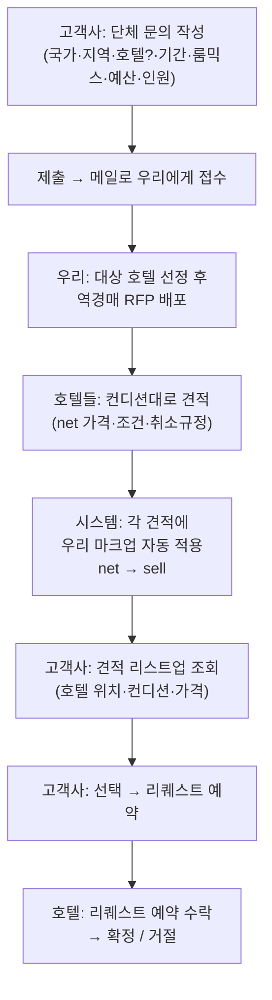

# 기능 기획 — 단체 문의 · 역경매(RFP) 소싱

> **작성일**: 2026-09-21 · **트랙**: B (Marketplace 고도화) · **상태**: 🟡 **신규 기획 (초안 — 핵심 결정 대기)**
> **요청 출처**: 현업(2026-09-21) — 고객사 단체 문의를 리퀘스트 기반으로 접수 → 호텔에 역경매로 뿌려 견적 회수 → 우리 마크업 자동 적용 후 고객사에 리스트업 → 리퀘스트 예약

---

## 0. 한 줄 요약

**고객사가 마켓플레이스에서 "단체 문의"를 넣으면 → 메일로 우리에게 접수되고 → 우리가 호텔들에게 역경매(RFP)로 뿌려 견적을 회수 → 각 호텔 견적에 우리 마크업을 자동으로 얹어 고객사에 리스트업 → 고객사가 선택하면 리퀘스트 예약으로 진행**하는 기능.

- **핵심 1**: 즉시 예약이 아니라 **리퀘스트(문의) 기반**. 접수는 **메일 알림**으로 시작.
- **핵심 2**: 우리가 중간에서 일일이 처리하지 않고 **호텔들에게 역경매로 뿌린다**(호텔이 자기 컨디션에 맞춰 견적).
- **핵심 3**: 호텔 견적은 **우리 마크업 불포함일 수 있다** → 시스템이 **마크업을 자동으로 얹어** 고객 안내가 나가야 하고, 그 마크업은 **일률적으로 설정** 가능해야 한다.

---

## 1. 배경과 목적

### 1.1 문제 인식
- 단체(스포츠팀·행사·MICE 등)는 **다실·특수요건**(장소 인접·특정 룸믹스·총예산)이라 **즉시 예약 흐름에 맞지 않는다.** 기존 즉시 예약은 **5실 초과 차단**(No.12 확정), 약관 **제4조 ③ 4실 이상 = 그룹 예약(별도 요금·취소)** 이라 별도 채널이 필요하다.
- 지금은 이런 문의가 **오프라인/메일로 산발 접수**되고, 우리가 수작업으로 호텔을 물색·중개한다. 표준 접수 양식·역경매·마크업 자동화가 없다.

### 1.2 목적
- **표준 접수 양식**으로 단체 문의를 구조화(국가·지역·호텔·기간·룸믹스·예산·인원).
- **역경매 소싱** — 한 번의 문의를 다수 호텔에 뿌려 **호텔이 경쟁 견적**하게 함(우리 수작업 중개 최소화).
- **마크업 자동·일률 설정** — 호텔 net 가격에 우리 마진을 자동으로 얹어 고객 sell 가격 산출(요율·net 은닉).
- 리퀘스트 예약까지 **한 흐름**으로 연결.

### 1.3 다른 기획과의 관계
| 관계 | 내용 |
|------|------|
| 즉시 예약 5실 캡 (No.12) | 즉시 예약은 5실 초과 차단 → **초과·단체는 이 기능으로 라우팅**. 상호 보완 |
| 약관 제4조 ③ | 4실 이상 = 그룹 예약(별도 요금·취소). 단체 문의가 그 **공식 채널** |
| OP Points | 무관(리퀘스트 예약 확정 시 적립 대상 여부는 추후 — 지금 범위 밖) |

---

## 2. 사용자·역할

| 역할 | 하는 일 |
|------|---------|
| **고객사 (셀러/OP)** | 단체 문의 작성·제출 → 회수된 견적 리스트 조회 → 선택 → 리퀘스트 예약 |
| **우리 (OMH 오퍼레이션)** | 접수 메일 수신 → 대상 호텔에 RFP 배포 → 호텔 견적(net) 회수·입력 → **마크업 자동 적용** → 고객사에 리스트업 |
| **호텔 (공급사)** | RFP 수신 → 자기 컨디션대로 견적(수락/인상/인하) 회신 → 고객 선택 시 리퀘스트 예약 수락 |

---

## 3. 전체 흐름



### 상태(Status) 정의
| 상태 | 의미 |
|------|------|
| `Draft` | 작성 중 |
| `Submitted` | 제출 완료 — **접수 메일 발송** |
| `Sourcing` | 우리가 호텔에 RFP 배포 (견적 수집 중) |
| `Quoted` | 견적 회수 + 마크업 적용 + 고객 리스트업 완료 |
| `Selected` | 고객사가 특정 호텔 견적 선택 |
| `Requested` | 리퀘스트 예약 접수(호텔 응답 대기) |
| `Confirmed` / `Declined` | 호텔 수락 / 거절 |
| `Expired` / `Cancelled` | 견적 마감 경과 / 문의 취소 |

---

## 4. 문의 입력 항목

| 항목 | 필수 | 설명 | 샘플 매핑 |
|------|:---:|------|-----------|
| **목적지** | ✔ | **국가 → 지역 → (선택) 호텔.** 호텔까지 특정할 수도, **지역까지만** 지정하고 열어둘 수도 있음 | Japan → Ibaraki (호텔 미지정) |
| **기준점(앵커)** | – | 특정 장소(경기장·행사장) + **거리 제약**(예: 차량 30분 이내). 있으면 호텔을 거리로 필터/정렬 | Sakaimachi Urban Sports Park, **차량 30분 이내** |
| **기간** | ✔ | 체크인~체크아웃 / 박수 | 11/23–11/30, **7박** |
| **룸 요건** | ✔ | 룸타입 + 수량 여러 행 + **식사조건** | **Twin 5 + Single 5**, Room Only |
| **인원** | ✔ | 총 인원 + (선택) 국적·비고 | **15명**, 중국 대표팀 선수 |
| **예산** | ✔ | **1실·1박 기준** 입력(통화 포함) → 내부에서 × 실수 × 박수로 **총액 환산**(견적 비교 기준). 현업 확정 2026-09-21 | **JPY 9,100/실·박 (총 637,000)** |
| **비고** | – | 특수요건 자유서술 | – |

> 입력 UX: 목적지는 **드릴다운**(국가→지역→호텔, 중간에서 멈춤 허용). 룸 요건은 **행 추가**(룸타입+수량). 예산은 통화 선택.

---

## 5. 역경매 · 견적 회수

- **한 문의 → 다수 호텔 배포.** 대상은 **기존 계약/마켓플레이스 호텔이 기본**이며 ⑴ 문의에서 호텔을 특정했으면 그 호텔(들), ⑵ 지역까지만이면 **해당 지역(±앵커 거리) 내 기존 호텔군.** **신규 소싱은 필수가 아니라 옵션**(해당 지역에 계약 호텔 재고가 부족할 때만 운영 판단으로 추가). 〔현업 확정 2026-09-21〕
- 호텔 견적 1건 = **net 가격 + 가용성 + 컨디션 + 취소규정 + 유효기한.**
- 호텔은 자기 사정대로 **수락(견적 그대로)/인상/인하** 가능.
- 회수된 견적은 **마크업 적용 후**(§6) 고객사에 **리스트업**: *"어디 호텔은 위치가 이렇고, 컨디션·가격이 이렇다."*

**역경매 방식 — 결정 필요 (제안 기본값):**
| 논점 | 제안 기본값 | 대안 |
|------|-------------|------|
| 호텔이 서로 견적을 보는가 | **블라인드(sealed)** — 각자 독립 견적 | 오픈(경쟁가 노출) |
| 견적 마감 | **시한제**(예: 48~72h) | 무기한(선착 마감) |
| 고객 노출 큐레이션 | 회수 견적 **전부 자동 리스트** | 우리가 필터 후 노출 |

---

## 6. 마크업 로직 ⭐ (핵심)

> 호텔이 부른 가격은 **우리 마크업 불포함일 수 있다.** 따라서 시스템은 **들어온 호텔 가격을 net(원가)로 간주**하고, **우리 마크업을 자동으로 얹어 sell(고객가)** 를 만든다. 고객에겐 **sell만** 보인다(net·마크업률 은닉 — OP Points 요율 은닉과 동일 원칙).

```
sell = round( net × (1 + markupPct/100) )        // 정률
sell = round( net + markupFixed )                 // 정액(대안)
```

- **일률 설정**: 기본은 **글로벌 마크업(%) 1개 값**으로 전체 적용. (현업: "일률적으로 설정 할 수 있어야 하고.")
- **적용 접수 규칙**: 호텔에게서는 **항상 net으로 회수**한다(마크업 포함가로 받으면 이중 적용 위험) → 접수 화면에 "net 기준 입력" 명시.
- **은닉**: 고객·리스트업·리퀘스트 예약 어디에도 net/마크업률 비노출. 내부(오퍼레이션/ELLIS)만 net·마진 확인.

**마크업 설정 범위 — 결정 필요 (제안 기본값):**
| 논점 | 제안 기본값 | 대안 |
|------|-------------|------|
| 방식 | **정률(%)** | 정액 / 혼합 |
| 범위 | **글로벌 1값**(일률) | 국가·지역·호텔별 override 허용 |
| 반올림 | 통화 단위 올림/반올림 규칙 1개 | 통화별 규칙 |

---

## 7. 데이터 모델 (프로토타입 · 폐기 가능 구조)

```ts
GroupInquiry {
  id, opAccountId, status,
  destination: { country, region, hotelId?: string },   // 호텔은 선택(지역까지만 가능)
  anchor?: { name, address, radiusMinutes, mode: 'drive' | 'walk' },
  checkIn, checkOut, nights,
  rooms: { roomType: string, count: number }[],          // 예: [{Twin,5},{Single,5}]
  mealPlan: 'RO' | 'BB' | ...,
  guests: { total: number, nationality?: string, notes?: string },
  budgetPerRoomNight?: number,  // 고객 입력 = 1실·1박 기준
  budgetTotal?: number,          // = perRoomNight × 실수 × 박수 (견적 비교 기준)
  notes?: string,
  createdAt, submittedAt, quoteDeadline?,
  quotes: HotelQuote[],
}

HotelQuote {
  id, inquiryId, hotelId, hotelName, location, distanceMinutes?,
  net: { currency, amount, basis: 'total' | 'perRoomNight' },  // 호텔 회수가(원가) — 내부
  markup: { type: 'pct' | 'fixed', value },                    // 적용 마진 — 내부
  sell: { currency, amount },                                  // 고객 노출가 = net + 마크업
  condition?, cancellationPolicy?, availabilityNote?, validUntil?,
  status: 'received' | 'listed' | 'selected' | 'declined',
}

MarkupConfig { scope: 'global' | 'country' | 'region' | 'hotel', type: 'pct' | 'fixed', value, rounding }
```

---

## 8. 화면 (Screens)

| # | 화면 | 대상 | 내용 |
|---|------|------|------|
| S1 | **단체 문의 작성** | 고객사 | 목적지 드릴다운 · 앵커+거리 · 기간 · 룸 행(타입+수량) · 식사 · 인원 · 예산 · 비고 → 제출 |
| S2 | **내 문의 목록/상세** | 고객사 | 상태별 목록 · 상세에서 회수 견적 리스트(호텔·거리·컨디션·**sell 가격**) → **선택** → 리퀘스트 예약 |
| S3 | **문의 접수·소싱** | 우리(내부) | 접수 문의 · 대상 호텔 배포 · 호텔 견적(**net**) 입력 → 마크업 자동 → 리스트업 |
| S4 | **마크업 설정** | 내부/ELLIS | 글로벌 마크업(%) (+ 필요 시 범위별 override) |
| — | **접수 메일** | 우리 | 제출 시 문의 요약이 메일로 발송(알림) |

> 프로토타입 우선순위: **S1(작성) + S2(리스트업·선택)** 를 고객 흐름으로 먼저, S3/S4는 내부 데모 패널로 간이 구현(마크업 자동 적용 시연).

---

## 9. 단계 (MVP → 확장)

| 단계 | 범위 |
|------|------|
| **MVP** | 문의 작성(S1) · 제출 시 **메일 접수** · 내부에서 호텔 견적 **수기 입력** · **마크업 자동 적용** · 고객 리스트업(S2)·선택 → 리퀘스트 예약. **호텔 배포/회수는 메일·오퍼레이션 중개.** |
| **확장** | **호텔용 셀프 견적 포털/ELLIS 모듈**(호텔이 직접 견적 입력) · 앵커 거리 자동계산(지도) · 견적 시한 자동 마감 · 범위별 마크업 · 리퀘스트 예약↔ELLIS 연동 |

---

## 10. 기존 규칙과의 관계 (제약)

1. **약관 제4조 ③** — 4실 이상 = 그룹 예약(별도 요금·취소). 단체 문의 견적·리퀘스트 예약은 이 규정을 따른다(취소규정은 견적별 호텔 조건 기준).
2. **즉시 예약 5실 캡** — 6실+ 즉시 예약 차단. 초과 시 **"단체 문의로 진행"** 안내로 라우팅(연결).
3. **취소는 예약 전체 단위**(부분취소 미지원, 전사 정책) — 리퀘스트 예약도 동일.

---

## 11. 열린 결정 (착수 전 확인)

| # | 논점 | 제안 |
|---|------|------|
| 1 | **마크업 방식·범위** | 정률(%) · 글로벌 1값(일률). 향후 범위별 override 여지 |
| 2 | **역경매 가시성** | 블라인드(호텔 상호 비노출) · 견적 시한제(48~72h) |
| 3 | **호텔 배포/회수 채널** | MVP=메일·오퍼레이션 중개 → 확장=호텔 셀프 포털 |
| 4 | **즉시예약→단체문의 라우팅 기준** | 몇 실부터? 약관 4조③(4실) vs 5실 캡 — **정렬 필요** |
| 5 | **문의 제출자** | 고객사 OP 본인(계정) 기준. 접수 메일 수신 주체(오퍼레이션 메일함) 확정 |
| 6 | **리스트업 큐레이션** | 회수 견적 전부 자동 노출 vs 우리 필터 후 노출 |

---

## 12. 부록 — 샘플 문의 (워크드 예시)

| 필드 | 값 |
|------|----|
| 목적지 | Japan / Ibaraki (호텔 미지정 — 지역까지) |
| 앵커 | Sakaimachi Urban Sports Park (境町アーバンスポーツパーク駐車場), 차량 **30분 이내** |
| 기간 | 2026-11-23 ~ 11-30 (**7박**) |
| 룸 | **Twin ×5, Single ×5** — Room Only |
| 인원 | **15명** (중국 대표팀 선수) |
| 예산 | **JPY 9,100 / 실·박** (10실 × 7박 = 총 637,000) |

> 이 문의가 지역(Ibaraki, 앵커 30분)의 호텔군에 RFP로 배포되고, 각 호텔 net 견적에 마크업이 얹혀 고객사에 리스트업된다.

---

## 13. 관련 문서
- [기획서 ② — Marketplace 고도화](spec-b-dotbiz-enhancement.md)
- [분리 예약(폐기) — 약관 4조③·다실 제약 근거](feature-split-room-booking.md)
