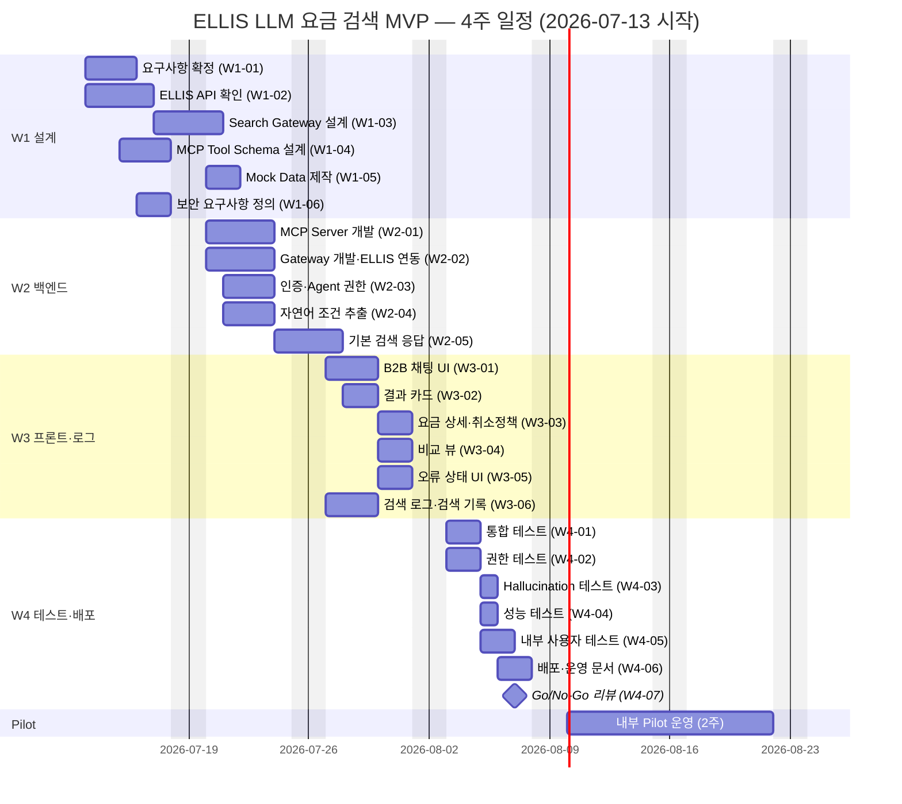

# ELLIS 기반 LLM 자연어 요금 검색 — MVP 실행 계획서

> **문서 상태**: DRAFT v0.1
> **작성일**: 2026-07-10
> **기준 아키텍처**: [`docs/architecture/ellis-mcp-llm-search.md`](../architecture/ellis-mcp-llm-search.md)
> **목표**: 4주 내 **내부 직원용** 자연어 호텔 요금 검색 프로토타입 완성 (Chat UI → LLM Orchestrator → MCP Server → Search Gateway → ELLIS)
> **시작일**: 2026-07-13(월) [가정] / **개발 완료 목표**: 2026-08-07(금) / **내부 Pilot**: 2026-08-10 ~ 08-21 (2주)

---

## 1. 목표 및 범위

### 1.1 목표

- 내부 세일즈·운영 직원이 **자연어 한 문장**으로 목적지·호텔·실시간 요금을 검색하고, 조건 수정·호텔 비교·취소정책 확인까지 **채팅 한 화면에서** 수행할 수 있는 프로토타입을 4주 내 완성한다.
- 모든 요금·취소조건 숫자는 **MCP 도구가 반환한 구조화 JSON에서만 렌더링**하여 Hallucination을 구조적으로 차단한다 (아키텍처 §5).
- 전 구간 감사 로그와 Agent(계정) 권한 통제를 갖춰, Phase 2(외부 셀러 공개) 이전의 검증 기반을 마련한다.

### 1.2 범위 (In / Out)

| 구분 | 항목 | 비고 |
|------|------|------|
| ✅ 포함 | 목적지 검색 (자연어 → 지역코드 해석) | `resolve_destination` |
| ✅ 포함 | 호텔 검색 (지역·날짜·인원·성급 등 필터) | `search_hotels` |
| ✅ 포함 | 실시간 요금 검색 (객실타입·식사·판매가) | `get_hotel_rates` — 요금 캐시 금지 |
| ✅ 포함 | 자연어 조건 추출 (날짜·지역·인원·필터 파싱) | LLM tool call 파라미터 추출 |
| ✅ 포함 | 조건 수정 (대화 중 "날짜만 바꿔줘" 등 후속 수정) | Conversation Store 컨텍스트 유지 |
| ✅ 포함 | 호텔 비교 (직전 결과셋 기반 가격·취소조건 비교) | `compare_results` — ELLIS 재호출 없음 |
| ✅ 포함 | 취소정책 표시 (단계별 위약금·마감일시) | `get_cancellation_policy` |
| ✅ 포함 | 검색 기록 (본인 세션 최근 검색 조회) | `get_search_history` |
| ✅ 포함 | Agent 권한 (내부 계정 인증·기능 플래그·조회 전용 통제) | 아키텍처 §7 |
| ✅ 포함 | 검색 로그 (chat_turn / tool_call / error 전 구간 기록) | 아키텍처 §8 |
| ❌ 제외 | 예약 생성·변경·취소 | MCP 쓰기 도구 미구현 = 구조적 차단, Phase 2 |
| ❌ 제외 | 결제·정산·바우처 발행 | Phase 2+ |
| ❌ 제외 | 자동 추천 (개인화·판매 이력 기반) | Phase 3 |
| ❌ 제외 | 음성 검색 | Phase 3 |
| ❌ 제외 | 지도 인터랙션 (지도 위 검색·핀 표시) | 확장 검토 |
| ❌ 제외 | 외부 고객사(셀러) 공개 | MVP는 내부 직원 한정, Pilot 후 판단 |
| ❌ 제외 | 공급사 자동 선택 (소싱 최적화) | ELLIS 룰 엔진 결과 그대로 사용 |
| ❌ 제외 | AI 마크업 결정 (요금 가공·할인 제안) | 마크업은 ELLIS 룰 엔진 전담 |

---

## 2. WBS (주차별 작업 분해)

> 공수 단위: 인일(MD). 시작일 2026-07-13(월), 주 5일 기준. [가정] 팀별 투입 인원: Backend 2, B2B Frontend 2, Product 1, ELLIS 1, QA 1, IT Security 0.5, Sales Operation 0.5

### 2.1 Week 1 (07-13 ~ 07-17) — 요구사항·설계·Mock

| ID | 작업 항목 | 산출물 | 담당팀 | 선행 조건 | 공수(MD) | 완료 기준 |
|----|-----------|--------|--------|-----------|----------|-----------|
| W1-01 | 요구사항 확정 (MVP 범위·예시 질의 셋·성공지표 합의) | 요구사항 정의서 v1.0, 예시 질의 20건 | Product | 이해관계자 킥오프 | 3 | 전 팀 사인오프, 범위 변경 시 CR 절차 합의 |
| W1-02 | ELLIS API 확인 (Search/Content/Rate 스펙·인증·쿼터·국적필터) | API 스펙 확인서, 갭 리스트 | ELLIS, Backend | ELLIS 담당자 배정 | 4 | 5개 도구 매핑표 완성, 미지원 항목 대체안 확정 |
| W1-03 | Search Gateway 설계 (라우팅·토큰 검증·레이트리밋·감사로그) | Gateway 설계서, API 계약(OpenAPI) | Backend | W1-02 | 3 | 설계 리뷰 통과, 타임아웃/서킷브레이커 정책 확정 |
| W1-04 | MCP Tool Schema 설계 (7개 도구 입출력 JSON Schema) | Tool Schema 정의서, 에러코드 표 | Backend, Product | W1-01, W1-02 | 3 | 스키마 리뷰 통과, 예시 질의 20건 → 도구 매핑 검증 |
| W1-05 | Mock Data 제작 (목적지·호텔·요금·취소정책 샘플) | Mock 데이터셋 + Mock Gateway 서버 | Backend, ELLIS | W1-04 | 2 | 예시 질의 20건 전부 Mock으로 응답 가능 |
| W1-06 | 보안 요구사항 정의 (데이터 최소화·LLM 전달 금지 항목) | 보안 체크리스트 v1 | IT Security | W1-01 | 1 | 체크리스트 승인, 2·4주차 검토 일정 확정 |

### 2.2 Week 2 (07-20 ~ 07-24) — 백엔드 코어

| ID | 작업 항목 | 산출물 | 담당팀 | 선행 조건 | 공수(MD) | 완료 기준 |
|----|-----------|--------|--------|-----------|----------|-----------|
| W2-01 | MCP Server 개발 (7개 조회 도구 + 스키마 검증 + result_id 부여) | ellis-mcp 서버 v0.1 | Backend | W1-04, W1-05 | 5 | 7개 도구 Mock 기반 단위테스트 100% 통과 |
| W2-02 | Search Gateway 개발·ELLIS 연동 | Gateway v0.1 (스테이징 ELLIS 연결) | Backend, ELLIS | W1-03, W2-01 착수 | 4 | 실 ELLIS 응답 = 기존 포털 검색 결과와 표본 20건 일치 |
| W2-03 | 인증·Agent 권한 (세션 토큰 검증, 내부 계정 컨텍스트 주입, 기능 플래그) | 인증 모듈, 권한 매트릭스 | Backend, IT Security | W1-06, 세션 검증 API 확보(B-3) | 3 | 비로그인/만료 토큰 차단 테스트 통과, LLM 경유 컨텍스트 변조 불가 확인 |
| W2-04 | 자연어 조건 추출 (Orchestrator + 시스템 프롬프트 + tool call 루프) | Orchestrator v0.1, 프롬프트 v1 | Backend, Product | W2-01 | 4 | 예시 질의 20건 조건 추출 정확도 ≥ 80% (수동 채점) |
| W2-05 | 기본 검색 응답 (Validator 1차 + 구조화 응답 포맷 + 스트리밍) | 응답 스키마, Validator v0.1 | Backend | W2-04 | 3 | 텍스트 숫자 ↔ 도구 결과 대조 로직 동작, E2E 1개 시나리오 관통 |

### 2.3 Week 3 (07-27 ~ 07-31) — 프론트엔드·로그

| ID | 작업 항목 | 산출물 | 담당팀 | 선행 조건 | 공수(MD) | 완료 기준 |
|----|-----------|--------|--------|-----------|----------|-----------|
| W3-01 | B2B 채팅 UI (패널·입력·스트리밍 표시·기존 검색 탈출 링크) | Chat UI v0.1 | B2B Frontend | W2-05 응답 스키마 확정 | 4 | 스테이징에서 대화 왕복 동작, 스트리밍 렌더 |
| W3-02 | 결과 카드 (호텔 카드 — 도구 JSON에서만 숫자 렌더) | 호텔/요금 카드 컴포넌트 | B2B Frontend | W3-01 | 3 | 카드 내 모든 금액이 도구 JSON 기원임을 코드 리뷰로 확인 |
| W3-03 | 요금 상세 + 취소정책 표시 (Billing·취소 마감·위약금 단계) | 요금 상세 뷰 | B2B Frontend | W3-02 | 2 | 취소정책 원문과 화면 표기 표본 10건 일치 |
| W3-04 | 비교 뷰 (compare_results 결과 테이블 렌더) | 비교 테이블 컴포넌트 | B2B Frontend | W3-02 | 2 | "최저가 vs 취소조건" 시나리오 동작 |
| W3-05 | 오류 상태 UI (§9 에러코드 8종 매핑 + 재시도·탈출구) | 오류 상태 컴포넌트 | B2B Frontend | W3-01 | 2 | 에러코드 8종 전부 사용자 메시지 노출 확인 |
| W3-06 | 검색 로그·검색 기록 (Audit Log 적재 + get_search_history UI) | 로그 파이프라인, 검색기록 화면 | Backend, B2B Frontend | W2-05 | 3 | trace_id로 질의→도구→응답 전 구간 추적 가능 |

### 2.4 Week 4 (08-03 ~ 08-07) — 테스트·배포

| ID | 작업 항목 | 산출물 | 담당팀 | 선행 조건 | 공수(MD) | 완료 기준 |
|----|-----------|--------|--------|-----------|----------|-----------|
| W4-01 | 통합 테스트 (E2E 시나리오 15건, 요금 정합성 대조) | 통합 테스트 리포트 | QA, Backend | W3 전체 | 3 | P0 시나리오 100% 통과, 요금 표본 50건 기존 포털과 일치 |
| W4-02 | 권한 테스트 (비인가 접근·토큰 변조·프롬프트 인젝션) | 보안 테스트 리포트 | IT Security, QA | W2-03 | 2 | 권한 우회 0건, 인젝션 시나리오 10건 차단 |
| W4-03 | Hallucination 테스트 (적대적 질의 50건, Validator 차단율 측정) | Hallucination 평가 리포트 | QA, Product | W4-01 | 2 | 숫자 환각 노출 0건, 차단율 ≥ 98% |
| W4-04 | 성능 테스트 (턴 P95 지연·동시 10 세션·레이트리밋) | 성능 테스트 리포트 | QA, Backend | W4-01 | 2 | 턴 P95 ≤ 20s, ELLIS 오류율 < 3% |
| W4-05 | 내부 사용자 테스트 (UAT — 세일즈·운영 5명 시나리오 수행) | UAT 결과·개선 백로그 | Sales Operation, Product | W4-01 | 2 | 참가자 전원 핵심 시나리오 완수, P0 결함 0건 |
| W4-06 | 배포·운영 문서 (스테이징→내부 프로덕션 배포, 런북·롤백 절차) | 배포 완료, 운영 런북, 온보딩 가이드 | Backend, Product | W4-01~05 | 3 | 내부 프로덕션 배포 + 롤백 리허설 1회 완료 |
| W4-07 | Go/No-Go 리뷰 (§9 기준 평가·Pilot 개시 승인) | Go/No-Go 의사결정 기록 | Product (전 팀) | W4-01~06 | 0.5 | 의사결정 회의록 승인 |

### 2.5 Gantt 차트

---

## 3. 팀별 R&R (RACI)

> R = 실행 책임, A = 최종 승인, C = 협의, I = 통보

| 작업 영역 | Product | B2B Frontend | Backend | ELLIS | IT Security | QA | Sales Operation |
|-----------|:-------:|:------------:|:-------:|:-----:|:-----------:|:--:|:---------------:|
| 요구사항·범위 관리 | **R/A** | C | C | C | C | C | C |
| ELLIS API 스펙 확인·연동 지원 | I | I | C | **R/A** | I | I | — |
| Search Gateway 설계·개발 | I | I | **R/A** | C | C | I | — |
| MCP Server·도구 스키마 | C | I | **R/A** | C | C | I | — |
| LLM Orchestrator·프롬프트·Validator | C | I | **R/A** | — | C | C | — |
| 인증·Agent 권한 | I | C | **R** | I | **A** | C | — |
| 채팅 UI·결과 카드·비교 뷰 | C | **R/A** | C | — | I | C | C |
| 검색 로그·모니터링 | I | I | **R/A** | I | C | C | — |
| 통합·성능 테스트 | I | C | C | C | I | **R/A** | — |
| 보안·권한·인젝션 테스트 | I | I | C | I | **R/A** | R | — |
| Hallucination 평가 | **A** | I | C | — | I | **R** | C |
| 내부 사용자 테스트(UAT)·Pilot 운영 | **A** | I | I | — | I | C | **R** |
| 배포·롤백·운영 런북 | C | C | **R/A** | I | C | I | I |
| Go/No-Go 의사결정 | **A** | C | C | C | C | C | C |

---

## 4. 선행 조건 (블로커)

| ID | 블로커 | 필요 시점 | 담당 | 미확보 시 영향 / 대응 |
|----|--------|-----------|------|----------------------|
| B-1 | **ELLIS API 스펙 문서 확보** (Search/Content/Rate 엔드포인트·인증·쿼터) | W1 수요일까지 | ELLIS | Gateway 설계 지연 → W1-05 Mock 기반으로 W2 진행, 스펙 확보 시 W2-02에서 치환 |
| B-2 | **국적별 판매 필터 지원 확인** (`client_nationality`) | W1 말까지 | ELLIS | 미지원 시 해당 기능 MVP 제외 확정(범위 축소로 대응, 일정 영향 없음) |
| B-3 | **세션 토큰 검증 API** (서버측 검증 수단 존재 여부) | W2 초까지 | Backend, IT Security | 부재 시 내부 전용 임시 토큰 발급 방식으로 대체 [가정], Pilot 전 정식 전환 |
| B-4 | **LLM API 계약·예산 승인** (Claude API 키·월 예산 한도) | W1 말까지 | Product, IT Security | W2-04 착수 불가 → 최우선 에스컬레이션 대상 |
| B-5 | **파일럿 사용자 선정** (내부 세일즈·운영 5~10명 확정) | W3 말까지 | Sales Operation | UAT(W4-05)·Pilot 지연 → W3 주간 리뷰에서 확정 강제 |

---

## 5. 리스크 관리

| # | 리스크 | 확률 | 영향 | 완화책 | 담당 |
|---|--------|:----:|:----:|--------|------|
| R-01 | ELLIS API 문서 부재·불완전 | 높음 | 높음 | W1 Mock 우선 개발로 경로 분리, ELLIS 담당자 주 2회 정례 미팅, 갭 발견 즉시 에스컬레이션 | ELLIS |
| R-02 | 요금 정합성 오류 (AI 검색가 ≠ 기존 포털가) | 중간 | 높음 | 마크업·환율 재계산 금지(ELLIS 판매가 그대로 통과), W4-01 표본 50건 자동 대조 테스트 | Backend |
| R-03 | LLM 비용 초과 | 중간 | 중간 | 일별 토큰 예산 알림, 셀러/사용자별 레이트리밋(분당 30), 프롬프트 캐싱·컨텍스트 절감 | Backend |
| R-04 | 일정 내 Search Gateway 미완 | 중간 | 높음 | Gateway를 경량(라우팅·인증·로그만)으로 유지, 비즈니스 로직 배제, W2 중간 점검 시 범위 축소 옵션 | Backend |
| R-05 | Hallucination 잔존 (Validator 우회 숫자 노출) | 중간 | 높음 | 숫자 렌더링을 카드(JSON)로 한정, Validator 차단 시 카드만 표시 모드, W4-03 적대적 테스트 50건 | QA, Product |
| R-06 | 보안 검토 지연 (권한·데이터 최소화 승인 지연) | 중간 | 중간 | W1-06에서 체크리스트 선합의, W2·W4 2회 분할 검토로 막판 몰림 방지 | IT Security |
| R-07 | 자연어 조건 추출 정확도 미달 (날짜·인원 오해석) | 중간 | 중간 | 예시 질의 20건 회귀 셋 운영, 모호 조건은 되묻기 강제, 추출 결과를 카드로 노출해 사용자 확인 유도 | Backend, Product |
| R-08 | ELLIS 스테이징 환경 불안정·쿼터 제한 | 중간 | 중간 | Mock Gateway 상시 유지(폴백), 타임아웃·서킷브레이커 W2 적용, 테스트 시간대 ELLIS 팀과 협의 | ELLIS, QA |
| R-09 | 핵심 인력 이탈·겸직 과부하 (Backend 2인 의존) | 낮음 | 높음 | W1 설계 문서화 철저(버스팩터 완화), 주간 리뷰에서 부하 점검, 우선순위 P0 기능 먼저 완성 | Product |
| R-10 | 내부 사용자 참여 저조 (UAT·Pilot 피드백 부족) | 중간 | 중간 | 경영층 스폰서십 확보, Pilot 참가자 업무 시간 공식 배정, 피드백 채널 단일화 | Sales Operation |
| R-11 | 프롬프트 인젝션으로 타 계정 컨텍스트 조회 시도 | 낮음 | 높음 | 계정 컨텍스트를 LLM 입출력 밖에서 주입(아키텍처 §7), W4-02 인젝션 시나리오 10건 테스트 | IT Security |
| R-12 | 세션 토큰 서버측 검증 불가 (B-3 실현 실패) | 중간 | 중간 | 내부망 한정 임시 인증으로 MVP 진행 [가정], 외부 공개 전 정식 인증 전환을 Phase 2 게이트로 명시 | Backend |

---

## 6. 완료 기준 (DoD) · 테스트 기준 · 배포 기준

### 6.1 Definition of Done

| 항목 | 기준 |
|------|------|
| 기능 | §1.2 포함 범위 10개 기능 전부 스테이징에서 동작 |
| 코드 | 코드 리뷰 100%, 단위테스트 커버리지 핵심 모듈(MCP 도구·Validator·인증) ≥ 80% |
| 데이터 정합성 | 표시 요금·취소정책이 ELLIS 응답과 100% 일치 (표본 50건 자동 대조) |
| 로그 | 모든 채팅 턴이 trace_id로 질의→도구호출→응답까지 추적 가능 |
| 문서 | 운영 런북, 롤백 절차, 사용자 온보딩 가이드, Tool Schema 문서 완비 |
| 보안 | IT Security 체크리스트 전 항목 통과 승인 |

### 6.2 테스트 기준

| 분류 | 기준 | 측정 방법 |
|------|------|-----------|
| P0 시나리오 | **100% 통과** (검색→요금→취소정책→비교 핵심 플로우 15건) | W4-01 통합 테스트 |
| P1 시나리오 | ≥ 90% 통과, 실패 건은 알려진 이슈로 문서화 | W4-01 |
| Hallucination 차단율 | **≥ 98%** (적대적 질의 50건 중 숫자 환각 텍스트 노출 0건) | W4-03 |
| 조건 추출 정확도 | ≥ 90% (예시 질의 회귀 셋 20건 + 신규 30건) | W4-03 |
| 성능 | 턴 P95 ≤ 20s, P50 ≤ 8s, 동시 10세션 무오류 | W4-04 |
| 권한 | 비인가 접근·토큰 변조·인젝션 시나리오 우회 **0건** | W4-02 |
| 오류 처리 | §9 에러코드 8종 전부 정의된 사용자 메시지로 노출 | W4-01 |

### 6.3 배포 기준

| 게이트 | 기준 |
|--------|------|
| 스테이징 통과 | 6.2 테스트 기준 전 항목 충족 + UAT P0 결함 0건 |
| 보안 승인 | IT Security 서면 승인 (권한 테스트 리포트 첨부) |
| 롤백 계획 | 기능 플래그 즉시 off 가능 + 이전 버전 복귀 절차 리허설 1회 완료 |
| 운영 준비 | 모니터링 대시보드·알림(성공률<97%, P95>20s, 차단율>2%, 일 예산 초과) 가동 |
| 접근 통제 | 내부 직원 화이트리스트만 접근 가능 확인 (외부 노출 경로 없음) |

---

## 7. 내부 Pilot 운영 방식

| 항목 | 내용 |
|------|------|
| 대상 | 내부 세일즈·운영 직원 **5~10명** (호텔 검색 업무 빈도 높은 인원 우선, Sales Operation 선정) |
| 기간 | **2주** (2026-08-10 ~ 08-21) |
| 사용 방식 | 실제 고객 문의 대응 업무에 병행 사용 — 기존 검색 화면과 자유 선택, 강제 전환 없음 |
| 피드백 채널 | ① 사내 메신저 전용 채널(실시간 버그·불만) ② 채팅 UI 내 턴별 👍/👎 + 코멘트 ③ 주간 설문(CSAT 5점 척도) |
| 주간 리뷰 | 매주 금요일 45분 — Product 주관, 전 팀 참석. 사용 지표(§8 KPI) 리뷰 → 개선 백로그 우선순위화 → 다음 주 핫픽스 범위 확정 |
| 운영 원칙 | P0 버그 24시간 내 핫픽스, 요금 오표시 신고 시 즉시 기능 플래그 off 후 원인 분석 |
| 종료 산출물 | Pilot 결과 보고서 (KPI 실측치, 피드백 요약, Phase 2 제안) — Go/No-Go 후속 판단 자료 |

---

## 8. 성공 KPI

| KPI | 정의 | 목표치 | 측정 방법 |
|-----|------|--------|-----------|
| 검색 성공률 | 오류 없이 결과(또는 정상 NO_RESULTS 안내)로 종료된 턴 비율 | **≥ 95%** | chat_turn 로그 자동 집계 |
| 턴당 평균 시간 | 질의 입력 → 응답 완료 (P50) | **≤ 8초** (P95 ≤ 20초) | 로그 지연시간 필드 |
| 조건 추출 정확도 | 자연어 → 도구 파라미터 정확 매핑 비율 | **≥ 90%** | 주간 표본 50턴 수동 채점 |
| Hallucination 차단율 | 환각 의심 숫자 중 Validator가 차단한 비율 (사용자 노출 0건 유지) | **≥ 98%**, 노출 0건 | Validator 로그 + 신고 건수 |
| 사용자 만족도 (CSAT) | 주간 설문 5점 척도 평균 | **≥ 4.0 / 5.0** | Pilot 주간 설문 |
| 검색 소요시간 단축률 | 동일 시나리오 기존 포털 검색 대비 소요시간 감소율 | **≥ 40%** | Pilot 중 타임트라이얼 비교(시나리오 5종 × 참가자) |

---

## 9. Go/No-Go 판단 기준

### 9.1 평가 항목·임계치 (4주차 말, 2026-08-07 평가)

| # | 평가 항목 | Go 임계치 | Conditional-Go | No-Go |
|---|-----------|-----------|----------------|-------|
| 1 | P0 통합 테스트 통과율 | 100% | — (P0는 조건부 불가) | < 100% |
| 2 | 요금 정합성 (표본 50건) | 100% 일치 | — | 1건이라도 불일치 |
| 3 | Hallucination | 노출 0건 + 차단율 ≥ 98% | 노출 0건 + 차단율 95~98% (카드-온리 모드 강제로 보완) | 숫자 환각 사용자 노출 발생 |
| 4 | 보안 승인 | 서면 승인 완료 | 경미 지적사항 + 1주 내 보완 계획 승인 | 권한 우회 발견 |
| 5 | 성능 | P95 ≤ 20s | P95 20~30s (레이트리밋 강화 조건) | P95 > 30s |
| 6 | UAT | P0 결함 0건, 참가자 전원 시나리오 완수 | P1 결함 ≤ 3건 (백로그 관리) | P0 결함 잔존 |
| 7 | 운영 준비 | 런북·롤백·모니터링 완비 | 대시보드 일부 미완(1주 내 보완) | 롤백 절차 부재 |

### 9.2 의사결정 프로세스

| 단계 | 내용 | 누가 | 언제 |
|------|------|------|------|
| 1. 평가 리포트 취합 | W4 테스트 리포트 4종 + UAT 결과를 평가표로 정리 | QA, Product | 08-06(목) EOD |
| 2. Go/No-Go 회의 | §9.1 항목별 판정 — 전원 판정 후 이견 시 근거 기반 토론 | Product 주관, 전 팀 리드 + CEO Office 배석 [가정] | 08-07(금) 오후 |
| 3. 최종 결정 | **Go**: 08-10 Pilot 개시 / **Conditional-Go**: 보완 조건·기한 명시 후 개시 / **No-Go**: 1주 연장 후 재평가(1회 한정), 재평가 실패 시 범위 축소 재계획 | 최종 승인: Product Owner [가정: 스폰서 = CEO Office] | 회의 당일 |
| 4. 결과 공지 | 결정·조건·책임자를 회의록으로 전사 공유 | Product | 08-07(금) EOD |

---

## 부록. 참고

- 아키텍처 설계서: [`docs/architecture/ellis-mcp-llm-search.md`](../architecture/ellis-mcp-llm-search.md) — 특히 §5(LLM 금지사항), §7(인증), §9(예외 처리), 부록 A(Open Questions = 본 문서 §4 블로커와 매핑)
- [가정] 표기 항목은 W1-01 요구사항 확정 시 검증·확정한다.
