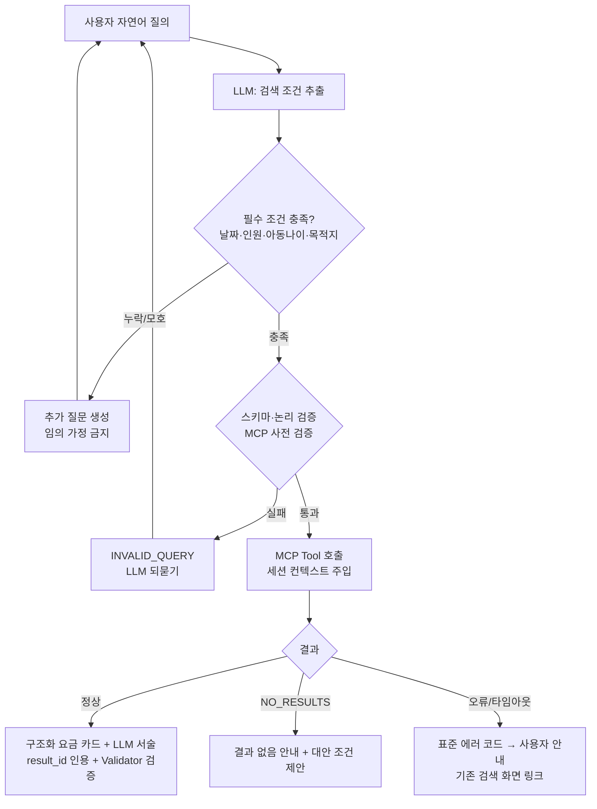
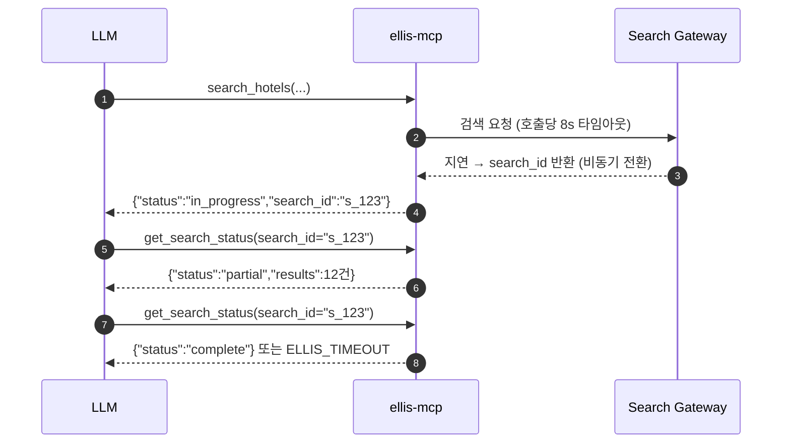
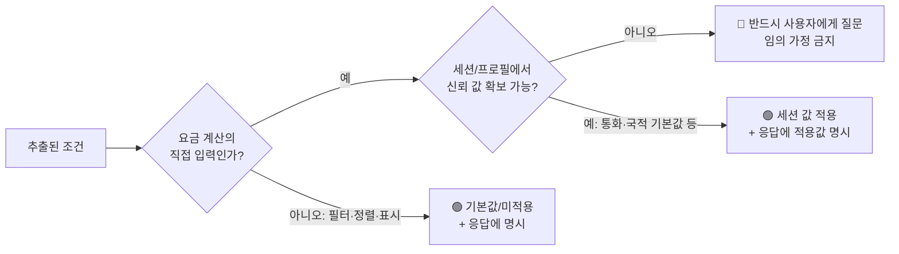

# ELLIS 기반 LLM 자연어 요금 검색 — 사용자 요구사항 및 검색 시나리오 정의서

> **문서 상태**: DRAFT v0.1
> **작성일**: 2026-07-10
> **상위 문서**: [`docs/architecture/ellis-mcp-llm-search.md`](../architecture/ellis-mcp-llm-search.md)
> **범위**: 조회 전용(Read-Only) MVP — 예약 생성·취소·수정·결제 제외
> **표기**: 확인되지 않은 전제는 [가정] 으로 표기

---

## 1. 사용자 정의

### 1.1 사용자군 개요

| 사용자군 | 목적 | 대표 과업 | RBAC 역할 | 요금 노출 범위 |
|----------|------|-----------|-----------|----------------|
| **여행사 (Travel Agency)** | 고객 문의에 대해 판매 가능한 호텔·요금을 빠르게 탐색하고 견적 제공 | 목적지/호텔 요금 검색, 무료취소·조식 조건 확인, 여러 호텔 비교, 견적용 요금 확인 후 기존 예약 플로우로 이동 | `AGENT_USER` | `selling_price`만 (net_price/markup 비노출) |
| **OTA (Online Travel Agency)** | 자사 채널에 실릴 상품·요금의 사전 확인, 대량 문의 대응 | 지역 단위 재고·요금 탐색, 취소정책·식사조건 확인, 판매 가능 국가 조건 확인 | `AGENT_USER` | `selling_price`만 |
| **내부 세일즈팀 (Internal Sales)** | 셀러 지원, 견적 대응, 공급사별 소싱 비교, 마진 검토 | 동일 호텔의 공급사별 요금 비교, net/markup 포함 요금 분석, 특정 셀러 관점 요금 재현 조회 | `INTERNAL_SALES` | `selling_price` + `net_price` + `markup` |
| **운영팀 (Operations)** | 검색 품질·장애 대응, 요금 이상 신고 검증, 사용 현황 파악 | 검색 이력 조회, 재현 검색, 상태/헬스 확인, 오류 코드 분석 | `INTERNAL_OPS` | `selling_price` + `net_price` + `markup` |
| (참고) 보안 관리자 | 감사 로그 열람, 권한·정책 관리 | 감사 추적, 이상 사용 탐지 | `SECURITY_ADMIN` | 검색 기능 자체는 미사용(로그 열람 중심) [가정] |
| (참고) 시스템 관리자 | 기능 플래그·레이트리밋·시스템 설정 | health_check, 설정 변경 | `SYSTEM_ADMIN` | 전체 |

### 1.2 역할별 MCP Tool 접근 매트릭스

| MCP Tool | AGENT_USER | INTERNAL_SALES | INTERNAL_OPS | SECURITY_ADMIN | SYSTEM_ADMIN |
|----------|:---:|:---:|:---:|:---:|:---:|
| `search_destinations` | ✅ | ✅ | ✅ | ❌ | ✅ |
| `search_hotels` | ✅ | ✅ | ✅ | ❌ | ✅ |
| `get_hotel_details` | ✅ | ✅ | ✅ | ❌ | ✅ |
| `search_hotel_rates` | ✅ | ✅ | ✅ | ❌ | ✅ |
| `compare_hotel_rates` | ✅ | ✅ | ✅ | ❌ | ✅ |
| `get_rate_details` | ✅ | ✅ | ✅ | ❌ | ✅ |
| `get_cancellation_policy` | ✅ | ✅ | ✅ | ❌ | ✅ |
| `get_search_status` | ✅ | ✅ | ✅ | ❌ | ✅ |
| `get_recent_searches` | ✅ (본인/자사 범위만) | ✅ (담당 셀러 범위) [가정] | ✅ (전체) | ✅ (감사 목적, 읽기) | ✅ |
| `health_check` | ❌ | ❌ | ✅ | ❌ | ✅ |
| net_price/markup 필드 노출 | ❌ (`FORBIDDEN` 또는 필드 제거) | ✅ | ✅ | — | ✅ |
| 공급사(supplier) 필터·비교 | △ 공급사명 마스킹 정책 적용 [가정] | ✅ | ✅ | — | ✅ |

> 권한 위반 시 MCP Server가 `FORBIDDEN`을 반환하며, LLM은 해당 조건을 무시하고 검색하지 않고 "권한이 없는 조건"임을 안내한다. 응답 필드 레벨 필터링(net/markup 제거)은 **MCP Server에서 수행**하고 LLM 프롬프트에 의존하지 않는다.

---

## 2. 자연어 검색 지원 항목

LLM이 자연어에서 추출하는 검색 조건의 표준 파라미터 정의. 모든 파라미터는 MCP Tool 호출 전 JSON Schema로 검증된다.

### 2.1 필수 항목

| # | 항목 | 파라미터 | 추출 예시 (자연어 → 값) | 기본값 / 누락 시 동작 |
|---|------|----------|--------------------------|------------------------|
| 1 | 목적지 | `destination` (지역코드) | "도쿄 호텔" → `search_destinations("도쿄")` → `dest_code: "102911"` | 기본값 없음. 누락 시 **반드시 질문**. 후보가 복수(예: "파리" → 프랑스/텍사스)면 후보 제시 후 선택 요청 |
| 2 | 체크인 날짜 | `check_in` (ISO 8601) | "8월 20일부터" → `"2026-08-20"` (미래 최근접 연도 해석) | 기본값 없음. 누락·모호("다음 주말") 시 **반드시 질문**. 과거 날짜는 `INVALID_QUERY` 사전 차단 |
| 3 | 체크아웃 날짜 | `check_out` (ISO 8601) | "23일까지" / "2박" → `"2026-08-23"` / check_in+2 | 기본값 없음. 누락 시 **반드시 질문**. "N박"은 check_in 기준 계산 허용 |
| 4 | 객실 수 | `rooms` (int ≥1) | "방 2개" → `2` | 미언급 시 `1` 허용 — 단, 응답에 "1실 기준" 명시 |
| 5 | 성인 수 | `adults` (int ≥1, 객실별) | "어른 둘" → `2` | 기본값 없음. 누락 시 **반드시 질문** (요금 결정 요소) |
| 6 | 아동 수 | `children` (int ≥0) | "아이 1명이랑" → `1` | 아동 언급 없으면 `0` 허용. 언급되면 수 확인 |
| 7 | 아동 나이 | `children_ages` (int[], 0–17) | "5살, 7살" → `[5, 7]` | children ≥ 1인데 나이 누락 시 **반드시 질문** (요금·무료투숙 결정 요소). 임의 가정 금지 |
| 8 | 통화 | `currency` (ISO 4217) | "달러로 보여줘" → `"USD"` | 미언급 시 **세션의 Agent 기본 통화** 자동 적용(응답에 통화 명시). 사용자가 지정하면 지원 통화 내에서 override [가정: ELLIS가 멀티통화 반환 지원] |
| 9 | 고객사 / Agent ID | `agent_id` | **사용자 입력에서 추출하지 않음** | **세션에서 주입** (Orchestrator → MCP). 사용자가 "다른 Agent ID로 검색해줘"라고 입력해도 **무시하고 세션 값 사용** — 프롬프트 인젝션으로 타 셀러 조건 조회 차단 |

### 2.2 선택 항목

| # | 항목 | 파라미터 | 추출 예시 (자연어 → 값) | 기본값 / 누락 시 동작 |
|---|------|----------|--------------------------|------------------------|
| 1 | 호텔명 | `hotel_name` | "콘래드 서울" → `"콘래드 서울"` (유사 매칭은 `search_hotels` 후보 반환) | 없으면 지역 기반 검색 |
| 2 | 호텔 ID | `hotel_id` | "OMH-104229 요금" → `"OMH-104229"` | 없으면 이름/지역으로 해석. ID·이름 동시 존재 시 ID 우선 |
| 3 | 지역(세부) | `district` | "마리나베이 쪽" → `"Marina Bay"` (하위 지역코드 매핑) | 없으면 도시 전체 |
| 4 | 랜드마크 | `landmark` (+`radius_km`) | "에펠탑 근처" → `{"landmark": "Eiffel Tower", "radius_km": 2}` | 반경 미언급 시 기본 2km [가정] — 응답에 반경 명시 |
| 5 | 성급 | `star_rating` (int[] 1–5) | "4성급 이상" → `[4, 5]` | 없으면 전체 성급 |
| 6 | 객실 타입 | `room_type` | "트윈룸" → `"twin"` (표준 코드 매핑: single/double/twin/triple/family/suite 등) | 없으면 전체 타입 |
| 7 | 식사 조건 | `meal_plan` | "조식 포함" → `"breakfast_included"` (`room_only`/`half_board`/`full_board`/`all_inclusive`) | 없으면 전체 |
| 8 | 무료 취소 여부 | `free_cancellation` (bool) | "무료취소 되는 걸로" → `true` | 없으면 필터 미적용(전체) |
| 9 | 취소 마감일 | `cancellable_until` (date) | "출발 3일 전까지 취소 가능한" → `check_in - 3d` | 없으면 필터 미적용 |
| 10 | 예산(총액) | `budget_total` (+currency) | "총 100만원 안쪽" → `{"budget_total": 1000000, "currency": "KRW"}` | 없으면 필터 미적용. 통화 불명확 시 세션 통화로 해석 후 응답에 명시 |
| 11 | 1박 최대 요금 | `max_nightly_price` | "1박 15만원 이하" → `150000` | 없으면 필터 미적용 |
| 12 | 총 숙박 요금 상한 | `max_total_price` | "3박에 50만원 이하" → `500000` | 없으면 필터 미적용. `budget_total`과 동시 언급 시 더 구체적인 값 우선, 모호하면 질문 |
| 13 | 공급사 | `supplier` | "공급사별로 다 보여줘" → `{"group_by_supplier": true}` | 없으면 통합 최적가. **AGENT_USER는 공급사명 마스킹/제한 정책 적용** [가정], 내부 역할만 자유 필터 |
| 14 | 판매 가능 국가(고객 국적/거주국) | `client_nationality` (ISO 3166-1) | "베트남 국적 고객인데" → `"VN"` | Agent 프로필의 기본 국적 설정이 있으면 그 값 사용(응답에 명시) [가정], **없으면 반드시 질문** — 요금·판매가능 여부 결정 요소 |
| 15 | 호텔 시설 | `amenities` (string[]) | "수영장 있고 주차되는" → `["pool", "parking"]` | 없으면 필터 미적용 |
| 16 | 정렬 조건 | `sort` | "싼 순으로" → `"price_asc"` (`price_desc`/`star_desc`/`distance_asc`/`review_desc` [가정: 리뷰점수 보유]) | 기본 `recommended` (ELLIS 기본 정렬) [가정] |
| 17 | 마크업 포함 여부 | `include_markup_breakdown` (bool) | "마진 얼마 붙는지 같이" → `true` | 기본 `false`. **INTERNAL_SALES/OPS/SYSTEM_ADMIN 전용** — AGENT_USER 요청 시 `FORBIDDEN`, LLM은 권한 없음 안내 |
| 18 | 세금 포함 여부 | `tax_display` | "세금 포함 총액으로" → `"tax_included"` | 기본: ELLIS `Billing` 기준 세금 포함 총액 + 별도 부과 세금(현지세 등) 주석 표기 [가정]. LLM이 세금을 **계산·환산하지 않고** ELLIS 반환 필드만 표시 |

> **공통 원칙**: 추출 실패·모호 항목은 "그럴듯한 값"으로 채우지 않는다. 필수 항목은 §4의 규칙에 따라 되묻고, 선택 항목은 미적용 상태로 검색하되 적용된 필터/기본값을 응답에 명시한다.

---

## 3. 검색 시나리오 (16종)

### 3.0 공통 처리 흐름



**공통 응답 형식** — 모든 시나리오의 응답은 두 채널로 구성된다.

| 채널 | 내용 | 원천 |
|------|------|------|
| 요금/호텔 카드 (구조화 JSON) | hotel_id, 호텔명, 성급, `selling_price`(통화 포함), 객실타입, 식사, `availability`(`available` \| `on_request` \| `unavailable`), `last_updated_at`, 취소 마감, `booking_token`(있는 경우), `result_id` | MCP Tool 결과 그대로 (프론트가 직접 렌더) |
| LLM 텍스트 | 요약·비교·다음 행동 제안. 모든 상품 언급에 `[H-n]`/`[R-n]` result_id 인용 | LLM (Validator가 숫자 대조) |

**공통 주의점** (각 시나리오에서 반복 기술 생략):
- `availability`는 ELLIS가 `last_updated_at` 시점에 반환한 상태이며 **실시간 보장이 아님**을 카드와 텍스트에 표기한다.
- `booking_token`이 있는 요금만 "기존 예약 플로우로 이동" 버튼 활성화(TTL 내). 없으면 "참고용 요금(quote-only)" 라벨.
- `agent_id`·마켓·통화 컨텍스트는 항상 세션에서 주입 — LLM 입출력으로 변경 불가.
- 전 구간 `trace_id` 기반 감사 로그 기록.

---

### 3.1 시나리오 ① — 목적지 기반 호텔 검색

**사용자 질문 예시**
> "8월 20일부터 23일까지 도쿄에서 성인 2명 묵을 만한 호텔 찾아줘."

**추출 검색 조건 (JSON)**
```json
{
  "extracted": {
    "destination_query": "도쿄",
    "check_in": "2026-08-20",
    "check_out": "2026-08-23",
    "rooms": 1,
    "adults": 2,
    "children": 0,
    "children_ages": []
  },
  "session_context": {
    "agent_id": "(세션 주입)",
    "currency": "(Agent 기본 통화)",
    "client_nationality": "(Agent 프로필 기본값, 없으면 질문)"
  },
  "missing": []
}
```

**누락 정보 / 추가 질문**: 없음(객실 수는 1실 기본 적용, 응답에 명시). Agent 프로필에 기본 국적이 없으면 → "고객 국적(거주국)이 어디인가요? 요금과 판매 가능 여부에 영향이 있습니다."

**MCP Tool 호출 순서**
1. `search_destinations(query="도쿄")` → 지역코드 확정 (후보 복수 시 사용자 선택 요청)
2. `search_hotels(dest_code, check_in, check_out, rooms, adults, children_ages)` → 호텔 목록 + 대표 최저가 + `result_set_id`

**예상 응답 형식**: 호텔 카드 리스트(최대 20건, 페이징) — 호텔명·성급·대표 최저가(통화)·availability·`[H-n]` — + LLM 요약("도쿄에서 3박, 성인 2명, 1실 기준 N개 호텔을 찾았습니다 [H-1]~[H-20]. 조식·무료취소 등 조건을 더 알려주시면 좁혀드릴게요.").

**오류 처리**: 지역코드 미해석 → `INVALID_QUERY`로 재질문. 결과 없음 → `NO_RESULTS` 흐름(§3.14). ELLIS 오류/지연 → §3.15·§3.16.

**보안/운영 주의점**: 대표 최저가는 셀러 마켓·마크업 적용된 `selling_price`. 광역 검색은 결과 상한·페이징으로 ELLIS 부하 제어. 목적지 코드 캐시(24h) 활용.

---

### 3.2 시나리오 ② — 특정 호텔 요금 검색

**사용자 질문 예시**
> "콘래드 서울 9월 4일 체크인 2박, 성인 2명 요금 알려줘."

**추출 검색 조건 (JSON)**
```json
{
  "extracted": {
    "hotel_name": "콘래드 서울",
    "check_in": "2026-09-04",
    "check_out": "2026-09-06",
    "rooms": 1,
    "adults": 2,
    "children": 0,
    "children_ages": []
  },
  "session_context": { "agent_id": "(세션 주입)", "currency": "(세션 기본)" },
  "missing": []
}
```

**누락 정보 / 추가 질문**: 없음.

**MCP Tool 호출 순서**
1. `search_hotels(hotel_name="콘래드 서울", ...)` → 호텔 단일 확정 (`hotel_id`)
2. `search_hotel_rates(hotel_id, check_in, check_out, rooms, adults)` → 요금제 목록(객실타입·식사·취소마감·`rate_id`·`booking_token`)
3. (사용자가 특정 요금제 상세를 원하면) `get_rate_details(rate_id)`

**예상 응답 형식**: 요금제 카드(최대 30건) — 객실타입·식사·통화/총액·취소 마감일시·availability·`[R-n]` — + LLM 요약("가장 저렴한 요금은 [R-1] ...원(조식 불포함, 무료취소 9/1까지)입니다.").

**오류 처리**: 호텔명 미매칭/복수 매칭 → §3.3 유사 검색 흐름. 해당 날짜 판매 요금 없음 → `NO_RESULTS` + 인접 날짜 제안(재검색은 사용자 확인 후).

**보안/운영 주의점**: 요금은 캐시 금지 — 매 요청 실조회. 응답에 `last_updated_at`(조회 시점) 표기. `booking_token` TTL 경과 요금은 재조회 유도.

---

### 3.3 시나리오 ③ — 호텔명 유사 검색

**사용자 질문 예시**
> "센토사에 있는 샹그릴라… '라사 센토사'였나? 정확한 이름이 기억 안 나는데 10월 2일부터 3박 성인 2명 요금 봐줘."

**추출 검색 조건 (JSON)**
```json
{
  "extracted": {
    "hotel_name_query": "샹그릴라 라사 센토사",
    "destination_query": "센토사, 싱가포르",
    "check_in": "2026-10-02",
    "check_out": "2026-10-05",
    "rooms": 1,
    "adults": 2,
    "children": 0
  },
  "confidence": "hotel_name=low(유사 검색 필요)",
  "missing": []
}
```

**누락 정보 / 추가 질문**: 호텔 확정 전 검색 진행 금지 아님 — 후보를 먼저 보여주고 선택받는다. 질문 문구: "이 중 어느 호텔인가요? ① Shangri-La Rasa Sentosa ② Shangri-La Singapore (Orchard) …"

**MCP Tool 호출 순서**
1. `search_destinations(query="센토사")` → 지역 범위 축소
2. `search_hotels(dest_code, hotel_name="샹그릴라", fuzzy=true)` [가정: search_hotels가 부분/유사 매칭 지원] → 후보 목록
3. 사용자 선택 후 → `search_hotel_rates(hotel_id, ...)`

**예상 응답 형식**: 1차 응답 = 후보 호텔 카드(이름·주소·성급, `[H-n]`) + 선택 유도 텍스트. 2차 응답 = 시나리오 ②와 동일한 요금제 카드.

**오류 처리**: 후보 0건 → 철자 교정 제안("혹시 'Shangri-La'를 찾으시나요?")은 **도구가 반환한 후보에 한해서만** 제시 — LLM이 존재하지 않는 호텔명을 만들어내지 않는다. 후보 과다(>10) → 지역·성급 조건 추가 요청.

**보안/운영 주의점**: 유사 검색은 ELLIS Search API의 매칭 결과만 사용. LLM의 자체 지식으로 "그 호텔은 OO입니다"라고 단정 금지(콘텐츠 환각 위험). 후보 선택은 `hotel_id` 기준으로 고정하여 후속 턴에서 오매칭 방지.

---

### 3.4 시나리오 ④ — 가격 조건 검색

**사용자 질문 예시**
> "방콕 10월 12일부터 15일까지 성인 2명, 1박 10만원 이하로 찾아줘."

**추출 검색 조건 (JSON)**
```json
{
  "extracted": {
    "destination_query": "방콕",
    "check_in": "2026-10-12",
    "check_out": "2026-10-15",
    "rooms": 1,
    "adults": 2,
    "max_nightly_price": 100000,
    "price_currency": "KRW"
  },
  "session_context": { "currency": "KRW (세션 기본과 일치 확인)" },
  "missing": []
}
```

**누락 정보 / 추가 질문**: "10만원"의 통화가 세션 기본 통화와 다른 경우(예: 세션 통화 USD) → "예산 기준 통화가 KRW인가요, 계정 기본 통화(USD)인가요?" **LLM이 임의 환율로 환산 금지.**

**MCP Tool 호출 순서**
1. `search_destinations("방콕")`
2. `search_hotels(dest_code, ..., max_nightly_price=100000, currency="KRW", sort="price_asc")`

**예상 응답 형식**: 가격 오름차순 호텔 카드 + LLM 요약("1박 10만원 이하 기준 N건입니다. 상한을 12만원으로 올리면 선택지가 늘어날 수 있어요 — 다시 검색할까요?").

**오류 처리**: 조건 충족 0건 → `NO_RESULTS` + 상한 완화 제안(자동 재검색 금지, 사용자 확인 후). "1박"인지 "총액"인지 모호("10만원으로") → 검색 전 질문.

**보안/운영 주의점**: 가격 필터는 MCP/Gateway 파라미터로 ELLIS(또는 Gateway 조합 계층)에서 적용 [가정] — LLM이 결과를 받아 임의로 걸러내며 누락시키지 않는다. 세금 포함 기준(§2.2 #18)을 응답에 명시.

---

### 3.5 시나리오 ⑤ — 무료 취소 상품 검색

**사용자 질문 예시**
> "다낭 8월 1일부터 4일까지 성인 2명, 아이 1명(만 5세). 무료취소 되는 상품만 보여줘."

**추출 검색 조건 (JSON)**
```json
{
  "extracted": {
    "destination_query": "다낭",
    "check_in": "2026-08-01",
    "check_out": "2026-08-04",
    "rooms": 1,
    "adults": 2,
    "children": 1,
    "children_ages": [5],
    "free_cancellation": true
  },
  "missing": []
}
```

**누락 정보 / 추가 질문**: 없음(아동 나이 명시됨). 나이가 없었다면 검색 전 필수 질문: "아이가 만 몇 살인가요? 나이에 따라 요금과 무료 투숙 여부가 달라집니다."

**MCP Tool 호출 순서**
1. `search_destinations("다낭")`
2. `search_hotels(dest_code, ..., children_ages=[5], free_cancellation=true)`
3. (특정 상품의 취소 조건 상세 요청 시) `search_hotel_rates(hotel_id, ...)` → `get_cancellation_policy(rate_id)`

**예상 응답 형식**: 무료취소 요금 카드 — **취소 마감일시(호텔 현지시간 기준 [가정])를 카드에 필수 표기** — + LLM 요약("모두 무료취소 가능하며, 마감이 가장 늦은 곳은 [R-3](7/30 23:59까지)입니다.").

**오류 처리**: 무료취소 상품 0건 → "무료취소 조건을 빼면 N건이 있습니다. 조건을 완화해 다시 검색할까요?" (자동 완화 금지).

**보안/운영 주의점**: "무료취소"의 정의는 ELLIS 취소정책 필드 기준 — LLM이 정책 문구를 해석해 "사실상 무료"로 재분류 금지. 취소 마감의 시간대 표기 필수(분쟁 소지). 텍스트의 마감일시는 Validator가 도구 결과와 대조.

---

### 3.6 시나리오 ⑥ — 조식 포함 상품 검색

**사용자 질문 예시**
> "오사카 9월 18일~20일 성인 2명, 조식 포함으로만 부탁해."

**추출 검색 조건 (JSON)**
```json
{
  "extracted": {
    "destination_query": "오사카",
    "check_in": "2026-09-18",
    "check_out": "2026-09-20",
    "rooms": 1,
    "adults": 2,
    "meal_plan": "breakfast_included"
  },
  "missing": []
}
```

**누락 정보 / 추가 질문**: 없음.

**MCP Tool 호출 순서**
1. `search_destinations("오사카")`
2. `search_hotels(dest_code, ..., meal_plan="breakfast_included")`
3. (호텔 선택 시) `search_hotel_rates(hotel_id, ..., meal_plan="breakfast_included")`

**예상 응답 형식**: 요금 카드에 식사 코드(조식 포함/인원수 [가정: ELLIS가 조식 제공 인원 반환]) 표기 + LLM 요약. 같은 호텔의 room-only 대비 차액 언급은 **두 요금이 모두 결과에 있을 때만** 허용.

**오류 처리**: 조식 포함 0건 → room-only 결과 존재 여부를 함께 안내하고 재검색 여부 질문.

**보안/운영 주의점**: "조식 2인 포함"인지 "1인 포함"인지 등 세부는 `get_rate_details` 결과의 원문 필드로만 답변. 조식 유형(뷔페 등) 등 콘텐츠성 정보는 `get_hotel_details` 근거 없이 서술 금지.

---

### 3.7 시나리오 ⑦ — 객실 타입 검색

**사용자 질문 예시**
> "괌 11월 3일부터 6일, 성인 2명에 아이 둘(3세, 7세)인데 트윈룸이나 패밀리룸 있는 데로 찾아줘."

**추출 검색 조건 (JSON)**
```json
{
  "extracted": {
    "destination_query": "괌",
    "check_in": "2026-11-03",
    "check_out": "2026-11-06",
    "rooms": 1,
    "adults": 2,
    "children": 2,
    "children_ages": [3, 7],
    "room_type": ["twin", "family"]
  },
  "missing": []
}
```

**누락 정보 / 추가 질문**: 없음. (4인 1실 수용 불가 결과가 많으면 "2실로 나눠 검색해 볼까요?" 제안 — 자동 분할 금지.)

**MCP Tool 호출 순서**
1. `search_destinations("괌")`
2. `search_hotels(dest_code, ..., room_type=["twin","family"])`
3. (호텔별 상세) `search_hotel_rates(hotel_id, ...)` → 객실타입별 요금

**예상 응답 형식**: 카드에 객실타입명(ELLIS 원문 + 표준 코드)·최대 수용 인원 [가정: ELLIS 제공] 표기. LLM은 "4인 기준 수용 가능 여부"를 도구 결과의 occupancy 필드로만 판단.

**오류 처리**: 타입 매핑 불가한 표현("온돌방") → 표준 타입 후보 제시 후 확인. 해당 타입 0건 → 타입 필터 제외 결과 건수 안내.

**보안/운영 주의점**: 객실 타입 명칭은 공급사별로 상이 — MCP 정규화 결과와 원문명을 병기해 오해 방지. 수용 인원 초과 객실을 "가능"으로 서술 금지.

---

### 3.8 시나리오 ⑧ — 지도/랜드마크 기반 검색

**사용자 질문 예시**
> "10월 1일~3일 성인 2명, 에펠탑에서 걸어갈 수 있는 호텔로 찾아줘."

**추출 검색 조건 (JSON)**
```json
{
  "extracted": {
    "destination_query": "파리",
    "landmark": "에펠탑",
    "radius_km": 2,
    "check_in": "2026-10-01",
    "check_out": "2026-10-03",
    "rooms": 1,
    "adults": 2,
    "sort": "distance_asc"
  },
  "assumptions_shown_to_user": ["도보권 = 반경 2km로 해석"],
  "missing": []
}
```

**누락 정보 / 추가 질문**: "도보"의 반경은 기본 2km [가정] 적용하되 응답에 명시("도보권을 2km 이내로 해석했습니다. 조정할까요?"). 랜드마크가 좌표로 해석 불가하면 질문.

**MCP Tool 호출 순서**
1. `search_destinations(query="에펠탑", type="landmark")` [가정: 랜드마크/POI 해석 지원. 미지원 시 MVP에서 지역(district) 검색으로 대체하고 본 시나리오는 확장 단계로 이동]
2. `search_hotels(geo={lat,lng,radius_km:2}, ..., sort="distance_asc")`

**예상 응답 형식**: 카드에 랜드마크까지 거리(도구 반환값) 표기, 거리순 정렬 + LLM 요약("[H-1] 0.4km, [H-2] 0.7km ...").

**오류 처리**: 랜드마크 미해석 → `INVALID_QUERY` → "정확한 지역명이나 주소로 알려주시겠어요?" 반경 내 0건 → 반경 확대 제안(사용자 확인 후 재검색).

**보안/운영 주의점**: 거리는 도구가 반환한 수치만 인용 — LLM의 지리 지식으로 거리·도보시간 추정 금지("도보 5분" 환산 금지). 좌표 기반 검색은 부하가 크므로 반경 상한(예: 10km)과 결과 상한 적용.

---

### 3.9 시나리오 ⑨ — 여러 호텔 요금 비교

**사용자 질문 예시**
> "세부 제이파크랑 샹그릴라 막탄, 12월 24일부터 27일 성인 2명 아이 1명(6세) 요금 비교해줘."

**추출 검색 조건 (JSON)**
```json
{
  "extracted": {
    "compare_targets": [
      { "hotel_name": "J Park Island Resort", "destination_query": "세부" },
      { "hotel_name": "Shangri-La Mactan", "destination_query": "세부" }
    ],
    "check_in": "2026-12-24",
    "check_out": "2026-12-27",
    "rooms": 1,
    "adults": 2,
    "children": 1,
    "children_ages": [6],
    "compare_criteria": ["price", "meal", "cancellation"]
  },
  "missing": []
}
```

**누락 정보 / 추가 질문**: 없음. 호텔명 모호 시 각 호텔에 대해 §3.3 후보 확인 선행.

**MCP Tool 호출 순서**
1. `search_hotels(hotel_name="제이파크", ...)` / `search_hotels(hotel_name="샹그릴라 막탄", ...)` → 각 `hotel_id` 확정
2. `search_hotel_rates(hotel_id_A, ...)` , `search_hotel_rates(hotel_id_B, ...)` (병렬 가능)
3. `compare_hotel_rates(result_set_ids=[A, B], criteria=["price","meal","cancellation"])` → 비교 테이블(캐시된 실데이터 기반, ELLIS 재호출 없음)

**예상 응답 형식**: 비교 테이블 카드 — 호텔별 최저가·조식 포함 최저가·무료취소 최저가·취소 마감 — + LLM 서술("가격은 [R-A1]이 유리하고, 취소 조건은 [R-B2]가 더 깁니다."). **차액 계산은 `compare_hotel_rates`가 반환한 수치만 인용** — LLM 산술 금지.

**오류 처리**: 한쪽 호텔만 결과 있음 → 부분 비교임을 명시하고 실패 사유(NO_RESULTS 등) 표기. 비교 대상 3개 초과 시 상한(예: 5개) 안내 [가정].

**보안/운영 주의점**: 두 호텔 모두 동일 세션 컨텍스트(동일 셀러 조건)로 조회 — 비교의 공정성 확보. 비교 결과 캐시는 result_set TTL(30분) 내에서만 유효, 만료 시 `STALE_RESULT` → 재조회 유도.

---

### 3.10 시나리오 ⑩ — 동일 호텔의 여러 공급사 요금 비교

**사용자 질문 예시** (내부 세일즈)
> "호텔 ID OMH-104229, 다음 달 15일부터 2박 성인 2명. 공급사별 요금 전부 보여주고 어디가 제일 싼지, 마진 포함해서 알려줘."

**추출 검색 조건 (JSON)**
```json
{
  "extracted": {
    "hotel_id": "OMH-104229",
    "check_in": "2026-08-15",
    "check_out": "2026-08-17",
    "rooms": 1,
    "adults": 2,
    "group_by_supplier": true,
    "include_markup_breakdown": true
  },
  "session_context": { "role": "INTERNAL_SALES (권한 검증됨)" },
  "missing": []
}
```

**누락 정보 / 추가 질문**: 없음("다음 달 15일" → 2026-08-15로 해석해 응답에 날짜 명시, 모호하면 확인).

**MCP Tool 호출 순서**
1. `search_hotel_rates(hotel_id, ..., group_by_supplier=true, include_markup_breakdown=true)`
2. `compare_hotel_rates(result_set_id, criteria=["supplier","net_price","selling_price"])`
3. (특정 공급사 요금 상세) `get_rate_details(rate_id)`

**예상 응답 형식**: 공급사별 비교 테이블 — supplier, `net_price`, `markup`, `selling_price`, availability, 취소 마감 — + LLM 요약("최저 net은 [R-4](공급사 X)입니다."). 동일 객실·식사 조건끼리 비교되도록 도구가 그룹핑 [가정].

**오류 처리**: 일부 공급사 응답 실패 → `SUPPLIER_PARTIAL_FAILURE`: 성공한 공급사 결과만 표시하고 "공급사 N곳 중 M곳 응답 실패(재시도 가능)"를 명시 — 실패를 숨기지 않는다. **AGENT_USER가 동일 질문 시** → `include_markup_breakdown`은 `FORBIDDEN`, net/markup 필드는 MCP에서 제거되고 공급사명은 마스킹 정책 적용 [가정]; LLM은 "판매가 기준으로만 안내 가능합니다"라고 응답.

**보안/운영 주의점**: **net_price/markup 노출은 MCP Server의 역할 검증으로 강제** — 프롬프트 우회 불가. 공급사별 병렬 조회는 ELLIS 부하가 크므로 이 도구 조합에 별도 레이트리밋 [가정]. 내부 사용자의 net 조회도 전건 감사 로그 대상.

---

### 3.11 시나리오 ⑪ — 이전 검색 결과 기반 후속 질문

**사용자 질문 예시**
> (시나리오 ①의 도쿄 검색 직후) "그중에서 무료취소 되는 것만, 싼 순으로 다시 보여줘. 그리고 두 번째 호텔 취소 규정도 알려줘."

**추출 검색 조건 (JSON)**
```json
{
  "extracted": {
    "base_result_set_id": "rs_20260710_0042 (Conversation Store의 직전 결과)",
    "refine_filters": { "free_cancellation": true, "sort": "price_asc" },
    "detail_target": { "reference": "두 번째 호텔", "resolved_result_id": "H-2" }
  },
  "missing": []
}
```

**누락 정보 / 추가 질문**: "두 번째"가 정렬 변경 후 순서인지 원래 목록 순서인지 모호하면 확인("방금 목록의 [H-2] ○○호텔 말씀이신가요?"). 직전 결과셋 TTL(30분) 만료 시 → `STALE_RESULT`: "이전 검색 결과가 만료되었습니다. 같은 조건으로 다시 검색할까요?"

**MCP Tool 호출 순서**
1. `compare_hotel_rates(result_set_id, filter={free_cancellation:true}, sort="price_asc")` — **캐시 기반 재정렬·필터, ELLIS 재호출 없음**
2. `get_cancellation_policy(rate_id_of_H2)` — 취소 규정은 실조회
3. (세션을 넘어간 과거 검색 참조 시) `get_recent_searches()` → 검색 조건 복원 후 재검색

**예상 응답 형식**: 필터링된 카드 목록(원 result_id 유지) + 취소 정책 카드(단계별 위약금, 마감일시, 시간대) + LLM 서술.

**오류 처리**: 캐시 결과와 현재 요금이 달라질 수 있음 → 카드에 "조회 시점: HH:MM" 유지, 예약 이동 시 재검증 안내. 지시 대상 해석 불가("아까 그거") → 후보 제시 후 확인.

**보안/운영 주의점**: result_set은 **해당 세션·해당 셀러 소유**만 접근 가능 — 타 세션 result_set_id 추측 접근은 `FORBIDDEN`. `get_recent_searches`는 본인/자사 범위로 제한(§1.2). 후속 질문에서 LLM이 캐시에 없는 상품을 언급하지 않도록 인용 강제(Validator).

---

### 3.12 시나리오 ⑫ — 조건 부족 검색

**사용자 질문 예시**
> "호텔 좀 추천해줘."

**추출 검색 조건 (JSON)**
```json
{
  "extracted": {},
  "missing": ["destination", "check_in", "check_out", "adults"],
  "action": "ask_user"
}
```

**누락 정보 / 추가 질문**: 필수 4요소 전부 누락 → **도구 호출 없이** 한 번에 묶어 질문(질문 턴 최소화):
> "몇 가지만 확인할게요. ① 목적지(도시/지역) ② 체크인·체크아웃 날짜 ③ 성인·아동 인원(아동은 나이 포함) 을 알려주시면 바로 찾아드릴게요."

**MCP Tool 호출 순서**: 1차 턴에서는 **호출 없음**. 조건 확보 후 시나리오 ① 흐름 진입. (선택) 목적지 언급 즉시 `search_destinations`로 유효성 선검증 가능.

**예상 응답 형식**: 질문 텍스트만. 요금 카드 없음 — **조건 없이 "인기 호텔" 등을 임의 나열하지 않는다** (도구 근거 없는 추천 금지).

**오류 처리**: 사용자가 일부만 답하면 남은 항목만 재질문(이미 받은 값은 유지). 3회 이상 반복 실패 시 기존 검색 화면 링크 안내.

**보안/운영 주의점**: 되묻기 턴도 감사 로그 기록(재질문 비율은 품질 지표, §8.2 모니터링). 도구 호출 없는 턴은 LLM 비용만 발생 — 저비용 경로로 처리.

---

### 3.13 시나리오 ⑬ — 날짜/인원 오류

**사용자 질문 예시**
> "발리 7월 5일부터 3박, 성인 2명이랑 애들 데리고 갈 건데." (오늘 = 2026-07-10 → 과거 날짜, 아동 수·나이 불명)

**추출 검색 조건 (JSON)**
```json
{
  "extracted": {
    "destination_query": "발리",
    "check_in": "2026-07-05",
    "check_out": "2026-07-08",
    "adults": 2,
    "children": "언급됐으나 수 불명"
  },
  "validation_errors": ["check_in이 과거(오늘 2026-07-10)"],
  "missing": ["children", "children_ages"],
  "action": "ask_user"
}
```

**누락 정보 / 추가 질문**: 과거 날짜 + 아동 정보를 한 턴에 질문:
> "7월 5일은 이미 지난 날짜예요. 혹시 8월 5일이거나 내년일까요? 그리고 아이는 몇 명이고 만 몇 살인지 알려주시면 정확한 요금으로 찾아드릴게요."
**"다음 해 7월로 자동 해석"하지 않는다** — 요금에 영향을 주는 값의 임의 보정 금지.

**MCP Tool 호출 순서**: 검증 실패 상태에서는 **호출 없음**(도구 호출 전 차단). 그 외 대표 검증 규칙: `check_out > check_in`, 최대 숙박일수(예: 30박), `rooms ≤ 9`, 객실당 성인 상한, `children_ages` 0–17, 검색 가능 미래 범위(예: 500일) [가정: 상한값은 ELLIS 정책 확인 필요].

**예상 응답 형식**: 오류 사유 + 교정 질문 텍스트. 요금 카드 없음.

**오류 처리**: LLM 추출 단계에서 잡지 못한 오류는 MCP JSON Schema 검증이 `INVALID_QUERY`로 반환 — 2중 방어. 에러 메시지는 어떤 필드가 왜 잘못됐는지 기계가독 형식으로 반환해 LLM이 정확히 되묻게 한다.

**보안/운영 주의점**: 검증 상한은 ELLIS 스펙과 동기화(초과 요청이 ELLIS로 전달되지 않도록 Gateway에서도 재검증). 반복적인 비정상 파라미터(스키마 회피 시도)는 이상 사용 지표로 집계.

---

### 3.14 시나리오 ⑭ — 결과 없음

**사용자 질문 예시**
> "12월 31일 하루, 강릉 5성급 오션뷰로 1박 5만원 이하 찾아줘. 성인 2명."

**추출 검색 조건 (JSON)**
```json
{
  "extracted": {
    "destination_query": "강릉",
    "check_in": "2026-12-31",
    "check_out": "2027-01-01",
    "rooms": 1,
    "adults": 2,
    "star_rating": [5],
    "amenities": ["ocean_view"],
    "max_nightly_price": 50000,
    "price_currency": "KRW"
  },
  "missing": []
}
```

**누락 정보 / 추가 질문**: 검색 전에는 없음. 결과 없음 이후 대안 제안 질문으로 전환.

**MCP Tool 호출 순서**
1. `search_destinations("강릉")`
2. `search_hotels(...)` → `NO_RESULTS`
3. (선택) 사용자가 완화 조건에 동의한 경우에만 완화 조건으로 `search_hotels` 재호출

**예상 응답 형식**:
> "조건에 맞는 상품이 없습니다. (12/31, 강릉, 5성급, 오션뷰, 1박 5만원 이하) 다음 중 조건을 조정해 볼까요? ① 가격 상한 상향 ② 성급 완화 ③ 날짜 변경"
빈 결과를 그대로 보고 — **"비슷한 상품"을 임의로 만들어 보여주지 않는다.** 어떤 필터에서 걸렸는지 진단 정보가 있으면 함께 제시 [가정: Gateway가 필터 단계별 건수 제공 가능].

**오류 처리**: `NO_RESULTS`는 오류가 아닌 정상 상태로 처리(재시도 불필요). 완화 재검색은 반드시 사용자 확인 후 1개 조건씩.

**보안/운영 주의점**: 결과없음 비율은 품질 지표(§8.2) — 특정 지역/조건에서 반복되면 콘텐츠 커버리지 이슈로 운영팀 리포트. 자동 완화 재검색 금지(불필요한 ELLIS 호출·비용 방지).

---

### 3.15 시나리오 ⑮ — 검색 API 오류

**사용자 질문 예시**
> "나트랑 9월 10일부터 4박, 성인 2명 호텔 찾아줘." (조건 정상 — ELLIS가 5xx 반환)

**추출 검색 조건 (JSON)**
```json
{
  "extracted": {
    "destination_query": "나트랑",
    "check_in": "2026-09-10",
    "check_out": "2026-09-14",
    "rooms": 1,
    "adults": 2
  },
  "missing": [],
  "runtime_error": "ELLIS_ERROR (Rate API 5xx)"
}
```

**누락 정보 / 추가 질문**: 검색 조건 측 누락 없음. 오류 안내 후 "잠시 후 다시 시도할까요?"만 질문.

**MCP Tool 호출 순서**
1. `search_destinations("나트랑")` → 정상
2. `search_hotels(...)` → Gateway 1회 재시도(멱등 조회) → 실패 시 `ELLIS_ERROR` 반환
3. (부분 실패 시) 성공 데이터만 `SUPPLIER_PARTIAL_FAILURE`와 함께 반환
4. (운영팀 확인용) `health_check()` — INTERNAL_OPS/SYSTEM_ADMIN 전용

**예상 응답 형식**:
> "요금 시스템 오류로 검색을 완료하지 못했습니다. 잠시 후 다시 시도해 주세요. 급하신 경우 [기존 검색 화면]을 이용해 주세요."
부분 실패 시: 성공 결과 카드 + "일부 공급사(M/N) 응답 실패 — 표시된 요금이 전체 최저가가 아닐 수 있습니다" 경고 배지.

**오류 처리**: 연속 5회 실패 → 서킷브레이커 60s 오픈, 그 동안 즉시 실패 응답 + 운영 알림. **LLM에는 "오류 발생" 사실만 전달** — LLM이 결과를 지어내지 않도록 오류 턴에서는 요금 서술 자체를 차단(Validator: 도구 성공 결과 없는 턴의 금액 언급 = `VALIDATION_BLOCKED`).

**보안/운영 주의점**: 오류 원문(스택, 내부 호스트명)은 사용자·LLM에 비노출 — `trace_id`만 노출해 문의 시 추적. 오류율 급증 시 기능 플래그로 AI 검색 일시 차단(`LLM_UNAVAILABLE`과 동일한 기능 저하 운영 경로).

---

### 3.16 시나리오 ⑯ — 응답 지연·타임아웃

**사용자 질문 예시**
> "발리 전역에서 8월 20일~24일 성인 2명, 수영장 있는 5성급 전부 찾아줘." (광역 + 다중 필터 → ELLIS 응답 지연)

**추출 검색 조건 (JSON)**
```json
{
  "extracted": {
    "destination_query": "발리",
    "check_in": "2026-08-20",
    "check_out": "2026-08-24",
    "rooms": 1,
    "adults": 2,
    "star_rating": [5],
    "amenities": ["pool"]
  },
  "missing": [],
  "runtime_state": "검색 진행 중 (search_id 발급, 폴링)"
}
```

**누락 정보 / 추가 질문**: 없음.

**MCP Tool 호출 순서**

1. `search_hotels(...)` → 8s 내 미완료 시 `search_id`와 `in_progress` 상태 반환 [가정: Gateway가 비동기 검색 전환 지원. 미지원 시 타임아웃 즉시 실패 + 조건 축소 제안으로 대체]
2. `get_search_status(search_id)` — 폴링(도구 전체 15s, 채팅 턴 60s 한도 내 최대 2~3회)
3. 한도 초과 → `ELLIS_TIMEOUT` 확정, 부분 결과 있으면 함께 반환

**예상 응답 형식**: 진행 중 — "검색 범위가 넓어 시간이 걸리고 있습니다(진행 중)…" 스트리밍 안내. 부분 완료 — 확보된 카드 + "현재까지 12건, 일부 결과가 누락될 수 있습니다" 명시. 최종 실패 — "응답이 지연되어 완료하지 못했습니다. 지역을 좁히거나(예: 스미냑) 잠시 후 재시도해 주세요."

**오류 처리**: 부분 결과 반환 시 반드시 불완전성 명시(전체 최저가 단정 금지). 폴링 중 사용자가 새 질문 시 이전 검색은 취소 처리. 타임아웃 재시도는 1회(멱등 조회)만.

**보안/운영 주의점**: P95 지연 > 20s 알림(§8.2). 광역 검색은 지역 세분화 유도·결과 상한으로 사전 축소. `search_id`도 세션 소유 검증(타 세션 폴링 = `FORBIDDEN`). 장기 지연 검색의 결과가 도착해도 TTL 지난 경우 `STALE_RESULT` 처리.

---

## 4. 핵심 설계 원칙 — "임의 가정 금지" 규칙

### 4.1 원칙

> **요금에 영향을 주는 필수 조건 — 날짜(체크인/체크아웃), 인원(성인 수·아동 수), 아동 나이, 고객 국적/거주국 — 이 누락되거나 모호하면, 시스템은 절대 임의 가정으로 검색하지 않고 반드시 사용자에게 확인한다.**

- 이 값들은 ELLIS 요금 계산의 직접 입력이므로, 잘못 가정하면 **틀린 요금을 정답처럼 제시**하게 된다(환각과 동급의 사고).
- 되묻기는 한 턴에 누락 항목을 묶어 질문해 대화 피로를 최소화한다(§3.12).
- 반대로, 요금에 영향이 없거나 세션에서 신뢰할 수 있게 확보 가능한 값은 기본값을 채우되 **반드시 응답에 "적용된 기본값"을 명시**한다.

### 4.2 기본값 허용 vs 반드시 질문 구분표

| 항목 | 처리 | 근거 / 조건 |
|------|------|-------------|
| 체크인/체크아웃 날짜 | 🔴 **반드시 질문** | 요금·재고 직접 결정. "다음 주말" 등 모호 표현은 해석 후보를 제시하고 확인 |
| 성인 수 | 🔴 **반드시 질문** | 요금 직접 결정 |
| 아동 나이 (아동 언급 시) | 🔴 **반드시 질문** | 아동 요금·무료 투숙·엑스트라베드 결정 |
| 고객 국적/거주국 | 🔴 **원칙 질문** — 단, Agent 프로필에 기본 국적이 등록된 경우 그 값 자동 적용 + 응답 명시 [가정] | 판매 가능 여부·요금 결정 |
| "1박 10만원"의 통화 (세션 통화와 상충 시) | 🔴 **반드시 질문** | LLM 임의 환율 환산 금지 |
| 모호한 호텔 지칭("두 번째 거", 유사 호텔명) | 🔴 **후보 제시 후 확인** | 오매칭 시 다른 상품 견적 사고 |
| 아동 수 (아동 언급 없음) | 🟢 기본값 `0` | 미언급 = 아동 없음이 자연스러운 해석 |
| 객실 수 | 🟢 기본값 `1` + 응답에 "1실 기준" 명시 | 관행적 기본. 인원이 많으면 분할 제안(자동 분할 금지) |
| 통화 | 🟢 세션의 **Agent 기본 통화** + 응답에 통화 명시 | 셀러 계약 조건에서 유래(세션 주입) |
| 고객사/Agent ID | 🟢 **세션 주입 고정** — 사용자 입력 무시 | 보안 경계(§2.1 #9). 변경 시도는 로그 |
| 랜드마크 반경 | 🟢 기본 2km [가정] + 응답 명시·조정 제안 | 요금이 아닌 검색 범위 조건 |
| 정렬 | 🟢 기본 `recommended` | 표시 순서일 뿐 요금 불변 |
| 성급·식사·무료취소·시설 등 선택 필터 | 🟢 미적용(전체) | 필터일 뿐 요금 계산 입력 아님 |
| 세금 표시 기준 | 🟢 ELLIS Billing 기준 기본 표기 + 포함/불포함 라벨 | 계산·환산은 하지 않고 반환 필드만 표시 |
| 마크업 표시 | 🟢 기본 미표시 — 내부 역할이 명시 요청 시만 | RBAC(§1.2). AGENT_USER는 `FORBIDDEN` |



### 4.3 보조 원칙 (전 시나리오 공통)

| # | 원칙 | 구현 지점 |
|---|------|-----------|
| 1 | 모든 요금·세금·취소조건 숫자는 MCP Tool 반환 JSON에서만 렌더 — LLM 텍스트 숫자는 Validator 대조 후 통과분만 표시 | Orchestrator Validator, 프론트 카드 렌더 |
| 2 | 기본값을 적용했을 때는 응답에 "적용 조건 요약"(날짜·인원·통화·국적·1실 기준 등)을 항상 표기 | LLM 시스템 프롬프트 + 카드 헤더 |
| 3 | 오류·결과없음·부분실패는 그대로 노출하고 대안을 제안 — 그럴듯한 대체 답변 금지 | 표준 에러 코드(§3.15~16), Validator |
| 4 | 자동 재검색(조건 완화·날짜 이동·반경 확대)은 사용자 확인 후에만 수행 | Orchestrator 대화 정책 |
| 5 | `availability`·요금은 `last_updated_at` 시점 정보 — 예약 이동 시 기존 플로우에서 재검증됨을 안내 | 카드 표기, 딥링크 |

---

## 부록 — 시나리오 ↔ MCP Tool 매핑 요약

| 시나리오 | 주 사용 Tool (순서) |
|----------|--------------------|
| ① 목적지 검색 | search_destinations → search_hotels |
| ② 특정 호텔 요금 | search_hotels → search_hotel_rates (→ get_rate_details) |
| ③ 호텔명 유사 검색 | search_destinations → search_hotels(fuzzy) → search_hotel_rates |
| ④ 가격 조건 | search_destinations → search_hotels(price filter) |
| ⑤ 무료 취소 | search_destinations → search_hotels → search_hotel_rates → get_cancellation_policy |
| ⑥ 조식 포함 | search_destinations → search_hotels → search_hotel_rates |
| ⑦ 객실 타입 | search_destinations → search_hotels → search_hotel_rates |
| ⑧ 랜드마크 | search_destinations(landmark) → search_hotels(geo) |
| ⑨ 여러 호텔 비교 | search_hotels ×N → search_hotel_rates ×N → compare_hotel_rates |
| ⑩ 공급사 비교 | search_hotel_rates(group_by_supplier) → compare_hotel_rates → get_rate_details |
| ⑪ 후속 질문 | compare_hotel_rates(캐시) / get_cancellation_policy / get_recent_searches |
| ⑫ 조건 부족 | (호출 없음 → 되묻기) |
| ⑬ 날짜/인원 오류 | (호출 없음 — 사전 검증 차단) |
| ⑭ 결과 없음 | search_hotels → NO_RESULTS 처리 |
| ⑮ API 오류 | search_hotels → ELLIS_ERROR/SUPPLIER_PARTIAL_FAILURE (+ health_check, 운영) |
| ⑯ 지연·타임아웃 | search_hotels → get_search_status(폴링) → ELLIS_TIMEOUT/부분 결과 |
