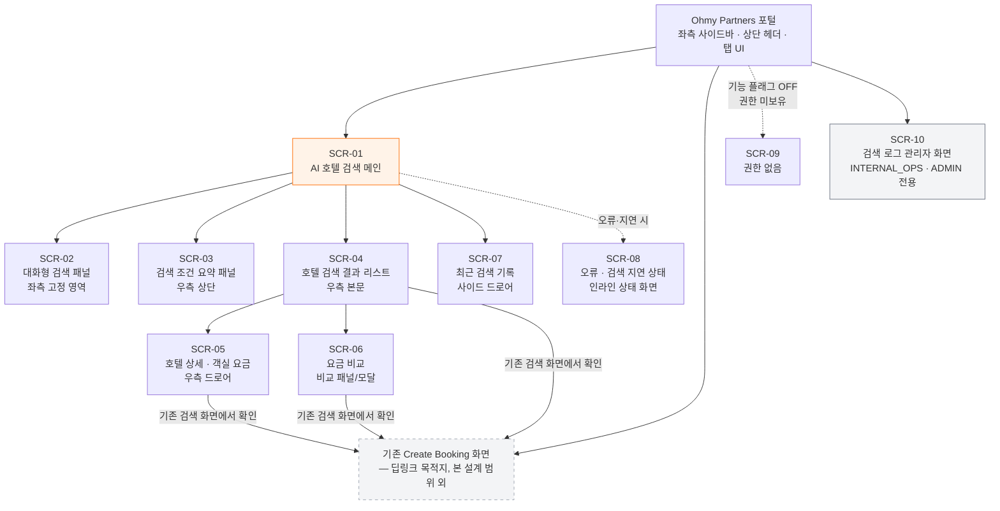
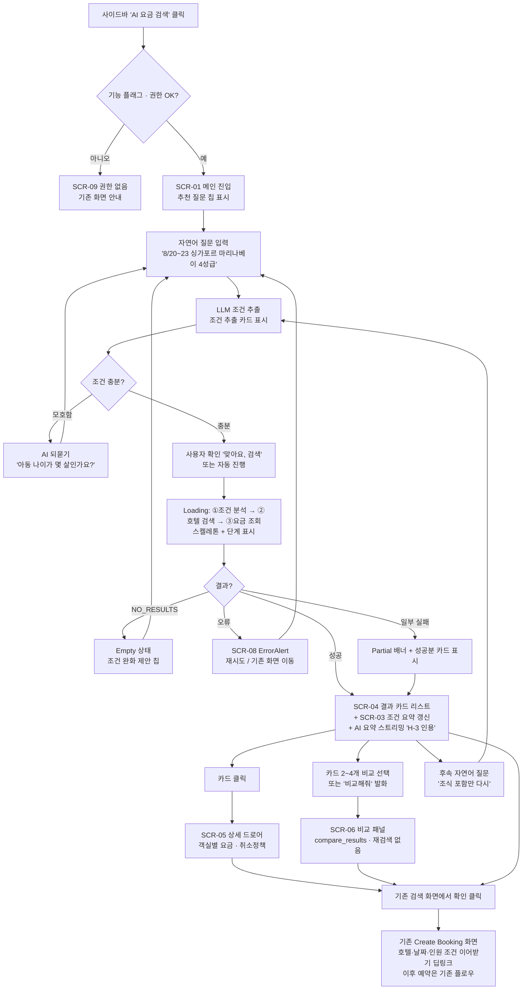

# ELLIS 기반 LLM 자연어 요금 검색 — UI/UX 설계서

> **문서 상태**: DRAFT v0.1
> **작성일**: 2026-07-10
> **대상 시스템**: Ohmy Partners B2B 포털 (ohmyhotel.biz) — 데스크톱 관리자형 포털
> **상위 문서**: [`docs/architecture/ellis-mcp-llm-search.md`](../architecture/ellis-mcp-llm-search.md)
> **범위**: 조회 전용(Read-Only) AI 호텔 요금 검색 UI — **예약 버튼 없음**, "기존 검색 화면에서 확인"(Create Booking 딥링크) 버튼만 제공

---

## 0. 디자인 원칙 및 전제

| # | 원칙 | 근거 |
|---|------|------|
| P1 | **모든 숫자(요금·취소마감·재고)는 MCP 도구 JSON에서만 렌더링** — LLM 텍스트에서 금액을 파싱해 표시하지 않는다 | 아키텍처 §5 |
| P2 | 기존 포털 UI 관성 유지: 좌측 사이드바 + 상단 헤더 + 탭 UI + 주황 브랜드 컬러(`--brand-orange`) | 기존 Ohmy Partners 스타일 |
| P3 | 채팅 UI에는 항상 "기존 검색 화면으로 이동" 탈출구를 상시 노출 | 아키텍처 §9 공통 원칙 |
| P4 | 조회 전용 MVP — 화면 어디에도 예약/결제 CTA 없음. 유일한 전환 CTA는 **"기존 검색 화면에서 확인"** 딥링크 | 아키텍처 §10.3 |
| P5 | 권한(AGENT_USER / INTERNAL_SALES / INTERNAL_OPS / ADMIN)에 따라 net_price·markup·supplier_id 노출을 서버 응답 단계에서 차단하고, UI는 받은 필드만 그린다 (프론트 숨김만으로 보호하지 않음) | §8 |
| P6 | [가정] 브랜드 컬러 토큰: 주황 `#FF6B00`(primary), 보조 `#1F2937`(gray-800), 성공 `#16A34A`, 경고 `#F59E0B`, 오류 `#DC2626` | 기존 포털 실측값 확인 필요 |
| P7 | [가정] 기존 포털은 상단 헤더에 로그인 Agent(셀러)명·통화·시장(마켓)이 이미 표시됨 — AI 검색 화면은 이를 "컨텍스트 바"로 재노출 | 확인 필요 |

---

## 1. 전체 화면 구조 (사이트맵)

총 10개 화면. AI 검색은 기존 포털 좌측 사이드바에 **"AI 요금 검색" 메뉴(신규)** 로 진입한다.



| 화면 ID | 화면명 | 유형 | 진입 경로 | 접근 권한 |
|---------|--------|------|-----------|-----------|
| SCR-01 | AI 호텔 검색 메인 | 페이지(포털 탭) | 사이드바 "AI 요금 검색" | 기능 플래그 ON 셀러의 전 역할 |
| SCR-02 | 대화형 검색 패널 | 메인 내 좌측 고정 패널 | SCR-01 내장 | 동일 |
| SCR-03 | 검색 조건 요약 패널 | 메인 내 우측 상단 패널 | SCR-01 내장 | 동일 |
| SCR-04 | 호텔 검색 결과 리스트 | 메인 내 우측 본문 | 검색 완료 시 | 동일 |
| SCR-05 | 호텔 상세·객실 요금 | 우측 슬라이드 드로어 | 결과 카드 클릭 | 동일 (필드 노출은 권한별) |
| SCR-06 | 요금 비교 | 하단 확장 패널/모달 | 카드 비교 체크 or "비교해줘" 발화 | 동일 |
| SCR-07 | 최근 검색 기록 | 좌측 드로어 | 채팅 패널 헤더 시계 아이콘 | 동일 (본인 세션 범위) |
| SCR-08 | 오류·검색 지연 상태 | 인라인 상태 뷰 | 오류/지연 발생 시 | 동일 |
| SCR-09 | 권한 없음 | 전면 안내 페이지 | 플래그 OFF·권한 미보유 진입 | 전체 |
| SCR-10 | 검색 로그 관리자 화면 | 페이지(포털 탭) | 사이드바 "AI 검색 로그"(관리 메뉴) | INTERNAL_OPS, ADMIN |

---

## 2. 메인 레이아웃 (SCR-01)

데스크톱 1440px 기준 [가정: 포털 최소 지원 해상도 1280px].

```
┌──────────────────────────────────────────────────────────────────────────────────────┐
│ ⬛ Ohmy Partners   [Create Booking] [Booking List] [AI 요금 검색●] ...     🔔  👤 CEO │ ← 상단 헤더(기존)
├──────────────────────────────────────────────────────────────────────────────────────┤
│ 컨텍스트 바: Agent: HanaTour Seoul │ 통화: KRW │ 시장: KR │ 오늘: 2026-07-10 (KST)   │ ← 상단 컨텍스트 바
├────────┬───────────────────────────────┬─────────────────────────────────────────────┤
│        │  SCR-02 대화형 AI 검색        │  SCR-03 검색 조건 요약 패널                 │
│ 사      │ ┌───────────────────────────┐ │ ┌─────────────────────────────────────────┐ │
│ 이      │ │ 🤖 AI 요금 검색   🕘 ⟳ ⛶ │ │ │ 📍싱가포르(SIN) 📅 08/20~08/23 (3박)     │ │
│ 드      │ ├───────────────────────────┤ │ │ 👥 성인2 │ ⭐4성+ │ 🍳조식 │ ✅무료취소    │ │
│ 바      │ │ [AI] 안녕하세요! 지역·날짜 │ │ │ [조건 수정은 채팅으로 요청하세요]        │ │
│        │ │  ·인원을 말씀해 주세요.    │ │ └─────────────────────────────────────────┘ │
│ (기존) │ │                           │ │  SCR-04 호텔 검색 결과 (12건) [정렬▾][표|카드]│
│        │ │ [나] 8/20~23 싱가포르 마리 │ │ ┌─────────────────────────────────────────┐ │
│ · 홈   │ │  나베이 4성급, 성인 2명    │ │ │ ▣ HotelResultCard #H-1                  │ │
│ · 예약 │ │                           │ │ ├─────────────────────────────────────────┤ │
│ · 정산 │ │ [AI] 조건을 확인했어요 →  │ │ │ ▣ HotelResultCard #H-2                  │ │
│ · AI●  │ │  4성급 12곳을 찾았습니다   │ │ ├─────────────────────────────────────────┤ │
│ · 로그◆│ │  [H-1][H-2][H-3] 참조...  │ │ │ ▣ HotelResultCard #H-3                  │ │
│        │ ├───────────────────────────┤ │ │            ... (스크롤)                  │ │
│        │ │ ┌───────────────────────┐ │ │ └─────────────────────────────────────────┘ │
│        │ │ │ 질문을 입력하세요...   │ │ │ ☑ 비교함(2)  [비교하기]                     │
│        │ │ └──────────────[전송 ➤]┘ │ │                                              │
│        │ │ ↳ 기존 검색 화면으로 이동 │ │                                              │
│        │ └───────────────────────────┘ │                                              │
├────────┴───────────────────────────────┴─────────────────────────────────────────────┤
│ 상태 바: ● 검색 완료 │ 조건분석 0.8s · 호텔검색 2.1s · 요금조회 3.4s │ 조회 14:02:31 │ ← 하단 스테이터스 바
└──────────────────────────────────────────────────────────────────────────────────────┘
  ● = 활성 메뉴  ◆ = INTERNAL_OPS/ADMIN에게만 표시
```

| 영역 | 폭 [가정] | 내용 |
|------|-----------|------|
| 좌측 사이드바 | 220px (기존 고정) | 기존 포털 메뉴 + "AI 요금 검색" 신규, "AI 검색 로그"(권한자만) |
| 상단 컨텍스트 바 | 전폭, 높이 40px | Agent(셀러)명 · 통화 · 시장 · 오늘 날짜(타임존). 읽기 전용 — 셀러 컨텍스트는 세션에서 주입되므로 UI에서 변경 불가 |
| 좌측 대화 영역(SCR-02) | 420px 고정(접기 가능) | 채팅 스레드 + 입력창 + 탈출구 링크 |
| 우측 결과 영역(SCR-03+04) | 나머지(≥620px) | 조건 요약(상단 고정) + 결과 리스트(스크롤) |
| 하단 스테이터스 바 | 전폭, 높이 32px | 검색 상태(대기/진행/완료/오류) · 단계별 소요 시간 · 마지막 조회 시각(`last_updated_at`) |

---

## 3. 화면별 와이어프레임 + 컴포넌트 표

### 3.1 SCR-02 대화형 검색 패널

```
┌────────────────────────────────────┐
│ 🤖 AI 요금 검색      🕘기록  ⟳새대화 │ ← 패널 헤더
├────────────────────────────────────┤
│                                    │
│  [AI] 어떤 호텔을 찾으시나요?       │
│       예) "8월 20~23일 도쿄 신주쿠  │
│       4성급, 성인 2명, 조식 포함"   │
│  ┌ 추천 질문 칩 ────────────────┐   │
│  │ (도쿄 주말 특가)(무료취소만)  │   │
│  └──────────────────────────────┘   │
│                        ┌─────────┐ │
│                        │[나] 8/20 │ │ ← 사용자 말풍선(우측, 주황 배경)
│                        │~23 싱가..│ │
│                        └─────────┘ │
│  [AI] 조건을 이렇게 이해했어요:     │ ← AI 말풍선(좌측, 회색 배경)
│  ┌ 조건 추출 카드 ──────────────┐   │
│  │ 📍 싱가포르 · 마리나베이      │   │
│  │ 📅 2026-08-20 → 08-23 (3박)  │   │
│  │ 👥 성인 2 · ⭐ 4성급 이상     │   │
│  │ [맞아요, 검색]  [수정할래요]  │   │
│  └──────────────────────────────┘   │
│  [AI] 12곳을 찾았습니다. 최저가는   │
│  [H-3] Marina Bay Hotel… ▌(스트리밍)│
├────────────────────────────────────┤
│ ┌────────────────────────────────┐ │
│ │ 질문을 입력하세요…      ➤ 전송 │ │ ← SearchInput
│ └────────────────────────────────┘ │
│ 예약·결제는 지원하지 않아요(조회 전용)│
│ ↳ 기존 검색 화면으로 이동           │ ← 상시 탈출구
└────────────────────────────────────┘
```

| 컴포넌트 | 역할 | 데이터 | 상태 |
|----------|------|--------|------|
| `ChatPanel` | 대화 스레드 컨테이너, 스크롤 관리, 스트리밍 수신 | 대화 이력(messages[]), trace_id | idle / streaming / error |
| `ChatMessage` | 말풍선 1건 렌더 (사용자/AI 구분, result_id 인용 배지 `[H-3]` 하이라이트) | role, content, citations[] | sending / streamed / blocked(Validator 차단 시 카드만) |
| `ConditionExtractCard` | LLM이 추출한 조건 확인 카드 — 검색 실행 전 사용자 컨펌 | destination, check_in/out, occupancy, filters | proposed / confirmed / edited |
| `SuggestedChips` | 첫 진입·빈 결과 시 추천 질문 칩 | 칩 텍스트 목록(정적+최근 검색 기반) | default / hidden |
| `SearchInput` | 자연어 입력창(멀티라인, Enter 전송, Shift+Enter 줄바꿈) | value, disabled 여부 | enabled / disabled(스트리밍 중) / rate-limited |
| `EscapeLink` | "기존 검색 화면으로 이동" 상시 링크 | 딥링크 URL(현재 조건 쿼리스트링 포함) | 항상 노출 |
| `ReadOnlyNotice` | "조회 전용" 고지 문구 | 정적 텍스트 | 항상 노출 |

### 3.2 SCR-03 검색 조건 요약 패널

```
┌───────────────────────────────────────────────────────────────┐
│ 검색 조건                                    result_set_id: RS-20260710-0042 │
│ ┌─────────┐┌──────────────────┐┌─────────┐┌───────┐┌─────────┐│
│ │📍싱가포르 ││📅08/20~08/23 (3박)││👥성인 2  ││⭐4성+  ││✅무료취소││ ← 조건 칩(읽기 전용)
│ └─────────┘└──────────────────┘└─────────┘└───────┘└─────────┘│
│ 국적 필터: VN (베트남 고객 판매가능 상품만)   통화: KRW        │
│ ⓘ 조건 변경은 좌측 채팅에 요청하세요. 예) "5성급으로 올려줘"   │
└───────────────────────────────────────────────────────────────┘
```

| 컴포넌트 | 역할 | 데이터 | 상태 |
|----------|------|--------|------|
| `SearchConditionPanel` | 현재 result_set의 확정 조건 표시(단일 진실 원천 = MCP 도구 입력값) | destination, dates, occupancy, filters, client_nationality, currency, result_set_id | empty(검색 전) / active / stale(30분 TTL 초과) |
| `ConditionChip` | 조건 1개 칩. **읽기 전용** — 직접 편집 없음(조건 변경은 채팅 발화로만, LLM 파라미터 추출 경로 단일화) | label, icon, value | default / changed(직전 대비 변경 시 주황 테두리 강조) |
| `ResultSetBadge` | result_set_id 표시(로그 대조·CS용) | result_set_id | 항상 |

### 3.3 SCR-04 호텔 검색 결과 리스트

```
┌──────────────────────────────────────────────────────────────────┐
│ 검색 결과 12건   정렬: [총요금 낮은순 ▾]   보기: [카드 ▣│표 ☰]   │
│ ⚠ 일부 공급사(2/5) 응답 실패 — 결과가 완전하지 않을 수 있습니다 ⓘ│ ← Partial 배너(해당 시)
├──────────────────────────────────────────────────────────────────┤
│ ▣ HotelResultCard [H-1]  (→ §5 상세 스펙)                        │
├──────────────────────────────────────────────────────────────────┤
│ ▣ HotelResultCard [H-2]                                          │
├──────────────────────────────────────────────────────────────────┤
│ ▣ HotelResultCard [H-3]                                          │
│              … 스크롤 …                                          │
├──────────────────────────────────────────────────────────────────┤
│ 20건 상한 도달 — 조건을 좁히면 더 정확한 결과를 볼 수 있어요      │
│ ☑ 비교함(2/4)  [비교하기]                                        │
└──────────────────────────────────────────────────────────────────┘
```

| 컴포넌트 | 역할 | 데이터 | 상태 |
|----------|------|--------|------|
| `HotelResultList` | 카드/표 목록 컨테이너, 정렬·뷰 전환, 비교 선택 관리 | hotels[](MCP `search_hotels` 결과), sort_key, view_mode | loading / loaded / empty / partial / error |
| `HotelResultCard` | 호텔 1건 카드 (§5 상세) | §5 필드 전체 | default / selected(비교) / stale |
| `HotelResultTable` | 표 보기 — 대량 비교용 밀집 뷰. 권한별 컬럼 노출(§8) | 카드와 동일 필드의 행 배열 | 동일 |
| `PartialResultBanner` | 일부 공급사 실패 경고 + warnings[] 상세 토글 | warnings[](공급사별 실패 사유), 실패/전체 공급사 수 | hidden / visible |
| `SortSelect` | 정렬(총요금↑/1박평균↑/성급↓/취소마감 여유순) | sort_key | — |
| `CompareTray` | 비교 대상 선택 트레이(최대 4개 [가정]) | 선택 result_id[] | hidden / active |

### 3.4 SCR-05 호텔 상세·객실 요금 (우측 드로어)

```
┌── RateDetailDrawer ────────────────────────────── ✕ 닫기 ──┐
│ ┌────────────┐  Marina Bay Grand Hotel  ⭐⭐⭐⭐            │
│ │  이미지     │  [H-3] 인용 배지                            │
│ │  캐러셀     │  📍 10 Bayfront Ave, Singapore  [지도 보기] │
│ └────────────┘  체크인 15:00 · 체크아웃 11:00              │
│─────────────────────────────────────────────────────────────│
│ 객실 요금 (2026-08-20 → 08-23 · 3박 · 성인 2)              │
│ ┌─────────────────────────────────────────────────────────┐ │
│ │ [R-12] Deluxe King · 조식 포함(BB)                      │ │
│ │ 무료취소: 08/17 23:59(KST)까지  [✅ 예약 가능 요금]      │ │
│ │ ─ 내부 전용(INTERNAL) ────────────────────────────────  │ │
│ │ │ Net 320,000 │ Markup 12% │ 공급사: SUP-HB(Hotelbeds) │ │
│ │ ─────────────────────────────────────────────────────── │ │
│ │ 판매가 358,400 + 세금 35,840 = 총 394,240 KRW           │ │
│ │ 1박 평균 131,413 KRW │ 재고: 잔여 3실                    │ │
│ │ 조회: 14:02:31 · ⚠ 요금 변동 가능                       │ │
│ └─────────────────────────────────────────────────────────┘ │
│ ┌ [R-13] Deluxe Twin · 조식 불포함(RO) … ┐                  │
│ └────────────────────────────────────────┘                  │
│ 취소 정책 전문 보기 ▾  (get_cancellation_policy)            │
│─────────────────────────────────────────────────────────────│
│            [ 기존 검색 화면에서 확인 ↗ ]  ← 유일한 CTA      │
└─────────────────────────────────────────────────────────────┘
```

| 컴포넌트 | 역할 | 데이터 | 상태 |
|----------|------|--------|------|
| `RateDetailDrawer` | 호텔 상세 + 요금제 목록 드로어(`get_hotel_content` + `get_hotel_rates`) | hotel content, rates[], result_id | loading / loaded / error / stale |
| `ImageCarousel` | 호텔 이미지 캐러셀(키보드 좌우 지원) | images[] | loading / empty(플레이스홀더) |
| `MapPreview` | 위치 정적 지도 + 외부 지도 새 창 링크 [가정: 정적 지도 타일 사용, 지도 SDK는 확장 단계] | lat/lng, 주소 | default |
| `RatePlanRow` | 요금제 1건 — §5 필드 배치 준수 | room_type_name, meal_plan, cancellation, 가격 구성, availability | available / on_request / soldout |
| `InternalPriceBlock` | Net·Markup·공급사 표시 블록 — **내부 권한자 응답에만 존재** | net_price, markup, supplier_id | 권한자만 렌더 |
| `CancellationPolicyAccordion` | 취소 정책 전문(단계별 위약금) | policy steps[] | collapsed / expanded / loading |
| `DeeplinkButton` | "기존 검색 화면에서 확인" — Create Booking 딥링크(호텔코드·날짜·인원 쿼리 이어받기) | deeplink URL | enabled / disabled(stale 시 재검색 유도) |

### 3.5 SCR-06 요금 비교

```
┌── HotelComparisonPanel ──────────────────────────── ✕ ──┐
│ 비교 (RS-20260710-0042 기준 · 재검색 없음 · 캐시 30분)   │
│ ┌───────────────┬───────────────┬───────────────┐        │
│ │ [H-3] Marina  │ [H-7] Orchard │ [H-1] Sands   │        │
│ │ Bay Grand ⭐4 │ Palace ⭐4    │ Bay ⭐5       │        │
│ ├───────────────┼───────────────┼───────────────┤        │
│ │ 총요금 394,240│ 총요금 412,000│ 총요금 688,500│ ← 최저가 셀 주황 강조
│ │ 1박 131,413   │ 1박 137,333   │ 1박 229,500   │        │
│ │ 조식 포함     │ 조식 불포함   │ 조식 포함     │        │
│ │ 무료취소~08/17│ 환불불가 ⚠    │ 무료취소~08/18│ ← 취소 유리 셀 초록 강조
│ │ 재고 3실      │ 재고 8실      │ 재고 1실 ⚠    │        │
│ │ (내부) Net/MU │ (내부) Net/MU │ (내부) Net/MU │ ← 권한자만 행 표시
│ ├───────────────┼───────────────┼───────────────┤        │
│ │[기존 화면에서 │[기존 화면에서 │[기존 화면에서 │        │
│ │  확인 ↗]      │  확인 ↗]      │  확인 ↗]      │        │
│ └───────────────┴───────────────┴───────────────┘        │
│ [AI] 최저가는 [H-3], 취소조건은 [H-3]가 가장 유리합니다   │ ← LLM 서술(숫자는 표에서)
└──────────────────────────────────────────────────────────┘
```

| 컴포넌트 | 역할 | 데이터 | 상태 |
|----------|------|--------|------|
| `HotelComparisonPanel` | `compare_results` 도구 결과의 열 비교 표(2~4열) | result_set_id, 비교 대상 result_id[], criteria | loading / loaded / stale(캐시 만료 시 "재검색 필요" 안내) |
| `ComparisonHighlight` | 기준별 최우수 셀 강조(최저가=주황, 취소유리=초록) | criteria별 winner result_id | — |
| `ComparisonNarrative` | LLM 비교 서술 말풍선(인용 배지 포함, 숫자 미표시 원칙) | narrative text, citations[] | streamed / blocked |

### 3.6 SCR-07 최근 검색 기록 (드로어)

```
┌── SearchHistoryPanel ──────────── ✕ ──┐
│ 최근 검색 (최근 30일 · 본인 세션)      │
│ ┌───────────────────────────────────┐ │
│ │ 오늘 14:02  싱가포르 · 08/20~23    │ │
│ │ 성인2 · ⭐4+ · 12건  [다시 검색 ⟳] │ │
│ ├───────────────────────────────────┤ │
│ │ 오늘 11:30  도쿄 신주쿠 · 09/01~03 │ │
│ │ 성인2 아동1(7세) · 8건 [다시 검색] │ │
│ ├───────────────────────────────────┤ │
│ │ 07/09 17:44  다낭 · 08/15~18      │ │
│ │ 결과 없음 ∅        [다시 검색 ⟳]  │ │
│ └───────────────────────────────────┘ │
│ ⓘ 과거 요금은 저장하지 않습니다.      │
│   "다시 검색"은 현재 요금을 새로 조회  │
└───────────────────────────────────────┘
```

| 컴포넌트 | 역할 | 데이터 | 상태 |
|----------|------|--------|------|
| `SearchHistoryPanel` | `get_search_history` 결과 목록(본인 범위) | history[](일시, 목적지, 날짜, 인원, 필터, 결과 건수) | loading / loaded / empty |
| `HistoryItem` | 이력 1건 + "다시 검색" 버튼(조건을 새 채팅 턴으로 주입 → 신규 조회) | 조건 요약, result_set_id | default / rerunning |
| `NoPriceStoredNotice` | "과거 요금 미저장 — 재조회" 고지 | 정적 | 항상 |

### 3.7 SCR-08 오류·검색 지연 상태 (인라인)

```
── Loading(지연 진행 중) ──────────────────────────────
│ ⏳ 요금 시스템 응답이 평소보다 느립니다 (8초 경과)     │
│ [①조건 분석 ✓]──[②호텔 검색 ✓]──[③요금 조회 ⏳...]  │
│ ▓▓▓▓▓▓▓░░░░ (스켈레톤 카드 3개)     [검색 취소]      │
────────────────────────────────────────────────────────
── Error ──────────────────────────────────────────────
│ ⚠ 요금 시스템 응답이 지연되고 있습니다 (ELLIS_TIMEOUT)│
│ 잠시 후 다시 시도해 주세요.                            │
│ [다시 시도]  [기존 검색 화면으로 이동 ↗]               │
│ 오류 코드: ELLIS_TIMEOUT · trace: TR-…07f2 (복사 📋)  │
────────────────────────────────────────────────────────
```

| 컴포넌트 | 역할 | 데이터 | 상태 |
|----------|------|--------|------|
| `LoadingSkeleton` | 스켈레톤 카드 + 3단계 진행 표시(§6.1) | 현재 단계, 경과 시간 | step1 / step2 / step3 / slow(8s+) |
| `ErrorAlert` | 에러 코드별 메시지·재시도·탈출구·trace_id 복사(§6.3) | error_code, message, trace_id, retryable 여부 | visible / retrying |
| `CancelSearchButton` | 진행 중 검색 취소(턴 중단) | — | enabled(스트리밍/조회 중만) |

### 3.8 SCR-09 권한 없음

```
┌──────────────────────────────────────────────┐
│                                              │
│                  🔒                          │
│        AI 요금 검색 사용 권한이 없습니다      │
│                                              │
│  이 기능은 현재 일부 파트너사에 순차 오픈     │
│  중입니다. 사용을 원하시면 담당 매니저에게    │
│  요청해 주세요.                               │
│                                              │
│  [기존 검색 화면으로 이동 ↗] [담당자 문의 ✉] │
│                                              │
└──────────────────────────────────────────────┘
```

| 컴포넌트 | 역할 | 데이터 | 상태 |
|----------|------|--------|------|
| `NoAccessPage` | 플래그 OFF/권한 미보유 안내 + 대안 경로 | 사유 코드(FLAG_OFF / ROLE_DENIED), 담당자 문의 링크 | 정적 |

※ 세션 만료(`UNAUTHORIZED`)는 이 화면이 아니라 재로그인 모달로 처리(기존 포털 패턴 준용) [가정].

### 3.9 SCR-10 검색 로그 관리자 화면 (INTERNAL_OPS · ADMIN)

```
┌──────────────────────────────────────────────────────────────────────┐
│ AI 검색 로그                          기간:[07/03~07/10▾] 셀러:[전체▾]│
│ 필터: 상태[전체|성공|오류|차단] 에러코드[▾] trace_id[________] [조회] │
├──────────────────────────────────────────────────────────────────────┤
│ KPI: 턴 1,204 │ 성공률 98.2% │ P95 12.4s │ Validator 차단 0.6% │      │
│      결과없음 7.1% │ 딥링크 전환율 23.4%                              │
├──────────────────────────────────────────────────────────────────────┤
│ 일시       셀러        질의(요약)        도구호출 상태   지연  trace  │
│ 07/10 14:02 HanaTour   싱가포르 4성급…   3회    ✓성공   6.3s  TR-07f2│
│ 07/10 13:55 ModeTour   도쿄 결과없음…    2회    ∅없음   4.1s  TR-07e9│
│ 07/10 13:41 HanaTour   다낭 8월…        1회    ⚠차단   9.8s  TR-07d1│
│ …                                              [행 클릭 → 상세 드로어]│
├──────────────────────────────────────────────────────────────────────┤
│ ◀ 1 2 3 … 41 ▶                            [CSV 내보내기 (ADMIN만)]  │
└──────────────────────────────────────────────────────────────────────┘
행 상세 드로어: 원문 질의 · 도구호출 타임라인(입력/결과건수/ELLIS응답코드/지연)
· Validator 결과 · 응답 요약 · 토큰 사용량 — 개인정보 없음(아키텍처 §7 데이터 최소화)
```

| 컴포넌트 | 역할 | 데이터 | 상태 |
|----------|------|--------|------|
| `SearchLogPage` | 로그 테이블 + 필터 + KPI 요약 | chat_turn/tool_call 로그(§8.1 스키마), 기간/셀러/상태 필터 | loading / loaded / empty |
| `LogKpiStrip` | 성공률·P95·차단율 등 KPI 타일 | 모니터링 지표(아키텍처 §8.2) | loaded / degraded(수집 지연) |
| `LogDetailDrawer` | 턴 1건의 도구호출 타임라인 상세 | trace_id 하위 전체 로그 | loading / loaded |
| `CsvExportButton` | 로그 내보내기 — ADMIN만 [가정] | 필터 조건 | enabled / disabled |

---

## 4. 사용자 흐름 (User Flow)



**핵심 UX 규칙**

| 단계 | 규칙 |
|------|------|
| 조건 추출 표시 | 검색 실행 전 반드시 조건 추출 카드로 가시화 — 사용자가 오추출을 즉시 교정 가능. 3필드(지역·날짜·인원) 모두 명확하면 [가정] 자동 검색 진행(카드는 표시 유지) |
| 결과 카드 | AI 텍스트가 언급하는 `[H-n]` 배지 클릭 시 우측 해당 카드로 스크롤+하이라이트(양방향 연결) |
| 비교 | 캐시 기반(30분 TTL) — TTL 초과 시 비교 버튼 비활성 + "재검색 필요" 툴팁 |
| 딥링크 | `/booking/create?hotelCode=…&checkIn=…&checkOut=…&adults=…&children=…` [가정: 기존 화면이 쿼리 파라미터 프리필 지원. 미지원 시 세션 스토리지 핸드오프] |

---

## 5. 검색 결과 카드 상세 스펙 (`HotelResultCard`)

### 5.1 레이아웃 — INTERNAL_SALES / INTERNAL_OPS / ADMIN 뷰

```
┌────────────────────────────────────────────────────────────────────────────┐
│ ┌──────────┐  Marina Bay Grand Hotel            [H-3]    ☑ 비교           │
│ │          │  ⭐⭐⭐⭐  📍 Marina Bay, Singapore [지도]                     │
│ │  hotel   │  ──────────────────────────────────────────                  │
│ │  image   │  Deluxe King · 조식 포함(BB)                                 │
│ │ 160×120  │  ✅ 무료취소 08/17 23:59(KST)까지                            │
│ │          │  ┌ 내부 전용 ─────────────────────────────┐                  │
│ └──────────┘  │ Net 320,000 │ MU 12% │ SUP-HB Hotelbeds│                  │
│               └─────────────────────────────────────────┘                  │
│  판매가 358,400 │ 세금 35,840 │ 총 394,240 KRW │ 1박 평균 131,413        │
│  ────────────────────────────────────────────────────────────────────────  │
│  🟢 예약가능(잔여 3실) │ ✅ 예약 가능 요금 │ ⚠ 요금 변동 가능              │
│  조회 14:02:31(KST)                    [상세 보기] [기존 검색 화면에서 확인↗]│
└────────────────────────────────────────────────────────────────────────────┘
```

### 5.2 레이아웃 — AGENT_USER 뷰 (내부 블록·Net·Markup·공급사 없음)

```
┌────────────────────────────────────────────────────────────────────────────┐
│ ┌──────────┐  Marina Bay Grand Hotel            [H-3]    ☑ 비교           │
│ │  image   │  ⭐⭐⭐⭐  📍 Marina Bay, Singapore [지도]                     │
│ │          │  Deluxe King · 조식 포함(BB)                                 │
│ └──────────┘  ✅ 무료취소 08/17 23:59(KST)까지                            │
│  판매가 358,400 │ 세금 35,840 │ 총 394,240 KRW │ 1박 평균 131,413        │
│  🟢 예약가능(잔여 3실) │ ✅ 예약 가능 요금 │ ⚠ 요금 변동 가능              │
│  조회 14:02:31(KST)                    [상세 보기] [기존 검색 화면에서 확인↗]│
└────────────────────────────────────────────────────────────────────────────┘
```

### 5.3 필드 명세

| # | 필드 | 표시 위치 | 형식 | 데이터 출처(MCP) | 권한 |
|---|------|-----------|------|------------------|------|
| 1 | `hotel_name` | 카드 헤더(굵게, 16px) | 텍스트, 말줄임 1줄 | search_hotels | 전체 |
| 2 | 이미지 | 좌측 160×120 썸네일 | lazy-load, 실패 시 플레이스홀더 | get_hotel_content | 전체 |
| 3 | `star_rating` | 호텔명 아래 | ⭐ 아이콘 반복 + sr-only "4성급" | search_hotels | 전체 |
| 4 | 위치(+지도) | 성급 옆 | 지역명 + [지도] 링크(새 창) | search_hotels / content | 전체 |
| 5 | `room_type_name` | 본문 1행 | 텍스트 | search_hotels(대표 요금) | 전체 |
| 6 | `meal_plan` | 객실타입 옆 | "조식 포함(BB)" / "룸온리(RO)" 등 코드+한글 병기 | rate 요약 | 전체 |
| 7 | `cancellation_type` / `deadline` | 본문 2행 | 무료취소=초록 ✅+마감일시(타임존 명기) / 환불불가=회색 ⛔ / 부분환불=주황 ⚠ | rate 요약 | 전체 |
| 8 | `supplier_id` | 내부 전용 블록 | 코드+공급사명 | rate 요약 | **내부만** |
| 9 | `net_price` | 내부 전용 블록 | 통화 로캘 포맷 | rate 요약 | **내부만** |
| 10 | `markup` | 내부 전용 블록 | % 또는 금액(원천 그대로) | rate 요약 | **내부만** |
| 11 | `selling_price` | 가격 행(강조) | 통화 로캘 포맷 | rate 요약 | 전체 |
| 12 | `tax` | 가격 행 | 통화 포맷 + "세금 포함/별도" 구분 표기 | rate 요약 | 전체 |
| 13 | 총 요금 | 가격 행(최대 강조, 주황·18px) | selling_price+tax 합산값을 **서버가 계산해 내려준 값 그대로** | rate 요약 | 전체 |
| 14 | 1박 평균 | 총 요금 옆(보조, 회색) | 서버 계산값 | rate 요약 | 전체 |
| 15 | `availability` | 상태 행 배지 | §11.5 배지 규칙 | rate 요약 | 전체 |
| 16 | `last_updated_at` | 상태 행 우측 | "조회 HH:mm:ss(타임존)" | MCP 응답 메타 | 전체 |
| 17 | `result_id` | 카드 우상단 `[H-3]` 배지 | 채팅 인용과 상호 하이라이트 | MCP 정규화 | 전체 |
| 18 | booking_token 유무 | 상태 행 라벨 | "✅ 예약 가능 요금" / "ℹ 참고용 요금" (§11.6) | rate 요약 | 전체 |

**규칙**: ⑧⑨⑩은 내부 권한자 **응답에만 포함**되며(P5), AGENT_USER 응답 JSON에는 필드 자체가 없다. UI는 `internal` 블록 존재 여부로만 분기한다.

---

## 6. 상태 설계

### 6.1 Loading — 스켈레톤 + 3단계 표시

```
┌─────────────────────────────────────────────────────┐
│  [① 조건 분석 ✓]──[② 호텔 검색 ⏳]──[③ 요금 조회 ○] │ ← StepIndicator
│                                                     │
│  ┌──────┐ ▓▓▓▓▓▓▓▓▓▓▓▓▓▓░░░░░░                     │
│  │▓▓▓▓▓▓│ ▓▓▓▓▓▓▓▓░░░░                             │ ← 스켈레톤 카드 ×3
│  └──────┘ ▓▓▓▓▓▓▓▓▓▓▓░░░░░░░░░                     │
│  8초 경과 시: "요금 시스템 응답이 평소보다 느립니다" │
│  15초 경과 시: [검색 취소] 버튼 노출                 │
└─────────────────────────────────────────────────────┘
```

| 단계 | 트리거 | 표시 | 예상 시간 [가정] |
|------|--------|------|------------------|
| ① 조건 분석 | LLM 턴 시작 | 조건 추출 카드 점진 표시 | ~2s |
| ② 호텔 검색 | `resolve_destination`/`search_hotels` tool_use 수신 | 스켈레톤 카드 + 단계 ② 활성 | ~4s |
| ③ 요금 조회 | rate 조회 진행 | 단계 ③ 활성, 카드 골격에 가격 영역만 펄스 | ~6s |
| slow 경고 | 8s 경과(타임아웃 15s 대비) | 지연 안내 문구, 15s에 취소 버튼 | — |

- 스트리밍 텍스트는 도착 즉시 표시하되, **가격 카드는 도구 결과 완결 후 일괄 렌더**(부분 숫자 노출 방지).
- 단계 전환은 Orchestrator SSE 이벤트(`step` 필드) 기준 [가정: 스트리밍 프로토콜에 step 이벤트 포함].

### 6.2 Empty — 조건 완화 제안 칩

```
┌─────────────────────────────────────────────────────┐
│                      ∅                              │
│   조건에 맞는 상품이 없습니다 (NO_RESULTS)           │
│   아래 조건을 조정해 다시 검색해 보세요:             │
│   ( 성급 3성+로 낮추기 ) ( 날짜 ±1일 )               │
│   ( 무료취소 조건 해제 ) ( 인근 지역 포함 )          │ ← 칩 클릭 = 해당 조건으로 채팅 발화 자동 입력
│   [기존 검색 화면으로 이동 ↗]                        │
└─────────────────────────────────────────────────────┘
```

- 제안 칩은 **실패한 필터 기준으로 동적 생성**(성급 필터 존재 → "성급 낮추기" 우선). 칩 클릭 시 새 검색 턴 실행.

### 6.3 Error — 에러 코드별 메시지·재시도

| 에러 코드 | 사용자 메시지 | 액션 버튼 | UI 위치 |
|-----------|--------------|-----------|---------|
| `ELLIS_TIMEOUT` | "요금 시스템 응답이 지연되고 있습니다. 잠시 후 다시 시도해 주세요." | [다시 시도] [기존 화면 이동] | 결과 영역 인라인 |
| `ELLIS_ERROR` | "요금 시스템에 일시적인 문제가 있습니다." | [다시 시도] [기존 화면 이동] | 결과 영역 인라인 |
| `INVALID_QUERY` | AI가 채팅으로 되묻기(별도 에러 UI 없음) | — | 채팅 말풍선 |
| `UNAUTHORIZED` | "세션이 만료되었습니다. 다시 로그인해 주세요." | [다시 로그인] | 전면 모달 |
| `RATE_LIMITED` | "요청이 많습니다. 1분 후 다시 시도해 주세요." | [60s 카운트다운 후 재시도 활성] | 입력창 상단 배너, 입력창 비활성 |
| `VALIDATION_BLOCKED` | (텍스트 없이) 카드만 + "상세는 카드를 확인해 주세요." | — | 채팅 말풍선 대체 |
| `LLM_UNAVAILABLE` | "AI 검색이 일시 중단되었습니다. 일반 검색을 이용해 주세요." | [기존 검색 화면으로 이동](주 CTA) | 전면 인라인 |
| `STALE_RESULT` | "조회 후 30분이 지나 요금이 변동되었을 수 있습니다." | [다시 검색] | 카드/비교 패널 배너(§11.3) |

- 모든 에러 뷰에 `trace_id` 축약 표기 + 복사 버튼(CS 대응용).
- 재시도는 **동일 조건 재실행**(입력 재타이핑 불필요), 버튼 연타 방지 디바운스 2s.

### 6.4 Partial result — 일부 공급사 실패

```
┌─────────────────────────────────────────────────────────────┐
│ ⚠ 일부 요금이 누락되었을 수 있습니다                          │
│   공급사 5곳 중 2곳 응답 실패 (SUP-EX: 시간초과, SUP-GT: 오류)│ ← warnings[] 상세 (내부 권한자: 공급사 코드 노출,
│   표시된 10건은 정상 조회된 요금입니다.   [누락분 재시도]     │    AGENT_USER: "일부 공급사"로만 표기)
└─────────────────────────────────────────────────────────────┘
```

- 성공한 결과는 **정상 카드로 즉시 표시**(전체 실패로 강등하지 않음).
- 배너는 warning 색(주황), 닫기 가능하되 상태 바에 ⚠ 아이콘 유지.
- `[누락분 재시도]`는 실패 공급사만 재조회 [가정: Gateway가 공급사 단위 부분 재시도 지원. 미지원 시 전체 재검색으로 대체].

---

## 7. 모바일 대응

| 항목 | 방침 |
|------|------|
| MVP 우선순위 | **데스크톱 우선.** B2B 셀러 업무 환경은 데스크톱 중심 [가정] — 모바일 전용 레이아웃은 Phase 2+ |
| 반응형 최소 기준 [가정] | ① ≥1280px: §2 3열 풀 레이아웃 ② 1024~1279px: 사이드바 아이콘 축소, 채팅 패널 360px ③ 768~1023px: 채팅/결과 **탭 전환형** 단일 컬럼(탭: "대화" / "결과 N건"), 결과 갱신 시 결과 탭에 배지 ④ <768px: 공식 미지원 — 레이아웃 파손만 방지(단일 컬럼 강제), "데스크톱 이용 권장" 배너 |
| 터치 대응 | 비교 체크박스·칩 등 터치 타깃 최소 44×44px 유지(태블릿 브라우저 대비) |
| 제외 항목 | 모바일 전용 제스처, 앱 셸, 오프라인 — MVP 범위 외 |

---

## 8. 권한별 UI 차이

| UI 요소 | AGENT_USER | INTERNAL_SALES | INTERNAL_OPS | ADMIN |
|---------|:----------:|:--------------:|:------------:|:-----:|
| AI 검색 화면 접근(SCR-01~08) | ✅(플래그 ON 셀러) | ✅ | ✅ | ✅ |
| `selling_price` / `tax` / 총 요금 / 1박 평균 | ✅ | ✅ | ✅ | ✅ |
| `net_price` 컬럼/블록 | ❌ (응답에 미포함) | ✅ | ✅ | ✅ |
| `markup` 컬럼/블록 | ❌ (응답에 미포함) | ✅ | ✅ | ✅ |
| `supplier_id` 컬럼/블록 | ❌ (응답에 미포함) | ✅ | ✅ | ✅ |
| Partial 배너 공급사 코드 상세 | ❌ ("일부 공급사"로 일반화) | ✅ | ✅ | ✅ |
| 표 보기(`HotelResultTable`) Net/MU/공급사 컬럼 | 컬럼 자체 미표시 | ✅ | ✅ | ✅ |
| 최근 검색 기록(SCR-07) | ✅ 본인 세션만 | ✅ 본인만 | ✅ 본인만 | ✅ 본인만 |
| 검색 로그 관리자 화면(SCR-10) | ❌ (메뉴 미노출 + 라우트 404) | ❌ | ✅ | ✅ |
| 로그 CSV 내보내기 | ❌ | ❌ | ❌ [가정] | ✅ |
| 기능 플래그(셀러별 on/off) 관리 | ❌ | ❌ | ❌ | ✅ [가정: 별도 어드민, 본 UI 범위 외] |

**구현 규칙**
1. 권한 분기는 **서버 응답 필드 유무**가 1차 방어선(P5). 프론트 role 체크는 메뉴 노출·라우팅 가드 용도로만 사용.
2. SCR-10은 메뉴 미노출 + 라우트 가드 + API 403 3중 차단.
3. [가정] 역할 체계는 포털 세션의 `role` 클레임(AGENT_USER / INTERNAL_SALES / INTERNAL_OPS / ADMIN)으로 전달 — 실제 포털 권한 모델 명칭 확인 필요(아키텍처 §7은 MVP를 "셀러 단위"로 정의, 내부 역할 세분화는 본 문서에서 확장 [가정]).

---

## 9. 접근성 기준 (WCAG 2.1 AA)

| 분류 | 기준 | 적용 |
|------|------|------|
| 키보드 탐색 | 2.1.1 / 2.4.3 | 논리적 탭 순서: 컨텍스트 바 → 채팅 입력 → 메시지 스레드 → 조건 칩 → 결과 카드 → 상태 바. 카드 내부는 화살표 키 이동(roving tabindex), `Enter`=상세 열기, `Space`=비교 체크. 드로어/모달은 포커스 트랩 + `Esc` 닫기 |
| 스트리밍 응답 알림 | 4.1.3 | 채팅 응답 영역 `aria-live="polite"` — 단, **토큰 단위가 아닌 문장 완결 단위로 버퍼링해 announce**(스크린리더 낭독 폭주 방지). 검색 단계 전환(①→②→③)·완료·오류는 `role="status"`로 별도 통지, 치명 오류는 `role="alert"` |
| 색 대비 | 1.4.3 / 1.4.11 | 본문 텍스트 대비 ≥4.5:1, 배지·아이콘 등 UI 요소 ≥3:1. 주황 브랜드(#FF6B00)는 흰 배경 위 대비 부족 → **텍스트·아이콘 단독 사용 금지, 배경색+진한 텍스트 조합** 또는 진한 주황(#C2410C 계열)로 보정 [가정] |
| 색 무의존 | 1.4.1 | 취소조건·재고 상태를 색+아이콘+텍스트 3중 표기(예: 🟢 "예약가능" — 색만으로 구분하지 않음) |
| 포커스 관리 | 2.4.7 / 3.2.1 | 가시적 포커스 링(2px, 브랜드 대비색). 상세 드로어 열림 시 포커스를 드로어 제목으로 이동, 닫힘 시 호출 카드로 복귀. 검색 완료 시 포커스 강탈 금지(aria-live 통지만) |
| 대체 텍스트 | 1.1.1 | 호텔 이미지 `alt="{hotel_name} 외관 사진"`, 장식 아이콘 `aria-hidden` |
| 성급 표기 | 1.3.1 | ⭐ 반복은 `aria-hidden`, `<span class="sr-only">4성급</span>` 병기 |
| 표 접근성 | 1.3.1 | `HotelResultTable`·비교표에 `<th scope>`, 캡션 제공 |
| 명칭·상태 | 4.1.2 | 비교 체크박스 `aria-label="{hotel_name} 비교에 추가"`, 배지들은 텍스트 포함이므로 별도 라벨 불요 |
| 시간 제한 | 2.2.1 | RATE_LIMITED 카운트다운·STALE 30분 TTL은 정보 손실 없음(재검색으로 동일 기능 수행 가능) — 예외 요건 충족 |

---

## 10. 다국어(i18n) UI 기준

| 항목 | 기준 |
|------|------|
| 지원 언어 | MVP: **ko / en** (아키텍처 §10.1 #6). Phase 3: ja / vi 확장 |
| 언어 결정 | 포털 기존 언어 설정 상속 [가정: 포털에 언어 스위처 존재]. **UI 라벨 언어와 LLM 응답 언어를 동일하게** Orchestrator에 전달 |
| 라이브러리 | react-i18next [가정] — 네임스페이스 분리, ICU 플루럴 지원 |
| i18n 키 구조 | `aiSearch.{영역}.{컴포넌트}.{키}` 계층. 예: `aiSearch.chat.input.placeholder`, `aiSearch.card.badge.freeCancellation`, `aiSearch.error.ELLIS_TIMEOUT.message`, `aiSearch.status.step.rateFetch` — **에러 키는 §9 에러 코드와 1:1 매핑** |
| 통화 포맷 | `Intl.NumberFormat(locale, {style:'currency', currency})` — 통화 코드는 **세션 셀러 통화**(컨텍스트 바 표시값)를 그대로 사용. KRW=소수 0자리, USD=2자리 등 통화별 자릿수는 Intl 기본 준수. **환산·반올림 금지** — 서버 값 그대로 포맷만 적용(P1) |
| 날짜 포맷 | 표시: `Intl.DateTimeFormat` 로캘 포맷(ko: 2026. 8. 20., en: Aug 20, 2026). 데이터 교환: ISO 8601 고정. **취소 마감일시는 반드시 타임존 병기**(예: "08/17 23:59 KST") [가정: ELLIS가 타임존 정보 제공. 미제공 시 "호텔 현지 시각" 문구로 대체] |
| 숫자 이외 LLM 응답 | LLM 서술 텍스트는 번역하지 않음(모델이 사용자 언어로 생성). UI 크롬(버튼·배지·에러)만 i18n 대상 |
| 텍스트 길이 | en이 ko 대비 평균 1.3배 — 버튼·칩은 고정폭 금지, min-width+패딩 설계 |
| 미번역 폴백 | ko → en 폴백, 키 노출 금지(CI에서 키 누락 검사 [가정]) |

---

## 11. 검색 결과 신뢰도 표시 방식

조회 전용 서비스에서 "이 요금을 믿고 고객에게 안내해도 되는가"를 UI가 직접 답하는 장치들.

### 11.1 조회 시각 타임스탬프
- 모든 카드·상세·비교 뷰 하단에 `조회 14:02:31 (KST)` 고정 표시(`last_updated_at`).
- 상태 바에도 result_set 단위 마지막 조회 시각 상시 표시.
- 5분 경과 시 상대 시각 병기: "조회 14:02 · 12분 전".

### 11.2 "요금 변동 가능" 배지
- 모든 요금 카드에 기본 부착되는 회색 소형 배지 `⚠ 요금 변동 가능`.
- 툴팁: "표시된 요금은 조회 시점 기준이며, 예약 시점에 달라질 수 있습니다."
- 목적: 캐시가 아닌 실시간 조회임에도 **확약이 아님**을 상시 고지(조회 전용 원칙과 딥링크 후 가격 차이 CS 예방).

### 11.3 STALE_RESULT 경고
- result_set 캐시 TTL 30분(아키텍처 §6) 초과 시:

```
┌────────────────────────────────────────────────────────┐
│ ⏰ 이 결과는 32분 전에 조회되었습니다.                    │
│    요금·재고가 변동되었을 수 있어요.   [다시 검색 ⟳]     │
└────────────────────────────────────────────────────────┘
```
- 카드 전체에 회색 오버레이 없이 **배너+카드 우상단 ⏰ 배지**로 표기(정보는 계속 읽을 수 있게).
- STALE 상태에서 딥링크 버튼은 유지하되 클릭 시 "최신 요금은 이동 후 화면에서 다시 확인됩니다" 툴팁.
- 비교 패널은 STALE 시 비활성(§3.5).

### 11.4 result_id 인용 배지
- AI 서술의 모든 상품 언급에 `[H-3]`, `[R-12]` 배지(아키텍처 §5 인용 강제와 동일 체계).
- 배지 클릭 → 해당 카드/요금행으로 스크롤+2초 하이라이트. 카드 쪽 배지 호버 시 채팅 내 언급 위치 역하이라이트.
- 목적: "AI가 말한 숫자의 출처가 화면의 구조화 데이터"임을 시각적으로 증명.

### 11.5 availability 상태 배지

| 값 | 배지 | 색/아이콘 |
|----|------|-----------|
| available (잔여 충분) | 🟢 예약가능 | 초록 |
| low stock (잔여 ≤3 [가정]) | 🟠 잔여 3실 | 주황, 잔여 수 명시 |
| on_request | 🔵 확인 필요(온리퀘스트) | 파랑 |
| sold_out | ⚫ 매진 | 회색, 카드 반투명 + 정렬 최하단 |

### 11.6 booking_token 유무 라벨

| 조건 | 라벨 | 의미 |
|------|------|------|
| rate에 `booking_token`(=rate_key 기반 예약 진입 가능 토큰 [가정]) 존재 | `✅ 예약 가능 요금` (초록 아웃라인 배지) | 기존 화면 이동 시 동일 요금제로 이어서 진행 가능성이 높음 |
| booking_token 없음(콘텐츠성 요금·집계 최저가 등) | `ℹ 참고용 요금` (회색 배지) | 시세 참고용 — 딥링크 버튼 문구도 "기존 검색 화면에서 최신 요금 확인"으로 변경 |

- 툴팁으로 두 라벨의 차이를 설명. 비교표에도 라벨 행 포함.

---

## 12. React + Tailwind CSS 컴포넌트 구조

### 12.1 컴포넌트 트리

```
AiSearchPage                              // SCR-01 라우트 (/ai-search)
├─ ContextBar                             // Agent · 통화 · 시장 · 날짜
├─ ChatPanel                              // SCR-02 좌측 420px
│   ├─ ChatPanelHeader                    //   기록·새대화 버튼
│   ├─ ChatMessageList
│   │   └─ ChatMessage (×n)
│   │       ├─ CitationBadge (×n)         //   [H-3] 인용 배지
│   │       ├─ ConditionExtractCard       //   조건 추출 확인 카드
│   │       └─ SuggestedChips             //   추천 질문 / 조건 완화 칩
│   ├─ SearchInput                        //   자연어 입력
│   └─ EscapeLink                         //   기존 화면 탈출구(상시)
├─ ResultArea                             // 우측 영역
│   ├─ SearchConditionPanel               // SCR-03
│   │   └─ ConditionChip (×n)
│   ├─ HotelResultList                    // SCR-04
│   │   ├─ PartialResultBanner
│   │   ├─ StaleResultBanner
│   │   ├─ HotelResultCard (×n)          //   카드 보기
│   │   │   ├─ AvailabilityBadge
│   │   │   ├─ BookingTokenLabel
│   │   │   ├─ InternalPriceBlock        //   내부 권한자만
│   │   │   └─ DeeplinkButton
│   │   ├─ HotelResultTable              //   표 보기(토글)
│   │   ├─ EmptyResult                   //   §6.2
│   │   ├─ LoadingSkeleton               //   §6.1 (StepIndicator 포함)
│   │   └─ ErrorAlert                    //   §6.3
│   ├─ CompareTray
│   ├─ RateDetailDrawer                  // SCR-05
│   │   ├─ ImageCarousel / MapPreview
│   │   ├─ RatePlanRow (×n)
│   │   │   └─ InternalPriceBlock
│   │   ├─ CancellationPolicyAccordion
│   │   └─ DeeplinkButton
│   └─ HotelComparisonPanel              // SCR-06
├─ SearchHistoryPanel                     // SCR-07 드로어
├─ SearchStatusBadge                      // 하단 상태 바 내 상태·단계·시각
└─ NoAccessPage                           // SCR-09 (라우트 가드 폴백)

SearchLogPage                             // SCR-10 별도 라우트 (/admin/ai-search-logs)
├─ LogKpiStrip
├─ LogFilterBar
├─ LogTable → LogDetailDrawer
└─ CsvExportButton
```

### 12.2 주요 컴포넌트 Props 개요

| 컴포넌트 | 주요 Props | 비고 |
|----------|-----------|------|
| `AiSearchPage` | `sellerContext: {sellerId, agentName, market, currency, role, aiSearchEnabled}` | 라우트 진입점. `aiSearchEnabled=false` → `NoAccessPage` |
| `ChatPanel` | `messages: ChatMessage[]`, `isStreaming: boolean`, `onSend(text)`, `onCancel()`, `onOpenHistory()` | SSE 스트림 구독은 상위 훅 `useChatStream` [가정] |
| `ChatMessage` | `role: 'user'\|'assistant'`, `content: string`, `citations: {resultId, targetType}[]`, `status: 'sending'\|'streamed'\|'blocked'`, `onCitationClick(resultId)` | blocked 시 안내 문구로 대체 |
| `SearchInput` | `value`, `onChange`, `onSubmit`, `disabled`, `disabledReason?: 'streaming'\|'rateLimited'`, `retryAfterSec?: number` | rate-limit 카운트다운 표시 |
| `SearchConditionPanel` | `conditions: SearchConditions \| null`, `resultSetId?: string`, `isStale: boolean` | conditions=null → empty 상태 |
| `HotelResultList` | `status: 'idle'\|'loading'\|'loaded'\|'empty'\|'error'`, `hotels: HotelResult[]`, `warnings: SupplierWarning[]`, `sortKey`, `viewMode: 'card'\|'table'`, `compareIds: string[]`, `onToggleCompare(id)`, `onOpenDetail(id)`, `highlightId?: string` | highlightId = 인용 배지 클릭 연동 |
| `HotelResultCard` | `hotel: HotelResult`, `viewerRole: Role`, `selected: boolean`, `isStale: boolean`, `onToggleCompare()`, `onOpenDetail()`, `onDeeplink()` | `hotel.internal?: {netPrice, markup, supplierId}` — 필드 부재 시 내부 블록 미렌더 |
| `HotelResultTable` | `rows: HotelResult[]`, `viewerRole: Role`, `sortKey`, `onSort(key)`, 그 외 Card와 동일 콜백 | 내부 컬럼은 `rows[].internal` 존재 시에만 정의 |
| `RateDetailDrawer` | `open: boolean`, `hotelCode: string`, `resultId: string`, `searchConditions`, `viewerRole`, `onClose()`, `onDeeplink(rateKey?)` | 내부에서 `get_hotel_content`/`get_hotel_rates` 페치 |
| `HotelComparisonPanel` | `resultSetId: string`, `targetIds: string[]`, `criteria: ('price'\|'cancellation'\|…)[]`, `isStale: boolean`, `narrative?: string`, `onClose()` | isStale=true → 내용 잠금+재검색 안내 |
| `SearchHistoryPanel` | `open`, `items: SearchHistoryItem[]`, `onRerun(item)`, `onClose()` | onRerun → 조건을 새 채팅 턴으로 주입 |
| `SearchStatusBadge` | `status: 'idle'\|'analyzing'\|'searching'\|'fetchingRates'\|'done'\|'partial'\|'error'`, `stepDurations?: {analyze, search, rates}`, `lastUpdatedAt?: string` | 하단 상태 바 + `role="status"` |
| `ErrorAlert` | `errorCode: ErrorCode`, `traceId: string`, `retryable: boolean`, `onRetry()`, `onEscape()` | 메시지는 i18n 키 `aiSearch.error.{code}.message` |
| `EmptyResult` | `failedFilters: FilterKey[]`, `suggestions: RelaxChip[]`, `onApplySuggestion(chip)` | 칩 클릭 → 채팅 발화 자동 생성 |
| `LoadingSkeleton` | `step: 1\|2\|3`, `elapsedSec: number`, `onCancel?()` | 8s slow 문구, 15s 취소 버튼 |

### 12.3 Tailwind 설계 메모 [가정]

| 항목 | 방침 |
|------|------|
| 토큰 | `tailwind.config`에 `brand.orange`(#FF6B00), `brand.orangeDark`(#C2410C, 텍스트용) 등록 — 임의 hex 사용 금지 |
| 레이아웃 | 메인: `grid grid-cols-[220px_420px_1fr]` (사이드바는 기존 포털 셸 소유 시 `grid-cols-[420px_1fr]`) |
| 상태 스타일 | 배지류는 `cva`(class-variance-authority)로 variant 관리: `availability`, `bookingToken`, `stale` 등 |
| 다크모드 | MVP 제외 [가정: 기존 포털이 라이트 단일 테마] |
| 데이터 페칭 | TanStack Query + SSE 훅 병행 [가정] — 본 문서는 UI 계약까지만 정의 |

---

## 부록 A. 확인 필요 사항 (UI Open Questions)

1. 기존 포털의 실제 브랜드 컬러 토큰·타이포그래피 스케일 (P6 [가정] 실측 대체)
2. Create Booking 화면의 딥링크 쿼리 파라미터 프리필 지원 여부 (§4)
3. 내부 역할 체계(INTERNAL_SALES/OPS/ADMIN)의 실제 포털 권한 클레임 명칭 (§8)
4. ELLIS rate 응답의 booking_token(또는 rate_key 예약 연계 가능 여부) 필드 존재 여부 (§11.6)
5. 취소 마감일시의 타임존 기준(호텔 현지 vs KST vs 셀러 마켓) (§10)
6. 지도 표시 방식(정적 타일 vs 지도 SDK 라이선스) (§3.4)
7. 공급사 단위 부분 재시도 Gateway 지원 여부 (§6.4)
